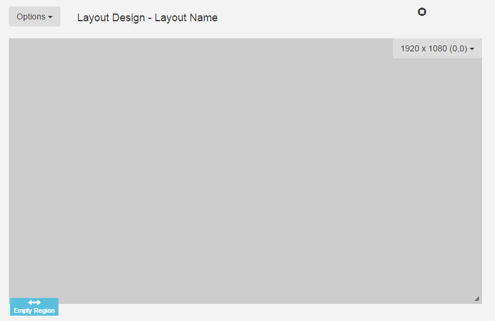
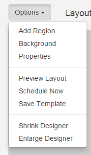
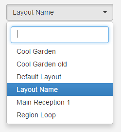

<!--toc=layouts-->
# Layout Designer

The Layout Designer is the heart of content creation in [[PRODUCTNAME]]. Each
time a new Layout is created, or an existing one needs a design change, the
Layout Designer is used.

[[PRODUCTNAME]] makes Layout Design simple through the use of drag and drop,
interactive previewing and design flexibility. When Designing a Layout from
scratch all of the default templates come with one Full Screen Empty
[Region](layouts_regions.html), pictured below.

Layouts are designed with an intended resolution which has been scaled back in
the designer window. The Layout Designer has a small design resolution so that
the Design can occur without panning around the browser with scroll bars. The
small design window does not matter and is seamlessly resized without losses on
each Display.

## Layout Status

When the Layout Designer is open the Layout will be periodically checked by the
CMS to make sure it is ready to play. This is called the Layout Status and can
be seen on the Actions tab and also on the Action Tab header icon.

Invalid layouts will be excluded from the Schedule and will not be played.

## Layout Duration

The Layout Duration is shown at the top of the screen and will update each time
the Layout Status is checked by the CMS. The Layout Duration is calculated based
on the longest running Region in the Layout.

Region durations are based on the durations of all the media contained on the
Play list, added together.

When a Layout is shown on a Player, it will run for its duration and then be
removed to make way for the next Layout in the Schedule.

## Toolbox

The top of the layout designer holds a toolbox which contains all of the
most used actions that can be taken on the Layout. There are two tabs to the
toolbox, "Designer" and "Actions".

- **Background**
    Change the Background image, colour and aspect ratio.

- **Add Region**
    Adds a new Region to the Layout that can then be positioned (drag/drop)
    and resized. It can then have content assigned to it.

- **Lock Positions**
    Disable drag and drop on the Regions so that they cannot be accidentally
    moved.

- **Hide Controls**
    Prevent the Region controls from showing when you move the mouse over a
    region.

- **- icon**
    Make the design window smaller.

- **+ icon**
    Make the design window larger.

- **Save icon**
    Save the current design window size as the default.
    Make the design window larger.

- **Undo**
    If the Regions have been moved around or resized with drag and drop, then
    undo those position changes.

- **Save Region Positions**
    If the Regions have been moved around or resized with drag and drop, then
    save those position changes.

- **Preview Layout**
    View the full screen Layout Preview directly in your browser.
    See [Previewing](layouts_previewing.html)

- **Schedule Now**
    Schedule the Layout onto one or more Displays directly from the Layout Designer.

- **Save Template**
    Want to use the design again? It can be saved as a Template from here.
    Saving a template will store an exact copy of the layout, including
    regions, playlists and media.

## Layout Selector

The Layout selector provides navigation between all Layouts the
current user has permissions to edit, without having to jump out to the Layout
Administration page each and every time.

Once clicked, it presents a list of Layout names - clicking the name will
load corresponding layout into the designer window.
