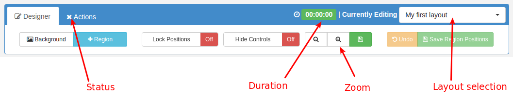

<!--toc=layouts-->
# Layout Designer

The Layout Designer is the heart of content creation in [[PRODUCTNAME]]. Each time a new Layout is created, or an existing one needs a design change, the Layout Designer is used.

[[PRODUCTNAME]] makes Layout Design simple through the use of drag and drop, interactive previewing and design flexibility. When Designing a Layout from scratch all of the default templates come with one Full Screen Empty [Region](layouts_regions.html), pictured below.

Layouts are designed with an intended resolution which has been scaled back in the designer window. The Layout Designer has a small design resolution so that the Design can occur without panning around the browser with scroll bars. The small design window does not matter and is seamlessly resized without losses on each Display.

## Options Menu

At the top left of the screen below the navigation bar is the options menu. This provides access to the higher level functions in the designer.

- **Add Region**
    
    Adds a new Region to the Layout that can then be positioned (drag/drop) and resized. It can then have content assigned to it.

- **Background**
    
    Change the Background image, colour and aspect ratio.

- **Properties**

    Adjust the Layout Properties, such as the name, description and tags.

- **Preview Layout**
    
    View the full screen Layout Preview directly in your browser. See [Previewing](layouts_previewing.html)

- **Schedule Now**
    
    Schedule the Layout onto one or more Displays directly from the Layout Designer.

- **Save Template**
    
    Want to use the design again? It can be saved as a Template from here. Saving a template will store an exact copy of the layout, including regions, playlists and media.

- **Shrink Designer**

    Make the design window smaller

- **Enlarge Designer**

    Make the design window larger

## Jump List
The Layout Designer Jump List provides navigation between all Layouts the current user has permissions to edit, without having to jump out to the Layout Administration page each and every time. It is accessible from an icon at the bottom right corner of the browser window, entitled "Layout Jump List".

Once clicked, it presents a list of Layout names - clicking the name will load corresponding layout into the designer window.