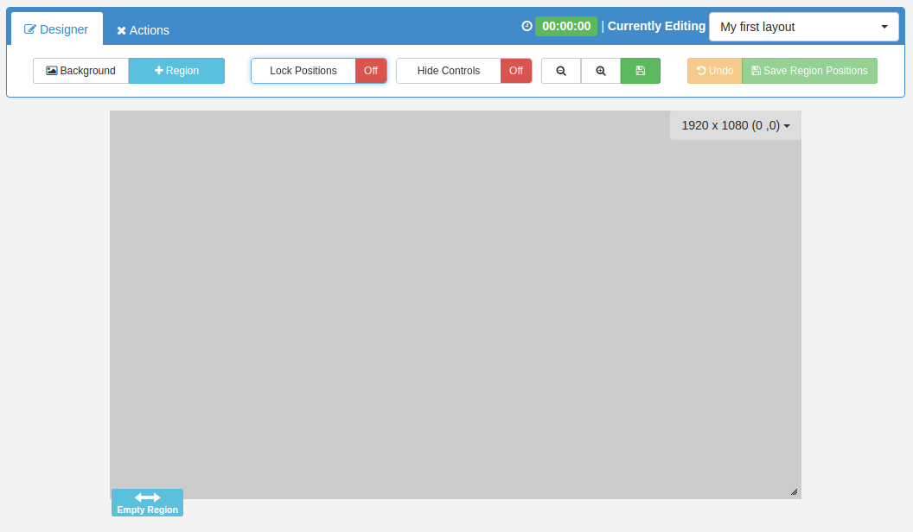

<!--toc=layouts-->

# Layout Designer

{tip}
**Please note:** If you are using a CMS later than v1.8.x please select from the options below:

- v2.0.x CMS click [here](layouts_designer_2.0html)
- v2.3.x CMS click [here](layouts_designer_2.html)
- v3.0.x CMS click [here](layouts_designer_3.html)
- v3.1.x CMS click [here](layouts_designer.html)

{/tip}

The Layout Designer is the heart of **content creation** in [[PRODUCTNAME]]. Each time a new Layout is added, or an existing one needs a design change, the Layout Designer is used.

[[PRODUCTNAME]] makes Layout Design simple through the use of **drag and drop**, **interactive previewing** and **design flexibility**. On adding a Layout the Layout Designer will open with one full screen empty [Region](layouts_regions_1.8.html), as pictured below.

## Toolbox

The Layout Designer holds a toolbox of actions that can be taken on a Layout. There are two tabs to the toolbox, **Designer** and **Actions**.

### Designer 

- **Background** - Select a Background image, colour and aspect ratio for your Layout.
- **+ Region** -  Add a new empty Region to the Layout.
- **Lock Positions** -  Toggle to 'On' to disable drag and drop for Regions so that they cannot be accidentally moved after Regions have been sized and placed. (Remember to toggle to ‘Off’ if you need to make further adjustments).
- **Hide Controls** -  Disable Region controls from showing when you move the mouse over a Region.
- **- icon** -  Decrease the canvas size to fit the screen you are working on.
- **+ icon** - Increase the canvas size to fit the screen you are working on.
- **Save icon** - Save your optimum canvas size as default.
- **Undo** - If Regions are moved or resized with drag and drop, then Undo will revert to your previously saved Region Positions and sizing.
- **Save Region Positions**  - Save the sizing and positioning of Regions on a Layout. These saved positions can then be used to revert back to if Regions are inadvertently moved.

### Actions

- **Preview Layout** - View a full screen Preview of the Layout from the comfort of your browser.
- **Schedule Now** - Schedule the Layout onto one or more Displays directly from the Layout Designer.
- **Save Template** - Save as a Template to use the design again. Saving a template will store an exact copy of the Layout, including Regions, Playlists and media.

### Layout Status

The Status of the Layout is shown, as well as a Status indicator (cross or tick) being shown on the Action Tab header icon. When the Layout Designer is open the Layout will be periodically checked by the CMS to make sure it is a valid Layout ready to play.  

The Layout Status in the image shown above is an "invalid status" as the Layout just contains 1 empty Region, Media content has yet to be assigned.
**Invalid Layouts will be excluded from the Schedule and will not be played.**

{tip}

A Layout must contain at least one Region **and** each Region must contain at least **one** media item for it to be valid and play when Scheduled.

{/tip}

### Layout Duration

The Layout Duration is shown at the top of the screen and will update each time the Layout Status is checked by the CMS. The Layout Duration is based on the longest running Region in the Layout.

{tip}

Each Media item has a duration so to calculate a Region duration all Media items contained on the Playlist are added together.

{/tip}

### Layout Selector

The Layout selector provides easy navigation between all Layouts the logged in User has permissions to edit, without having to leave the Layout Designer screen.

