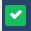
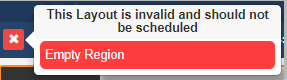
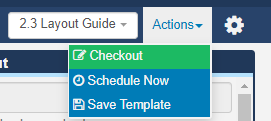
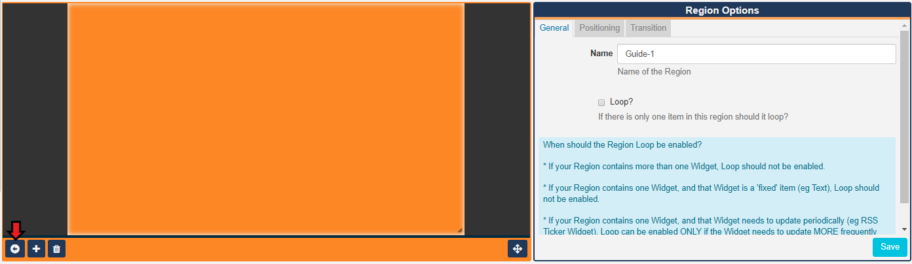
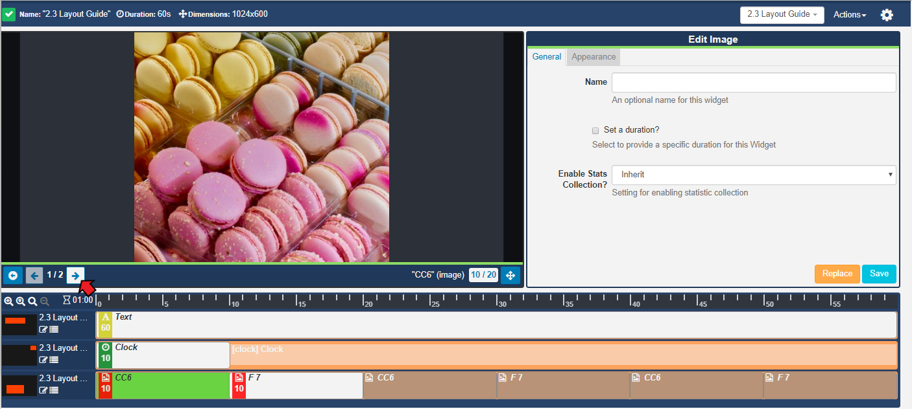
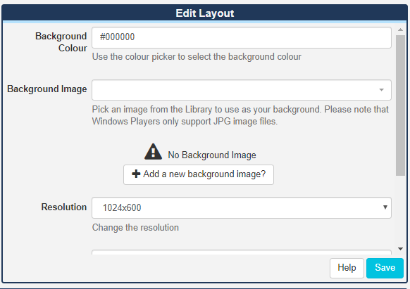
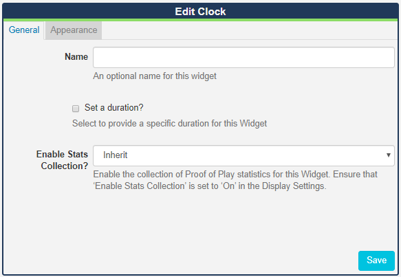
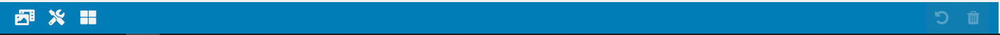

<!--toc=layouts-->

# Layout Designer

- {tip}
  **Please note:** 
  
  - If you are using a v1.8.x CMS, please click [here](layouts_designer_1.8.html)
  
  - If you are using a a v2.0.x - v2.2.x CMS, please click [here](layouts_designer_2.0.html)
  
  - If you are using a v3.0.x CMS, please click [here](layouts_designer_3.html)
  
  - If you are using a v3.1.x CMS, please click [here](layouts_designer.html)
  
    {/tip}

The Layout Designer is the heart of **content creation** in [[PRODUCTNAME]]. Each time a new Layout is added, or an existing one needs a design change, the Layout Designer is used.

[[PRODUCTNAME]] makes layout design simple through the use of **drag and drop**,**interactive previewing** and **design flexibility**. On adding a new Layout, the Layout Designer will open:

## Top Toolbar

A status indicator is shown to the left of the top toolbar to show you the current 'play' status of the selected Layout:

- This Layout has not been built yet.

 - This Layout is valid and can be scheduled once Published.

 - This Layout is invalid and will not be Published for scheduling. 

 - This Layout contains media that can only be assessed Player side, and can be scheduled once Published. 

{tip}
This is a normal Layout status to have if your Layout contains online content, such as a webpage etc. The CMS cannot say that the Player will display the content as it is not sent directly from the CMS (as with file based media, images, videos etc,) and is instead cached (stored) Player side.  The Player will need to have a reliable internet connection to successfully display such content.
{/tip}

{tip}
Hover over the status icon to see further information regarding the status you are seeing!

{/tip}

The total **Duration** of the selected Layout is displayed here in seconds, which updates each time a media item is added or an existing duration is edited, along with the Layout **Dimensions** applied from the selected **Resolution** on the Edit Layout form.

{tip}
The overall Layout duration is always based on the longest running Region on the Layout.
{/tip}

{tip}
A Layout must contain at least one Region **and** each Region must contain at least **one** media item for it to be valid and play when scheduled.
{/tip}

### Layout Selector

To the right of the toolbar, the **Layout selector** provides easy navigation between all Layouts the logged in User has permission to edit without having to leave the Layout Designer screen. Use the dropdown menu to change the Layout you are currently viewing/editing.

### Actions Menu

Located next to the Layout Selector is a menu of **Actions** that can be performed for Layouts, depending on the status of the Layout.

### Layouts in a Draft status have the following available Actions:

- #### Discard

  Any changes made to the Layout can be completely discarded, reverting the Layout to the previous Published version. 

Clicking on Discard will delete the draft and leave the Published version untouched.

- #### Publish 

  Once you are happy with your designs, set your Layout to **Publish** ready to be Scheduled.

{tip}
Invalid Layouts will not be published. On publishing, an error message will show as to why your Layout is invalid, which you will need to rectify before being able to Publish.
{/tip}

​	Layouts can be set to be **Published** straight away with updates automatically pushed to Layouts that are 	in the schedule. A **Publish Date** can also be selected to Publish a Layout at a specified date and time.

{tip}
You can also use the **row menu** for a selected draft Layout to set a **Publish time**.
{/tip}

{tip}
Published Layouts can be viewed in a read-only mode and 'Checked out' to create a draft Layout to make any edits needed.
{/tip}

### Layouts in a Published status have the following available Actions:

- #### Checkout

  Enable editing by putting the published Layout into a draft status.

- #### Schedule Now 

  Schedule published Layouts onto one or more Displays directly from the Layout Designer.

- #### Save Template

  Save your published designs by creating a [Template](layouts_templates_2.html) for reuse. Saving a template will store an exact copy of the Layout, including Regions, Playlists and media.

## Layout View

As you create your Layout, the Layout View will update, so that you can view all the elements as you go to ensure the correct positioning of [Regions](layouts_regions.html) and the correct ordering of [Widgets](layouts_modules.html), so it will play as you intend.

### Edit Layout Mode

All new Layouts, by default, have one full screen empty Region, represented as a semi-transparent overlay.  Use the **Edit Layout Mode** to add, position and resize **Regions**, by clicking on the Edit icon to open the editor.

Clicking on a **Region** in the opened editor, opens the **Region Options** form which allows for refinement of  **Positioning** and the application of **Exit Transitions** for when the Region finishes.

Use the arrow, in the bottom left corner of this window, to return to the Layout View.

## Preview

Play a full **Preview** of your Layout by clicking on the **Play** button located at the bottom left of the Layout View window. 

{tip}
View your Preview in full screen by clicking on the icon in the bottom right corner of the screen then press Play.
{/tip}

Click on a **Widget** to view the media content and use the arrows to cycle through all Widgets that have been assigned to that **Region**. 

**Please note:** Video files will only play in the full Layout Preview.

{tip}
Return to the **Layout View** by clicking on the back arrow at the bottom left of the Preview screen.
{/tip}

{tip}
When you have multiple Regions, easily Preview all of the Media assigned by toggling to full screen and using the arrow tabs for each Region to cycle through the content.

{/tip}

## Edit Forms

Edit aspects of your **Layout**,**Regions** and assigned **Widgets** using the available options in the **Edit **forms. 

Once assigned, click on **Widgets** from the **Timeline** to open the available edit options for that media item.

## Layout Timeline 

The [Layout Timeline](layouts_timeline.html) displays the duration of individual Widgets and gives you an overview of how media will play on the Layout.

## Bottom Toolbar

Located on the bottom left of the toolbar use the buttons to add [Library](layouts_library_search.html) media items, apply actions from the [Tools](layouts_tools.html) menu and assign [Widgets](layouts_widgets.html) to Layouts. 

{tip}
Further actions will show, when available, to Undo changes and Delete.
{/tip}

