# Layout Editor

The Layout Editor is the heart of **content creation** in [[PRODUCTNAME]]. Each time a new Layout is added, or an existing one needs a design change, the Layout Editor is used.

{nonwhite}{video}nfb9aCqbcIA{/video}{/nonwhite}

**Add** a new Layout or click **Design** from the row menu of an existing Layout to open the **Layout Editor**:

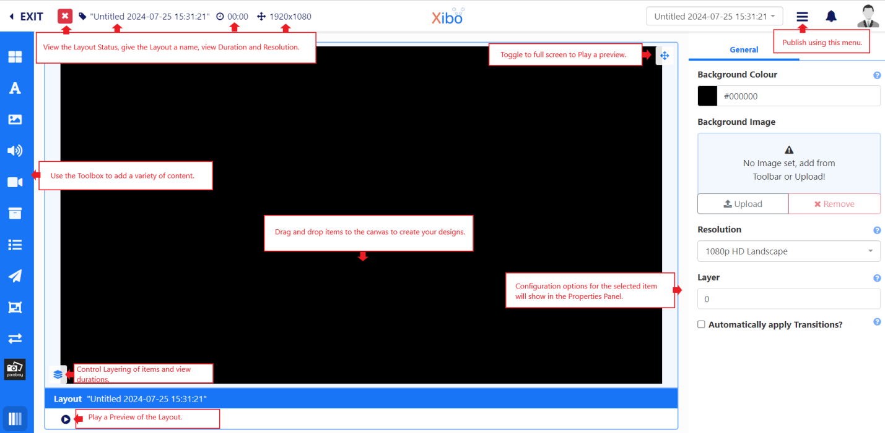

New Layouts are added as 'untitled' and need to be named:

- Click on the '**Untitled text**' to enter a **Name** and complete further form fields as required.

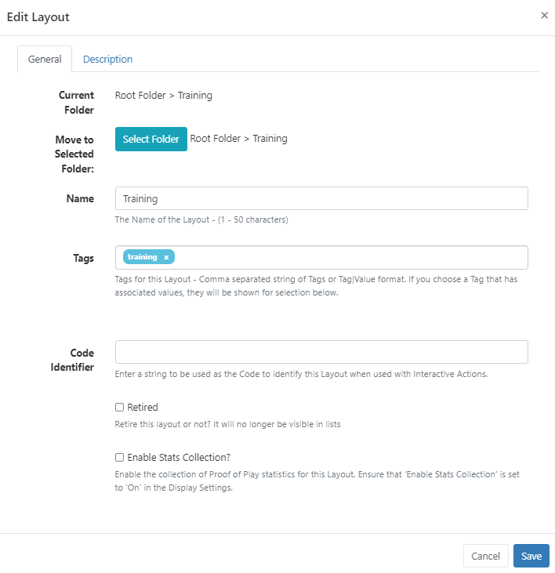

- [Folders](tour_folders.html) are used to organise as well as easily share user objects (Layouts, Playlists, media files etc.) with other Users/User Groups. Layouts saved to a Folder will inherit share options already applied to that Folder. 

{tip}
If users will need access to any of the Layout content, (image files which need to be added to the Layout for example), ensure that these are also saved to the same Folder!
{/tip}

- Include optional [Tags](tour_tags.html).

{tip}
Tags and Folders can also be assigned to multiple Layouts using the [With Selected](tour_cms_navigation.html#content-multi-select---with-selected) option at the bottom of the Layout grid!
{/tip}

- A string can be used as a **Code Identifier** for the Layout when using [Interactive Actions.](layouts_interactive_actions.html)
- The collection of statistics for [Proof of Play Reports](displays_metrics.html) can be enabled for the Layout.

{tip}
Prior to enabling the collection for Proof of Play for the Layout, ensure that the **Enable Stats Collection** check box has been enabled for the **Display** the Layout will be scheduled to by using [Display Profile Settings](displays_settings.html).
{/tip}

- Click to **Save** the new Layout record.

{tip}
If you are looking to use a [Template](layouts_templates) as a basis for your design you can add from the **Toolbar** inside the Layout Editor!
{/tip}

## Status Bar

In the top left of the editor you can see the current "play" status of the Layout as well as make edits to the Layout record and view the overall duration of the Layout:

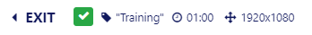

The Icons shown here represent the current status of the Layout:

- **Blue cog** - the Layout has yet to be built.
- **Green tick** - the Layout is valid and can be published and scheduled.

- **Red cross** - the Layout is invalid and should not be published for scheduling.

- **Orange exclamation mark** - the Layout contains media that can only be assessed Player side and can be published and scheduled.

{tip}

You can mouse over the icon to see the details as to the current status.

The Orange exclamation mark is a normal Layout status to have if your Layout contains online content, such as a webpage. The CMS cannot determine that the Player will display the content as this type of content is not sent directly from the CMS and is instead cached (stored) Player side.  The Player will need to have a reliable internet connection to successfully display such content.

{/tip}

The current **Name** of the Layout is shown next to the status icon. This can be clicked to make edits to the naming,  Folder location, Tags etc.

The total **Duration** of the Layout is shown here in minutes and seconds and is based on the longest running item on the Layout.

{tip}
Each item has a default duration which can be overridden from the **Advanced** tab from the **Properties Panel** when selected.
{/tip}

The dimensions of the Layout are set from the **Resolution** selected from the **Properties Panel** for the Layout configuration.

Top right, the Layout jump list provides easy navigation between all Layouts, the logged in User has access to edit, without having to leave the Layout Editor to switch:

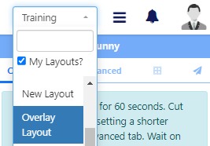

Next to the Layout jump list is a menu of items which show available actions dependent on if the Layout is [Published](layouts.html#content-layouts-in-a-published-status) or in a [Draft](layouts.html#content-layouts-in-a-draft-status) status.

## Properties Panel

The **Properties Panel** is used to configure all items added to the Layout as well as the Layout itself.

{tip}
Configuration options and available tabs will differ across items added.
{/tip}

On adding a new Layout with no content, configuration options are shown in the Properties Panel:

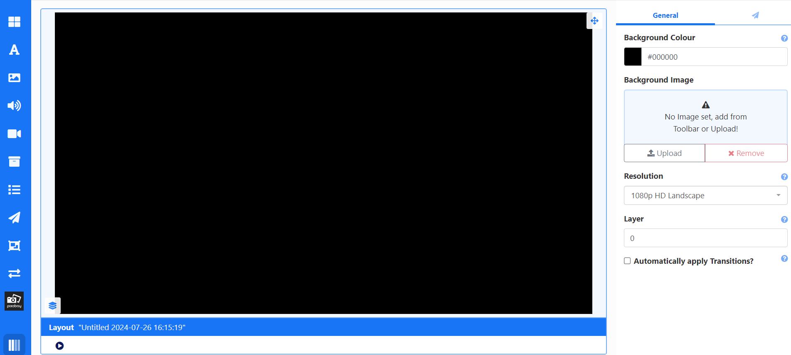

{tip}
Return to the Layout properties at any stage of creating the Layout by clicking anywhere on the background!
{/tip}

Select to use a colour or an image as your background:

- Click on the **Background Colour** field and select a colour to use.

- Drag an image from the [Image Library Search](layouts_editor_library_search.html) from the Toolbar, to the **Background Image** box.
- Use **Upload** to select and add a new image.

{tip}
Images uploaded here will automatically be saved to your CMS Library!
{/tip}

- Use the drop down to set the [Resolution](layouts.html#content-resolutions) that best matches your display.

{tip}
Custom Resolutions can be created by a Super Administrator!
{/tip}

- Tick to apply default [Transition](tour_transitions.html) settings to all Widgets added to the Layout.

## Layering

Template Zones, Layout content and the Layout background can be ordered using z-index settings.

Everything added to the Layout will get a new Layer (Video files, Playlists etc.) Elements get their own Canvas Layer to hold all added Elements which can be moved up and down the layers as one.

{tip}
To set the Layer for a Background Image, click on the background and set from the Properties Panel.
{/tip}

- Click in the item to open the configuration options in the Properties Panel .
- Select the positioning tab (with the grid icon).
- Enter a number to determine the layer.

{tip}
The higher the number the higher the Layer.

Use the [Context Menu](layouts_editor.html#content-context-menu) and  [Layer Control Panel](layouts_editor.html#content-layer-control) to easily move selected items forwards and backwards.
{/tip}

{version}
**NOTE:** If you are using Windows Players, the HLS Widgets and Embedded/Web Widgets configured to use the Edge browser are not transparent and will not show anything placed underneath them.
{/version}

## Toolbox

The Toolbox is used to access various content types to add to Layouts:

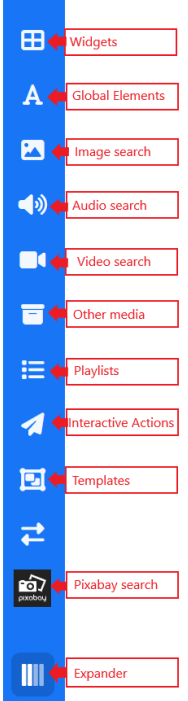

{tip}
Click on the expander icon at the bottom to change the media thumbnail view for easier media assignment!

It will only expand to a sensible level dependent on the screen size you are working on. Using the Layout Editor on screens less than 1600px will limit the total number of available levels to view.
{/tip}

[Templates](layouts_templates.html) are selected from inside the Layout Editor from the Toolbox.

{nonwhite}
Select from one of our designed templates from the [Xibo Exchange.](layouts.html#content-xibo-exchange) by clicking the button below Templates!
{/nonwhite}

{version}
Selecting a **Template** will replace the Layout you are currently working on to the chosen Template. This action is irreversible and so must be used with caution.
{/version}

## Arranging Layout Content

Position content exactly where you want it with flexible drag and drop, rotation and resizing tools:

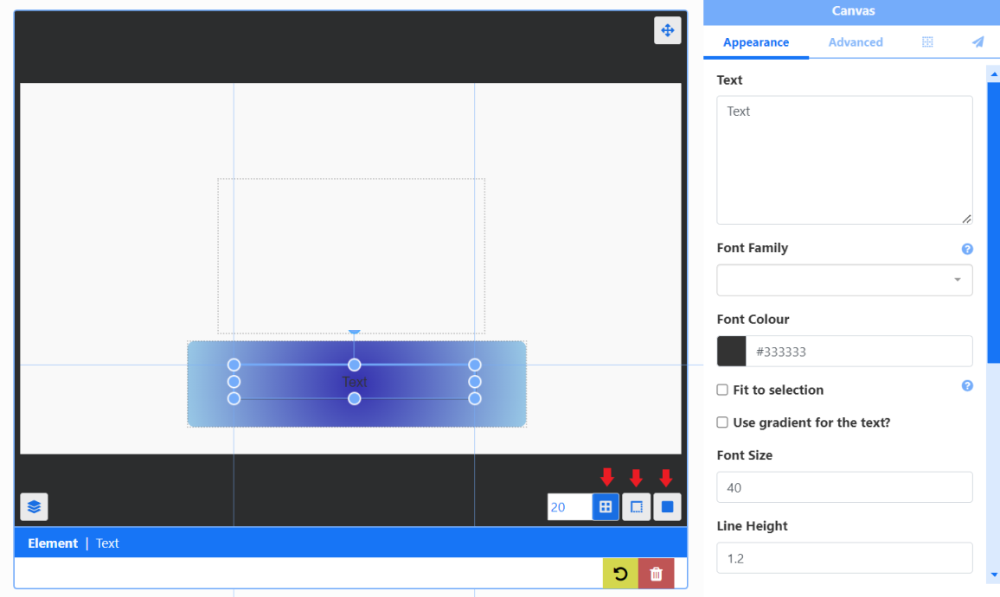

{tip}
Use the "Snap to buttons" at the bottom right to select to **Snap to Grid**, **Snap to Borders** or **Snap to Elements** for easier positioning when adding items to the Layout.
{/tip}

Move multiple items added to a Layout in a block.

- Click and hold an on the background.
- Drag to create a rectangle outline.

Ensure that all items that need to be moved are contained within the rectangle.

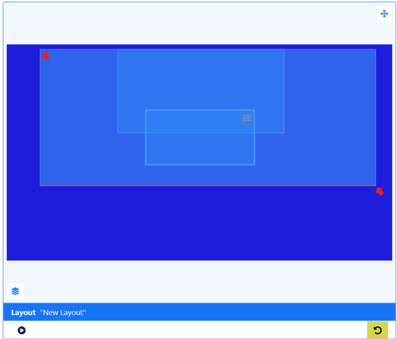

- Click to re-position the block of items on the Layout:

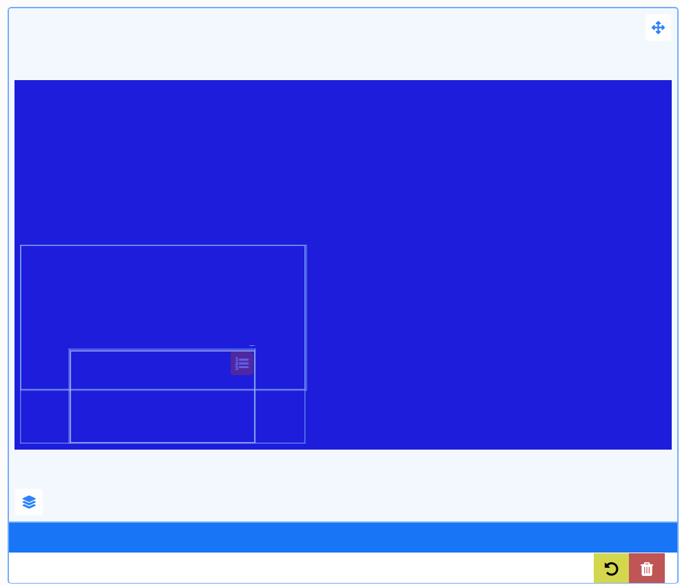

- Click anywhere outside of the block to return to separate items once positioned.

## Layer Control

View Layering and item durations of all items added to the Layout from the **Layer Control** located at the bottom left:

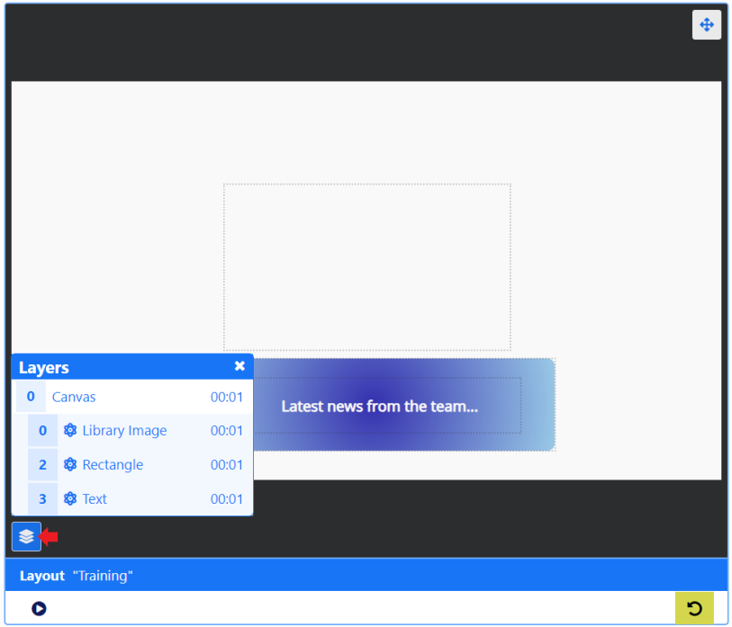

{tip}
Use the Layer Control to easily select items that are positioned behind other items to make edits!
{/tip}

## Context Menu

Items added to a Layout have an additional menu of items which are accessed from right clicking in a selected item:

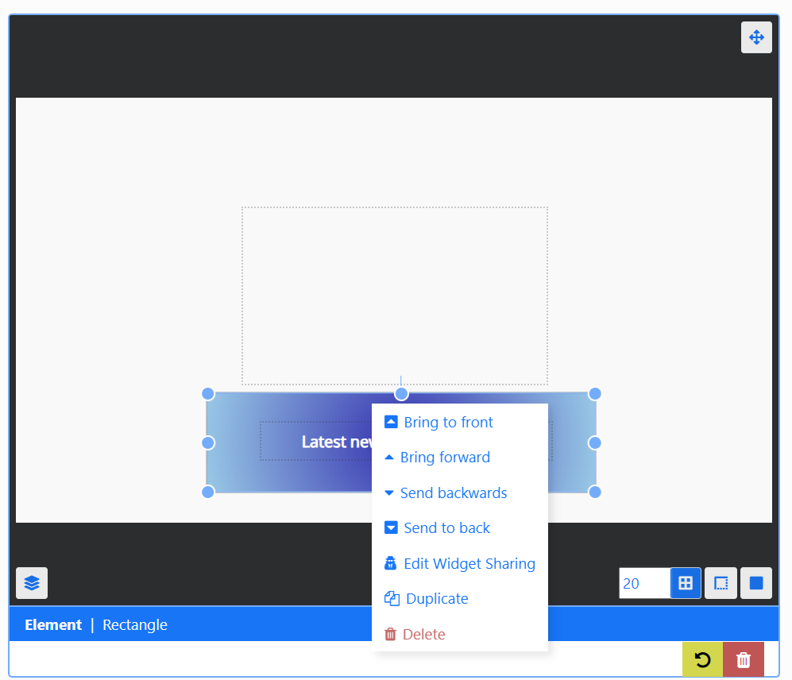

{tip}
Options shown are dependent on the item selected!
{/tip}

Widgets have further options which are show under the Widget name/type:

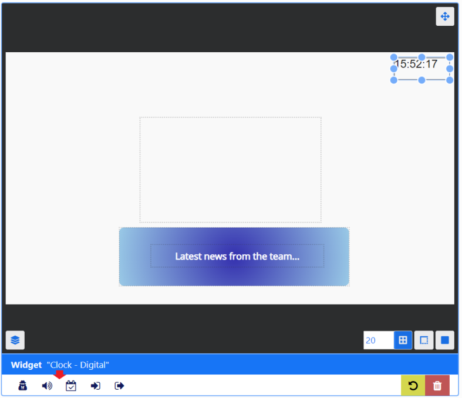

Options include attaching an [Audio](media_module_audio.html) file to a Widget as well as controlling [Sharing](users_features_and_sharing.html) options to View, Edit and Delete selected items for Users/User Groups.

## Preview

Play a full **Preview** of your Layout by clicking on the **Play** button: 

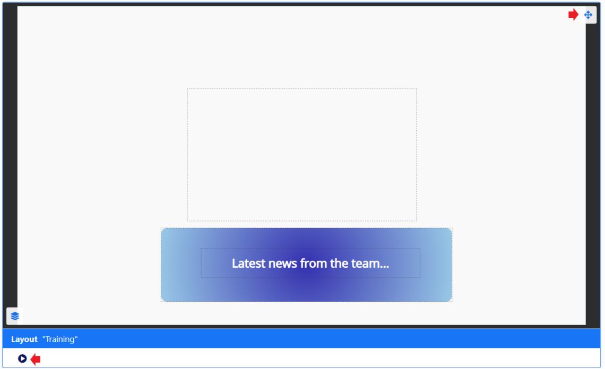

{tip}
Before the Layout can start all **Media** must be downloaded to your browser and verified so you may experience a slight delay whilst this is in process.

View in full screen by clicking on the icon in the top right corner of the preview window before pressing play!
{/tip}
