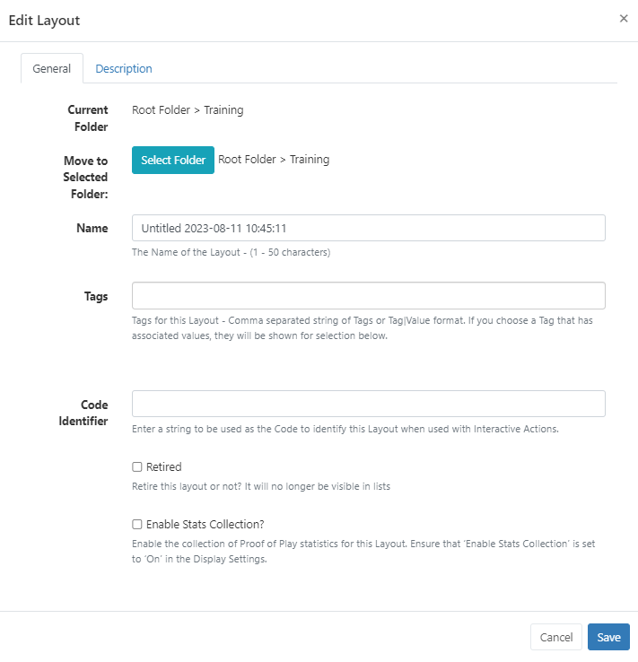
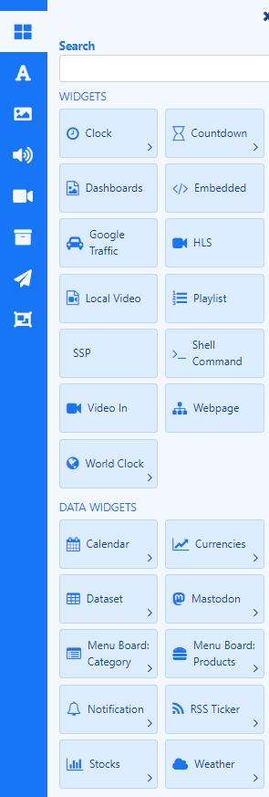
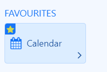
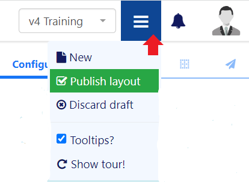
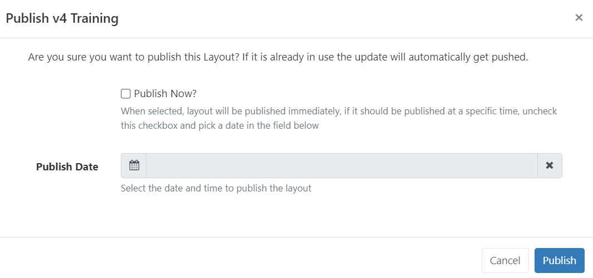

# Layout Editor

The Layout Editor is the heart of **content creation** in [[PRODUCTNAME]]. Each time a new Layout is added, or an existing one needs a design change, the Layout Editor is used.

On **adding** a new Layout, or clicking **Design** from the row menu for a Layout, the **Layout Editor** will open:

Adding a new Layout will create an 'untitled' Layout. Click on the '**Untitled text**' to Name and complete the form fields:

[Folders](tour_folders.html) are used to organise, search and easily [Share](users_features_and_sharing.html#content-share) User objects with other Users/User Groups. Layouts saved to a Folder will inherit the access options applied to that Folder. 

{tip}
If users should also have access to the Layout content (image files for example) ensure that this is also saved to the same Folder!
{/tip}

- Include optional [Tags](tour_tags.html).

{tip}
Tags and Folders can also be assigned to multiple Layouts using the [With Selected](tour_cms_navigation.html#content-multi-select---with-selected) option at the bottom of the Layout grid!
{/tip}

- Enter a string to be used as the **Code Identifier** to identify this Layout when used with [Interactive Actions](layouts_interactive_actions.html)
- Select to enable the collection of statistics for [Proof of Play Reports](displays_metrics.html) for the newly added **Layout**.

{tip}
Ensure that the **Enable Stats Collection** check box has been enabled for the **Display** this Layout will be scheduled to from the [Display Profile Settings](displays_settings.html).
{/tip}

- **Save**.

{tip}
If you want to use a [Template](layouts_templates) as a basis for your design, add from the [Toolbar](layouts_editor.html#content-templates)!
{/tip}

## Properties Panel

The Properties Panel is used to configure all items added to the Layout and the Layout itself.

{tip}
To return to the overall Layout configuration options further down the design, click anywhere on the background on the viewer.
{/tip}

Select a colour or add an Image to use as your background.

- Add an image from your Library using the [Image Library Search](layouts_editor.html#content-library-search) from the Toolbar. 
- Drag the image to the **Background Image area** of the properties panel.

{tip}
New Images can also be added as a background by using the **Upload** button!
{/tip}

- Select the [Resolution](layouts.html#content-resolutions) that best matches your display.

- Default [Transition](tour_transitions.html) settings can be applied to all Widgets on the Layout by ticking the box.

### Layering

Zones, content and a Layout background image can be ordered using z-index settings from the positioning tab in the properties panel:

- Click in the item to highlight.
- Select the tab with the grid icon from the properties panel.
- Enter a number to determine the layer.

{tip}
1 is considered the lowest Layer, the higher the number the higher the Layer.

Right click to show a [context menu](layouts_editor.html#content-context-menu) to easily move items forwards and backwards.
{/tip}

{version}
**NOTE:** If you are using Windows Players, the HLS Widgets and Embedded/Web Widgets configured to use the Edge browser are not transparent and will not show anything placed underneath them.
{/version}

Use the [Layer Control Panel](layouts_editor.html#content-layer-control) at the bottom of the viewer to easily see Layering and durations for all items on the Layout.

## Toolbar

Make a start adding content to the Layout from the Toolbar:

### Widgets

From the top of the Toolbar, click to utilise a variety of Widgets to add content to your Layouts:

{tip}
Widgets can be disabled/enabled by an Administrator in the [Modules](media_modules.html) section of the CMS.
{/tip}

Set Widgets as **Favourites** to make them easier to select by clicking the star icon in the left hand side of a Widget card:

{tip}
Click the star to deselect from the Favourites section.
{/tip}

Add Widgets by drag and drop or click the widget to highlight and click on the viewer.

#### Data Widgets and Elements

**Data Widgets** also contain 'data' **Elements** which allows a User to place each element of the Widget exactly where needed rather than being bound by a **Static Template** design:

{version}
**NOTE:** Elements are only available in the Layout Editor and are therefore not available in the [Playlist Editor.](media_playlists.html#content-playlist-editor)
{/version}

Each Widget has a set of Elements which are fed with the data returned by the Widget. Once added to the viewer, each Element has a set of configurable options available in the properties panel:

Elements have their own Layer, which can be used to determine where they appear in relation to other natively rendered Elements such as Playlists and Videos.

Click to highlight an Element and click the positioning tab in the properties panel:

#### Data Slots

Handle the paging of data when using more than one of the same Element for a Widget by specifying a **Data Slot** to use for each Element added.

{tip}
For example the image above shows 2 **Description Elements** from the **Calendar Widget** have been added. One has a **Data Slot of 1** the other a **Data Slot of 2.** If 10 (Calendar Events) items were returned, Data Slot 1 would show items 1,3,5,7,9 with Data Slot 2 showing items 2,4,6,8,10.
{/tip}

In addition Elements have the option to **Pin this slot** so that the first data item to appear in that slot will stay there for the entire duration of the Widget and won't cycle through items with the others.

{tip}
You can also set whether to **Repeat items** in order to fill all data slots to ensure that you don't have any empty slots by using the checkbox on the **Advanced** tab of the properties panel.
{/tip}

#### Grouping Elements

Elements can be grouped and treated as 'one' for ease of configuration,positioning, resizing and duplication:

{tip}
Groups can contain both **Data** and **Global Elements**. 

**NOTE:** All Data Elements need to share the same **Data Slot** and **Effect** when grouping!
{/tip}

- Hold down the shift key to multi-select and click in each **Element** to group. 
- Once the Elements have been selected, right click and select **Group elements**:

{tip}
Ungroup by right clicking!
{/tip}

#### Stencils 

Stencils are 'Element Group Templates' which have been included for selected Widgets to assist Users with creating content simply and quickly.

{tip}
Take advantage of our Stencil designs by adding, configuring and duplicating. Right click to **ungroup** should you want to make edits to further customise!!
{/tip}

#### Static Templates

Templates are included for specific Widgets to provide an easy way to add content using a pre-styled design. Templates can be configured to affect the behavior of returned results as well as alter styling options to suit your requirements.

Static Templates are predominantly used in the [Playlist Editor](media_playlists.html#content-playlist-editor) and are available to add to Layouts.

### Global Elements 

Easily add Text and a variety of shapes to your Layout:

{tip}
These global elements can be used across any module!
{/tip}

### Library Search

Select from [Image](media_module_image.html), [Audio](media_module_audio.html), [Video](media_module_video.html) and Other media file searches to easily assign media which already exists in the [Library](media_library.html).

{tip}
'Other media' search includes [Flash](media_module_flash.html), [HTML Package](media_module_htmlpackage), [PDF](media_module_pdf.html) and [PowerPoint](media_module_powerpoint.html#content-3-upload-a-prepared-ppt-file-windows-players-only) files.
{/tip}

When using Image/Video Library Search options, Integration from Pixabay gives users additional resources which can be added to Layouts without having to leave the Layout Editor.

{cloud}
Pixabay integration is enabled by default for new Xibo in the Cloud customers.

If you are upgrading from an earlier version you will need to enable by navigating to the **Administration** section of the CMS and click **Applications**. Scroll down the page to the **Connectors** section. Click to **Configure** and tick to enable, **Save** changes.

{/cloud}

{noncloud}

Pixabay can be enabled from the **Administration** section of the CMS menu by clicking on **Applications** and scrolling down the page to the **Connectors** section. Click Configure and enter your API Key after signing up for a Pixabay account. [PixabayAPI Documentation](https://pixabay.com/api/docs/)
{/noncloud}

{tip}
Images/videos that are selected from Pixabay to be used in Layouts will automatically be added to your Library for reuse!
{/tip}

### Interactive Actions

Widgets can have Actions attached to effect changes to the Layout triggered by Touch, click or webhook.
[Interactive Actions](layouts_interactive_actions.html) are created and managed from the Toolbar and shown on the **Actions** tab for the selected item in the **Properties Panel**.

### Templates

Select a Template to use from the Toolbar.

{tip}
[Published Layouts](layouts_editor.html#content-publish) can also be saved as a [Template](layouts_templates.html#content-save-layout-as-template)
{/tip}

{nonwhite}
Select from one of our templates available from the [Xibo Exchange.](layouts.html#content-xibo-exchange)
{/nonwhite}

Selecting a Template will replace the Layout you are currently working on with your chosen Template. (This action is irreversible and so must be used with caution)

## Viewer

The viewer will update as the Layout is designed so that you can clearly see your designs taking shape.

Position content exactly where you want it with flexible drag and drop, rotation and resizing tools.

{tip}
Use the buttons in the bottom right of the viewer to select to **Snap to Grid**, **Snap to Borders** or **Snap to Elements** for easier positioning when adding items.
{/tip}

### Layer Control

Located in the bottom left of the viewer, easily view all Layering and Durations of all items added to the Layout.

{tip}
Use the Layer Control to easily select items that behind other items to make edits!
{/tip}

## Context Menu

Further options are available from a **Context Menu** located at the bottom of the viewer as well as from a right click on added items. Actions shown are dependent on what you have selected.

### Audio

Attach an [Audio](media_module_audio.html) file to a Widget.

### Sharing

Control [Sharing](users_features_and_sharing.html) options to View, Edit and Delete selected items for Users/User Groups.

## Preview

Play a full **Preview** of your Layout by clicking on the **Play** button located at the bottom of the viewer: 

{tip}
View in full screen by clicking on the icon in the top right corner of the preview window before pressing play!
{/tip}

## Status Bar

View the current status, edit Naming, Tags, Folders etc. and see the overall duration of the Layout using the status bar at the top left of the Layout Editor. Layout duration is based on the longest running item on the Layout:

The icon shows you the current status of the selected Layout:

**Blue cog** - the Layout has not been built yet.

**Green tick** - the Layout is valid and can be published and scheduled.

**Red cross** - the Layout is invalid and should not be published for scheduling.

**Orange exclamation mark** - the Layout contains media that can only be assessed Player side and can be published an scheduled.

{tip}

Mouse over the status icon to view further information.

The last icon is a normal Layout status to have if your Layout contains online content, such as a webpage etc. The CMS cannot say that the Player will display the content as it is not sent directly from the CMS (as with file based media, images, videos etc,) and is instead cached (stored) Player side.  The Player will need to have a reliable internet connection to successfully display such content.
{/tip}

The Layout jump list provides easy navigation between all Layouts the logged in User has access to edit without having to leave the Layout Editor.

## Publish

Once your Layout design is complete you must ensure that you **Publish** your Layout before Scheduling. Use the Menu located to the far right of the status bar to view all options for your Layout:

{tip}
Available options are dependent on whether your Layout is in a [Draft](https://test.xibo.org.uk/manual/en/layouts#content-notable-settings-are-listed-below-for-a-draft-layout) or [Published](https://test.xibo.org.uk/manual/en/layouts#content-notable-settings-are-listed-below-for-a-published-layout) status.
{/tip}

Layouts can be set to be **Published** straight away with updates automatically pushed to Layouts that are in the schedule. A **Publish Date** can also be selected to Publish a Layout at a specified date and time.

{tip}
Setting a **Publish Date** is not an alternative to scheduling. Your Published Layout will still need to be [Scheduled](scheduling_events.html)!
{/tip}

#### Next...

[Media](media_library.html)

