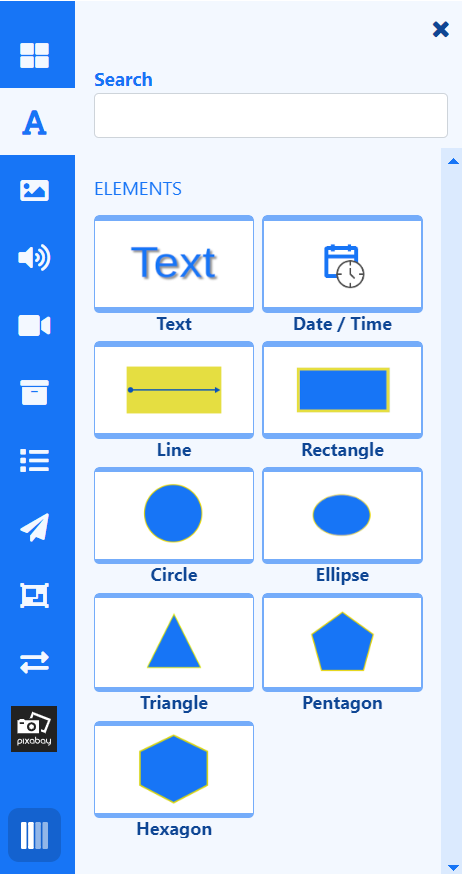
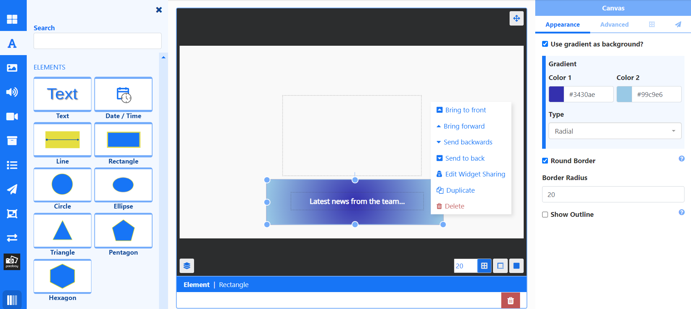

# Global Elements 

Select from a variety of Global Elements to add to Layouts to create eye-catching designs and to enhance other content.

{nonwhite}{video}4NxcXfiKBfM{/video}{/nonwhite}

## Feature Overview

- Enhance Layout designs.
- Flexibility in placement and sizing.
- Configure styling and appearance to suit.
- Compatible with all Widgets/Data Elements on a Layout.
- Easily add text to Layouts.
- Choose from a variety of shapes and lines to make your designs stand out.

Global Elements are accessed from the **Toolbox** inside the Layout Editor:

- Drag and drop or click in an element and click on the canvas to add.
- Position and resize.
- Configure from the **Properties Panel** to style.

{tip}
To edit **Text** directly, double click the Text Element on the Layout and type into the text box. A right click on this element also includes an **Edit Text** option to edit directly rather than from the Properties Panel.
{/tip}

Global Elements can be used on their own or used to complement existing content already added to the Layout.

{version}
Global Elements are only available from the Layout Editor and are not available in the Playlist Editor!
{/version}

Easily position shapes behind other content using the [Layer Control](layouts_editor.html#content-layer-control) to drag into order or right click a Global Element to use the **Send/Bring** options.

{tip}
Elements have their own Canvas [Layer](layouts_editor.html#content-layering), which can be used to determine where they appear in relation to other natively rendered Elements such as Playlists and Videos!
{/tip}

