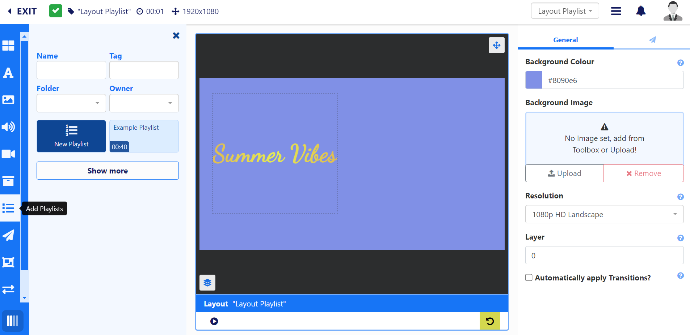
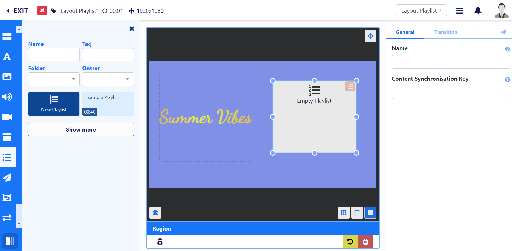
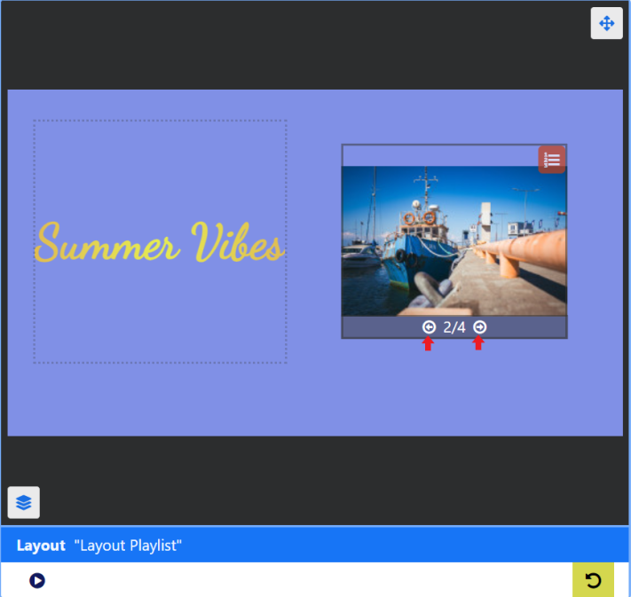
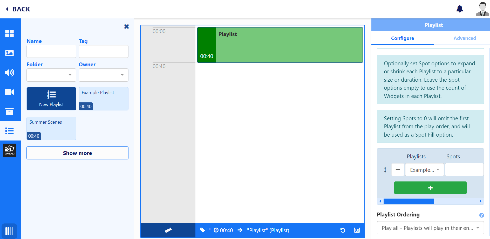
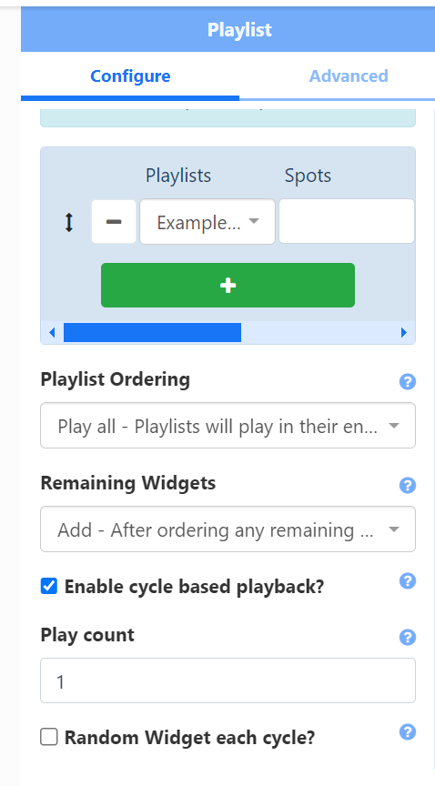

# Playlists

Playlists are used to show a sequence of media items (such as an image slideshow). There are two ways to create a Playlist:

- [Add Playlists](layouts_editor_playlists.html#content-add-playlists) directly to a Layout from the Layout Editor. Local Playlists can be converted to be saved for re-use as a global Playlist. Saved Playlists will be shown in the Layout Editor to add to Layouts.
- Create [Playlists](media_playlists.html#content-creating-a-playlist) independently to a Layout. Global Playlists can be scheduled to Displays without the creation of a Layout. Playlists created outside of the Layout Editor are still shown for selection from the Add Playlist function from the Layout Editor.

## Add Playlists

Create new or select existing Playlists to use from the **Layout editor** to create a timeline of content to show on a Layout.

## Feature Overview:

- Create and configure directly on a Layout.
- Convert a Playlist created on a Layout to a Global Playlist to save for future use.
- Easily display a 'slide-show' of content held in one or more Playlists.
- Sync with Playlists on other Layouts which are part of a Synchronised Event.
- Combine content from a variety of Playlists to be shown.
- Set the maximum number of items to be shown from a Playlist.
- Control how long each item on a Playlist should show before moving onto the next item.
- Set Expiry Dates for media items added to a Playlist.
- Play one item per cycle for a specified Play Count.
- Select a Random Widget to play at each cycle.
- Cycle through items contained on a Playlist in the viewer to easily see the sequence.

## Adding Playlists to a Layout

- From the [Layout Editor](layouts_editor), click on **Add Playlists** from the **Toolbox**:

- Click to Add or drag on a **New Playlist** or a named Playlist which has already been created.
- Resize and position:

From the **Properties Panel**, use the **Content Synchronisation Key** to sync with Playlists on other Layouts. Playlists with the same key will be synchronised when the Layout is scheduled as a [Synchronised Event.](scheduling_events.html#content-synchronised-events)

{tip}
**Scenario:**

You have a Synchronised Event with 3 Displays and 3 different Layouts. Each Layout has some Text at the top and a Playlist in the middle which all 3 need to play in sync. 

You could also set two different Playlists to sync differently which you could set to `sync_1` and `sync-2` for example.
{/tip}

- Optionally set [Transitions](tour_transitions.html#content-playlist-transitions) for items on a Playlist from the Properties Panel.

{tip}
When default Transitions have been applied, the properties panel will be blank. Only manually entered Transitions will show on forms.
Defaults can be overridden by unticking the **Automatically apply Transitions** check box from the Properties Panel for the Layout.
{/tip}

- Click the icon in the right hand corner of the Playlist to open the [Playlist Editor](media_playlists.html#content-playlist-editor) to add and configure content.

{tip}
The [Playlist Editor](media_playlists.html#content-playlist-editor) includes **Spacer** and **Rich Text** Widgets that are only available for use with Playlists.

Media added to a Playlist can also have Start and End times using [Expiry Dates](media_playlists.html#content-widget-expiry-dates).

{/tip}

{version}
**Note:** If you add a named Playlist which has already been created, any edits made to the Playlist will be applied everywhere the Playlist is being currently used!
{/version}

- Click the **Back** button at the top to exit the Playlist Editor and return to the Layout Editor.

View all the content that has been added to the Timeline of the Playlist by using the arrows in the bottom right of the Playlist on the Layout.

- Cycle through the order of content:

## Convert Playlist

If you add a **New Playlist** to the Layout you can opt to convert this into a saved Playlist. Converted Playlists will be shown for Playlist selection in the Layout Editor and from the [Playlists](media_playlists.html#content-playlists-grid) grid.

- Click the Playlist on the Layout to select and give it a **Name** from the **General** tab of the **Properties Panel**.
- Right click and select **Convert Playlist** from the menu.

You will see a pop up message at the bottom of the Layout Editor to say that the Playlist has been saved as a Global Playlist.

{tip}
Click the **Show more** button to see your Playlist added to the list of available Playlists!
{/tip}

Converted Playlists will be saved to the [Playlists Grid](media_playlists.html#content-playlist-grid).

## Add to Playlist

If you have a **New Playlist** on a Layout, you can add a new or global Playlist to the Timeline to open further options in the Properties Panel for configuration:

- Select Playlists, Spot Options and Playlist Ordering, when selecting more than one Playlist to [Embed](media_playlists.html#content-embedding-playlists) from the Properties Panel.

Adding a **Playlist** to a **New Playlist** on a Layout has additional [Cycle Based Playback](layouts_editor_playlists.html#content-cycle-based-playback) options which includes a Random Widget feature.

{tip}
If you want to add more than one Playlist to combine the play order, we recommend that you should only add one Playlist to the Timeline and then use the options in the Properties Panel to select the additional Playlists and configure.
{/tip}

- ### Cycle Based Playback

Once enabled all Playlists selected will be treated as one "list" and will only show one Widget each time the Layout is played, cycling through the content from all Playlists added:

- Tick Enable cycle based playback from the Properties Panel.
- Provide a **Play Count** to determine how many plays each Widget on the Playlist should have before moving onto the next Widget in the timeline.

Using the **Random Widget each cycle** option will play a Widget from the timeline at random for each cycle.

{version}
**Note:** These additional options are **not** available when adding one or more Playlists to a [Global Playlist](media_playlists.html#content-feature-overview) timeline, which has been added directly to the Layout!
{/version}

{tip}
Did you know [Playlists](media_playlists.html) created and managed independently to Layouts do not require further user access rights to Layouts or the Layout Editor to add and manage content! 

These global Playlists can also be directly [Scheduled](scheduling_events.html#content-media-scheduling) without the need to first create and add to a Layout!
{/tip}
