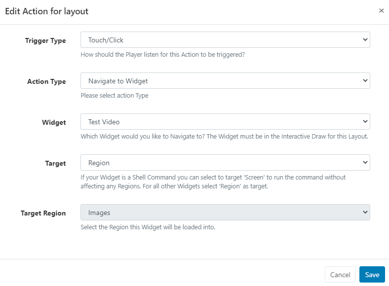

<!--toc=layouts-->

# Interactive Actions

#### Please note: Interactive Actions are currently only supported by the Windows Player.

Actions can be attached to an entire **Layout** a particular **Region** or specific **Widget** and can be used to effect changes to the Layout. These can be triggered by **Touch or Click** or programmatically by **webhook**.

{tip}
**Scenario**:
A Product display has a product that the customer can pick up. An 'internet of things' device, such as a light sensor could be used to trigger a webhook to [[PRODUCTNAME]] which loads that particular products information into a Region to be shown.
{/tip}

{nonwhite}
More information on webhooks can be found in our Developer documentation [here](https://xibo.org.uk/docs/developer/player-control/webhooks)
{/nonwhite}

Interactive Actions are accessed from the [Layout Designer](layouts_designer.html) and created and managed from the **Actions** tab on a Layout, Region or Widget **Edit** form.

## Adding an Action

Actions are created and configured in the [Layout Designer](layouts_designer.html) using the **Actions tab** for a Layout, Region and Widget:

- From the selected Actions tab, click on the **Add Action** button to create a new action.

- Use the **Trigger Type** drop down to select how this Action should be triggered: 

  #### Touch / Click

  Trigger by touching or clicking anywhere on a Layout, a particular Region or a particular Widget

  #### Web hook

  Include a Trigger Code, which must be present in the URL ``trigger=` parameter.

  

- Use the **Action Type** drop down to determine what will happen when triggered:

  ​	

  #### Next / Previous item in the Schedule 

  This option is available for selection when adding an Action to an entire Layout.

  #### Next / Previous Widget in the Timeline

  This option is available for selection when adding an Action to a Region or Widget.

  #### Navigate to Layout 

  On selecting this option a further field will be presented to select the **Layout Code** to identify the Layout to be used from the drop down menu. 

  

  {tip}
Layouts need to have a **Code Identifier** assigned in order to be included in this list for selection. Codes can be assigned when [adding](https://xibo.org.uk/manual/en/layouts.html#add_layout) new or by using the edit form for a Layout!
  {/tip}
  
  #### Navigate to Widget 

  To use this option, Widgets first need to be added to the **Interactive Drawer** from the [Layout Designer](layouts_designer.html) and a **Target Region** needs to be set.

  

  {tip}
Ensure you click to Save!
  {/tip}
  
  Once added to the drawer, Widgets will show for selection using the drop down menu.

  

  

- Next select the **Target**:

  #### Screen

  This option can only be selected if your Widget is a **Shell Command**, which will run the command without affecting any Regions.

  #### Region

  Select for all other Widgets. 

  {tip}
  The **Target Region** set for the Widget in the Interactive Drawer will be shown!

  

  {/tip}

  

- Once all relevant fields have been completed, click the **Save** button.

{tip}
Saved Actions can be further edited or deleted using the Row Menu.
{/tip}