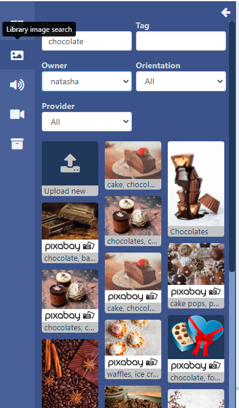
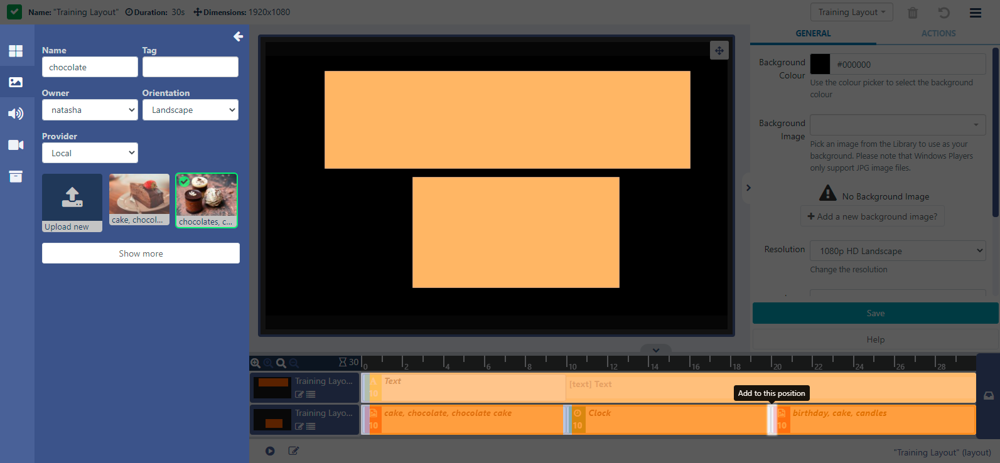
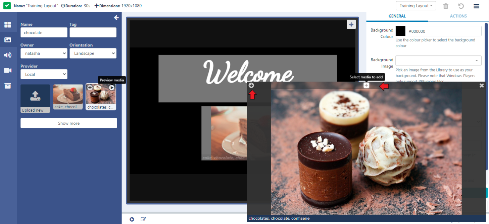
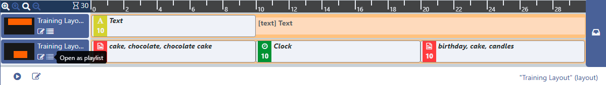
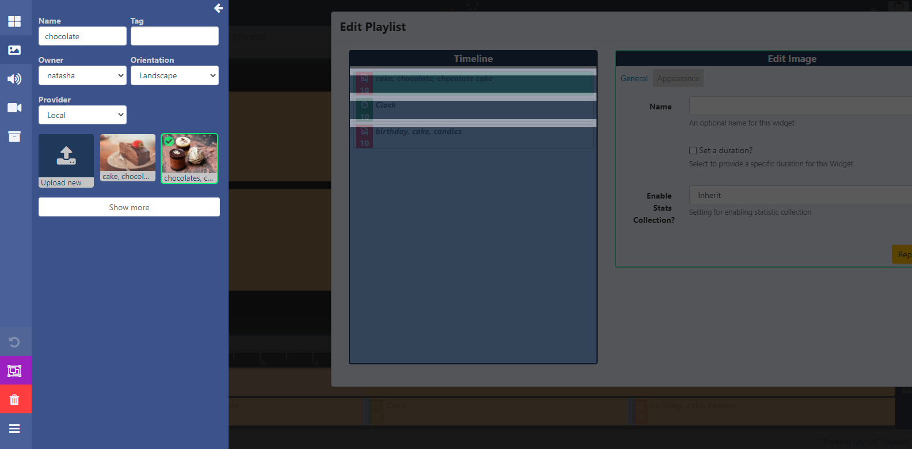

<!--toc=layouts-->

# Library Search

{tip}
If you are using a CMS earlier than v3.1.0 please select from the options below:

- 3.0.x CMS click [here](layouts_library_search_3.html)
- Earlier than 3.0.0 click [here](layouts_library_search_2.0)
  {/tip}

The **Toolbar** contains multiple **Library Search** options to give users an easy way to assign media which already exists in the [Library](media_library.html) to Layouts and Playlists.

- Select from image, audio, video or 'other media' files to open:

- Use the fields to narrow down searches.

Integration from Pixaby allows for images/videos to additionally be shown here.

{cloud}
Pixaby integration is enabled by default for Xibo in the Cloud customers.
{/cloud}

{noncloud}

Pixaby can be enabled from the **Administration** section of the CMS menu by clicking on **Applications** and scrolling down the page to the **Connectors** section. Click Configure and enter your API Key after signing up for a Pixaby account. [PixabyAPI Documentation](https://pixabay.com/api/docs/)
{/noncloud}

- Click on the **+** icon in the top left corner of a media file to select: 

{tip}

Select multiple files to add to the target Region in bulk. They will appear in the timeline in the same order they have been selected!
{/tip}

- Once selected click in the target Region to add.

- Files can also be added by drag and drop to the Region.

You can also add selections to a specific point on the **Timeline**, as indicated by the markers:

Files can be previewed before selecting. 

- Click on the Play icon in the top right corner of the media file. 

The file will open in a separate window where you can toggle to a larger window size using the arrow:

- Click on the **+** icon to select the media from the preview window.

- Add to a Region or Timeline.

{tip}
Use the **Upload new** button to add additional image files to the [Library](media_library)!
{/tip}

Library Media can also be added to a Region as a Playlist view by clicking on the menu to the right of the Timeline:

A Playlist view will open to add media in the same way, by clicking to add or drag and drop.

{tip}
Delete multiple items on the playlist using the purple **Select Multiple Widgets** button in the toolbar and then clicking on media in the timeline to select. Click the bin icon to remove all selections.
{/tip}

- Exit the Playlist view by closing down the Playlist window.

