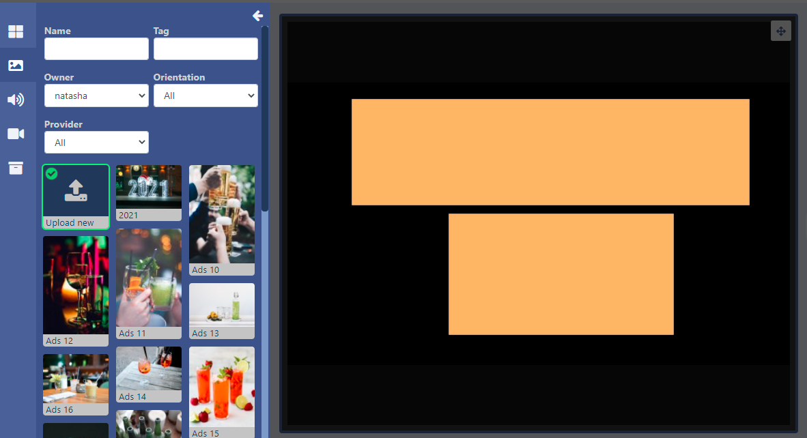

<!--toc=layouts-->

# Library Search

{tip}
If you are using a CMS earlier than v3.1.0 please select from the options below:

- v3.0.x CMS click [here](layouts_library_search_3.html)
- Earlier than v3.0.0 click [here](layouts_library_search_2.0)
  {/tip}

The **Toolbar** contains multiple **Library Search** options to give users an easy way to assign media which already exists in the [Library](media_library.html) to Layouts and Playlists.

- Select from Image, Audio, Video or 'other media' files to open:

- Use the fields to narrow down searches.

Integration from Pixabay allows for images/videos to additionally be shown here.

{cloud}
Pixabay integration is enabled by default for new Xibo in the Cloud customers.

If you are upgrading from an earlier version you will need to enable by navigating to the **Administration** section of the CMS and click **Applications**. Scroll down the page to the **Connectors** section. Click to **Configure** and tick to enable, **Save** changes.

{/cloud}

{noncloud}

Pixabay can be enabled from the **Administration** section of the CMS menu by clicking on **Applications** and scrolling down the page to the **Connectors** section. Click Configure and enter your API Key after signing up for a Pixabay account. [PixabayAPI Documentation](https://pixabay.com/api/docs/)
{/noncloud}

{tip}
Images/videos that are selected from Pixabay to be used in Layouts will automatically be added to your Library!
{/tip}

- Click on the **+** icon in the top left corner of a media file to select: 

{tip}

Select multiple files to add to the target Region in bulk. They will appear in the timeline in the same order they have been selected!
{/tip}

- Once selected click in the target Region to add.

- Files can also be added by drag and drop to the Region.

You can also add selections to a specific point on the **Timeline**, as indicated by the markers:

Files can be previewed before selecting. 

- Click on the Play icon in the top right corner of the media file. 

The file will open in a separate window where you can toggle to a larger window size using the arrow:

- Click on the **+** icon to select the media from the preview window.

- Add to a Region or Timeline.

Library Media can also be added to a Region as a Playlist view by clicking on the menu to the right of the Timeline:

A Playlist view will open to add media in the same way, by clicking to add or drag and drop.

{tip}
Delete multiple items on the playlist using the purple **Select Multiple Widgets** button in the toolbar and then clicking on media in the timeline to select. Click the bin icon to remove all selections.
{/tip}

- Exit the Playlist view by closing down the Playlist window.

## Upload new

New files can be uploaded from the **Toolbar** to be used directly in Layouts and saved to the Library.

- Open a Library Search for Image/Audio or Video and select **Upload new** and add to a Region:

The file uploader will open on adding:

- Click on **Add files** and select the file(s) to upload.

{tip}
We recommend the following file formats:

- **Audio** - mp3.wav
- **Image** - jpg,jpeg,png,bmp,gif (Animated gif's are not supported on any Player).
- **Video** - H264 MP4

{/tip}

Give your file a Name for easier identification in the CMS and an optional Tag.

{tip}
If the Name field is left blank, the file will be named as per the original file name on upload!
{/tip}

Files can be optionally saved to [Folders](tour_folders.html) for easier searches, organisation and to easily set [Share](users_features_and_sharing.html) options for Users/User Groups.

{tip}
Files that are saved in Folders will inherit the View, Edit, Delete [Share](users_features_and_sharing.html) options that have been applied to the destination Folder for User/User Group access!
{/tip}

Media uploaded directly to Layouts have the option to **Set Expiry Dates**

{tip}
This is particularly useful should you need to preload media to be shown at a later date/time!
{/tip}

- Tick the **Set Expiry Dates** box.

{tip}
**Please note:** Expiry Dates are currently not supported for the Linux Player!
{/tip}

- Select **Start** and **End** dates and times.

- Use the check boxes to remove the media file from the Playlist on expiry and delete from the Library.

- Click the **Start upload** button to begin the upload of all files added. If a Folder/Expiry Dates have been selected and there are multiple files to be added, all files will be uploaded to the specified location and have the same Expiry Dates set.
- Once successfully uploaded, click **Done**.

Files can also be uploaded individually and have different Folder locations/Expiry dates and times specified.
Instead of clicking on the Start upload button, click on the **blue upload** button shown at the end of the row for an added file. 

Change the Folder location using the **Select Folder** button as before and then click the blue button at the end of the row to upload just that singular file.

- Once all files have been individually uploaded, click **Done**.

{tip}
View or make changes to Expiry Dates by clicking on the icon on the uploaded media from the Timeline!
{/tip}

## Image Files

{tip}
We recommend the following file formats for images:

- jpg,jpeg,png,bmp,gif

  Animated gif's are not supported on any Player

{/tip}

When selecting image files to upload, users should check the resolution of the image and keep it within the intended screen size. Caution should be taken as uploading very large images can cause issues for the Player.

Please see the [Image](media_module_image.html) page for configuration options.

## Audio Files

{tip}
**Please note:** The Linux Player does not support Audio files.
{/tip}

{tip}
We recommend the following file formats for audio:

- mp3.wav

{/tip}

Please see the [Audio](media_module_audio.html) page for configuration options.

## Video Files

{tip}
We recommend the following file formats for video:

-  H264 MP4

{/tip}

When uploading video files the scroll bar can be used to select a frame to be used as the thumbnail in the CMS:

{tip}
The thumbnail will be used in the Library media grid for easier identification as well as being used for the Region preview when **Preview Enabled** has been ticked in the Video Module settings!
{/tip}

Please see the [Video](media_module_video.html) page for configuration options.