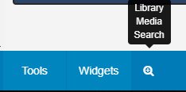
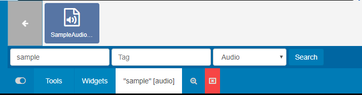
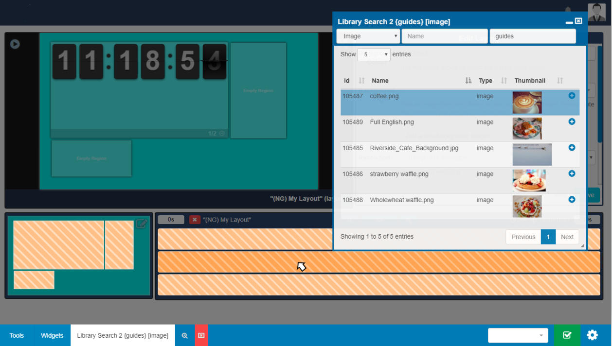

# Library Search

{tip}
**Please note:** This page is for users of a **2.0 - 2.2 CMS**. For an alternative version please select from the options below:

- 2.3.x CMS click [here](layouts_library_search_3.html)
- 3.0.x CMS click [here](layouts_library_search.html)
- 3.1.x CMS click [here](layouts_library_search.html)

{/tip}

The Library Search feature is used as a quick and easy way to assign **media** to **Layouts** which has already been uploaded to the Library.

Located on the bottom of the toolbar, click on the magnifying glass icon to create a new search tab.

Search fields can be used to search the CMS Library by **Name**, **Tag** or by using the drop down menu to search by a media **Type**. Click on the **Search** button to return results.

Returned results will open in a new window. 

{tip}
Use the resize handle in the bottom right corner of the Library Search window to minimise / maximise. Click and drag this window to any area of the Layout Designer.
{/tip}

Click on the plus icon to highlight the media item you wish to add and then select the target **Region** either in the Layout Timeline or Layout Navigator.

Once you have added the files you wish to use, click to minimise your search window back to the toolbar to be accessed again or close the search window completely.

{tip}
Create new tabs so that you can easily click between multiple search results.
Use the red X icon to easily close all open search tabs.
{/tip}

