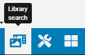
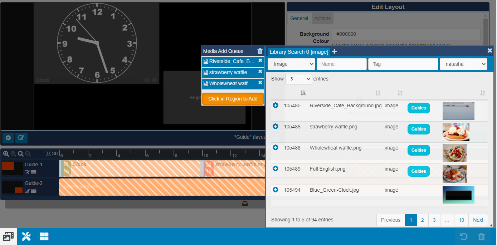
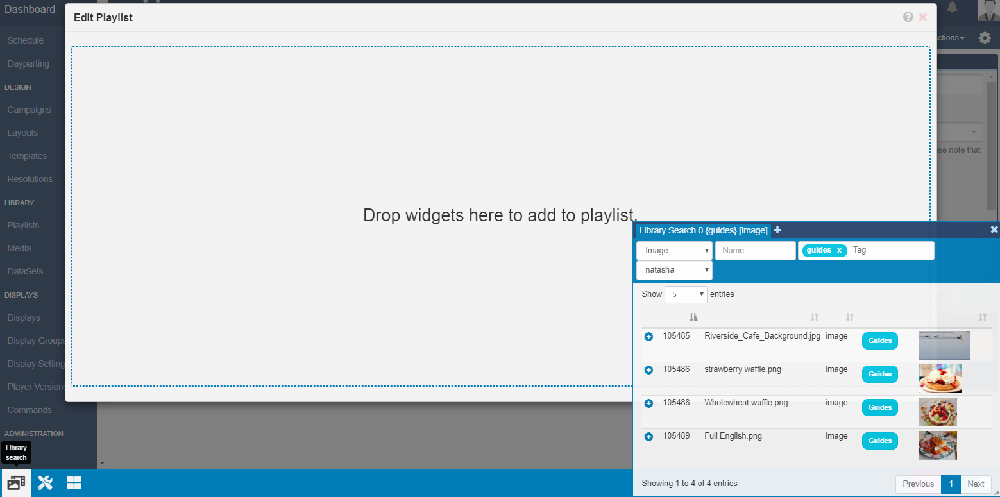

# Library Search

{tip}
**Please note:**

- If you are using a v3.1.x CMS, please click [here](layouts_library_search.html)
- If you are using a CMS earlier than v3.0.0, please click [here](layouts_library_search_2.0)
  {/tip}

The Library Search feature is used as a quick and easy way to assign **media** to **Layouts** which has already been uploaded to the Library.

{tip}
If you are using a version 2 CMS earlier than 2.3 please use the following link: [Library Search](layouts_library_search_2.0.html). 
{/tip}

Located on the bottom of the toolbar, click on the **Library Search** button to open the search window. 

Search fields can be used to search the CMS Library by **Name**, **Tag** and **Owner** as well as using the drop down menu to search by a media **Type**. 

{tip}
Use the resize handle in the bottom right corner of the Library Search window to minimise / maximise. Click and drag this window to any area of the Layout Designer.
{/tip}

Click on the plus icon to select the media you wish to add, which will show in the **Media Add Queue**.

{tip}
Drag and drop your queued media into another order and remove media files from this list.
{/tip}

Add your queued media by clicking in the target Region to add. 

You can also add media to a specific point on the **Timeline**, as shown by the markers

Library Search Media can also be added using an alternate view by clicking on the Menu icon for a Region.

A **Playlist view** will open, click on the **Library Search** button to add Media.

{tip}
Create multiple tabs in the Library Search window so that you can easily click between search results.
{/tip}

{tip}
Minimise the window by clicking on the `X` or by clicking on the Library Search button on the toolbar.
{/tip}

