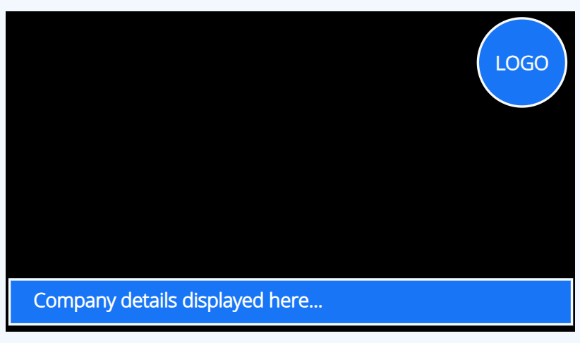

# Overlay Layouts

Create an Overlay Layout which when [Scheduled](scheduling_events.html#content-creating-a-schedule) will show on top of other Layouts in that schedule. 

{tip}
Overlay Layouts can also be Scheduled to be used with Layouts inside a [Layout List Campaign](layouts_campaigns.html#content-create-a-layout-list).
{/tip}

Overlay Layouts remain on top while your normal scheduled content changes underneath. This is particularly useful for logos, important information or emergency notices for example.

## Create an Overlay Layout

Overlay Layouts are created in exactly the same way as all other **Layouts**. Add content to fit around your existing designs so that your Overlay Layout can "sit on top" of other Layouts that are **Scheduled** at the same time as the Overlay.  Your Overlay Layout will display its all important content whilst the Layouts "underneath" play in rotation.

{tip}
[[PRODUCTNAME]] will not render the background on Players when a Layout is scheduled as an Overlay Layout.
{/tip}

{version}
**NOTE:** Layouts that contain Widgets / Media that use the Edge browser cannot be used with an Overlay Layout as content cannot sit on top of other content under these circumstances. This would include HLS and Embedded YouTube. If your content is not a video then the CEF browser can be used instead. 
{/version}

Overlay Layouts behave in a different way to Layouts when scheduled and will only render media content once so will not show any refreshed content.

If your Overlay Layout includes content which needs to be refreshed, Calendar or Ticker Widgets for example, a [Playlist](layouts_editor_playlists.html#content-add-playlists) should be added to the Layout and the media added to the Playlist. Then when it loads the next item in the Playlist it will reload the other items to show refreshed content.
