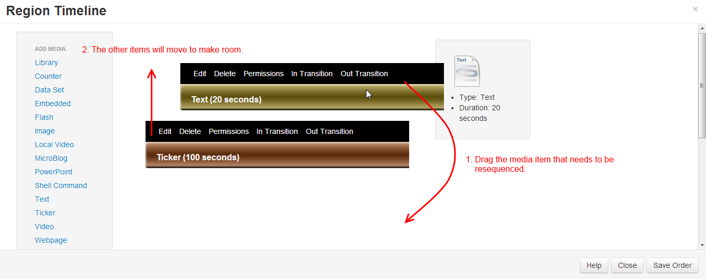
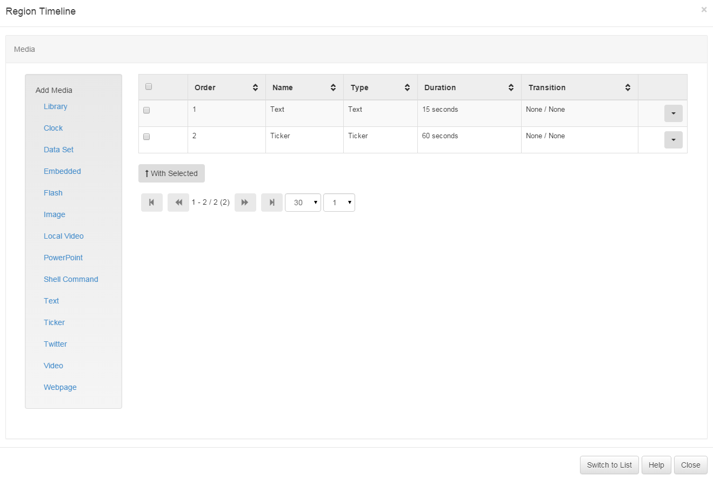

<!--toc=layouts-->
# Playlists

Each Region on a Layout has its own Playlist of content, which will be shown in
order by the Display Client. If required a Playlist can consist of a single item
(such as a company logo), or multiple items (such as an image slide show).

A Regions Playlist is viewed/edited by using the Region Action button and
selecting Edit Playlist. The following form is shown.

The items assigned to the Playlist are called **Widgets** and can either be
files stored in the Library or [Modules](media_modules.html).

The sequence of Widgets in the Playlist is vertical - top down.

## Assigning Widgets to Regions

Widgets are assigned to a Region Playlist using the " Widget Toolbox" shown on
the left hand side of the Region Playlist form. This toolbox lists all of the
enabled media types on the CMS.

The different types of Widget available can be enabled / disabled by an
administrator in the [Modules section](media_modules.html).

### Adding from the Library

The first link in the Widget Toolbox is the "Library" link. This allows
library files to be assigned directly from the CMS library. This content may
have been uploaded in a different Layout, or directly into the Library.

Pressing the "Library" link in the Widget toolbox will open the Assignment form
(above). The Assignment form is a standard CMS form with a "staging area" for
media which has been queued for assignment.

Library items are assigned using the plus icon, once pressed the item is
automatically moved to the staging area. Items can be removed from the staging
area using the minus icon.

### Editing Widgets

Widgets that have already been assigned to the Playlist can be edited or removed
using the links on the Playlist Widget bars. Each bar has its own "Action" links.

### Deleting Widgets

Widgets can be deleted by selecting the Delete button on the Playlist Widget
Bar. If a Library Widget is selected the option to "Delete from the Library"
will also be shown.

### Reordering Items in the Playlist

The sequence of a media item in the Playlist can be changed with drag and drop.
Once the item in the desired position press the "Save Order" button at the
bottom of the Region Playlist form.

## Grid View

An alternative view of the playlist is available called the "Grid View". This
view is very similar to other grids seen throughout the application.

The grid view is particularly useful for deleting more than one Widget at a
time.
