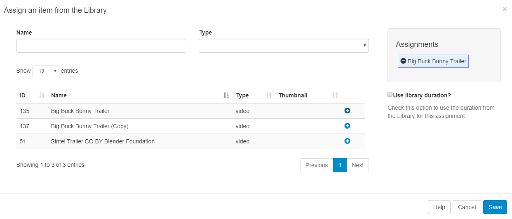
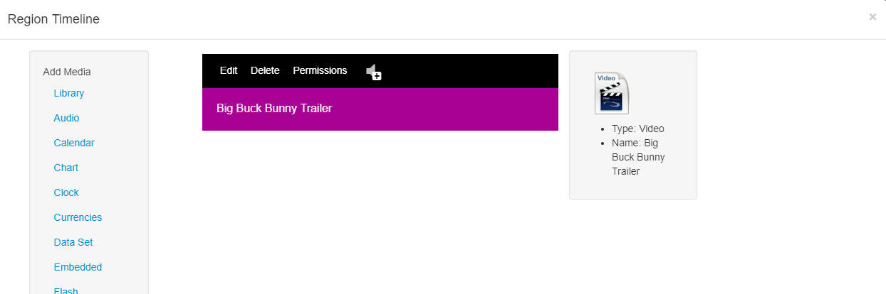

<!--toc=layouts-->

# Playlists

Each Region on a Layout has its own Playlist of content, which is shown in the specified order by the Display Client. A Playlist can consist of a **single item** (such as a company logo), or **multiple items** (such as an image slideshow).

A Regions Playlist is viewed/edited by using the Region Menu and selecting **Edit Timeline** (or by double clicking within the Region).

Items assigned to Playlists are called **Widgets** which are files stored in the [Library](media_library.html) or enabled [Modules](media_modules.html).

## Assigning Widgets 

Widgets are assigned to a Region Playlist using the Widget Toolbox, shown on the left-hand side of the Region Timeline form. The toolbox lists all of the enabled media types for your CMS.

<tip>
Widgets that are available can be enabled/disabled by an Administrator in the Modules section of the CMS.
</tip>

## Assigning Content

Library files can be assigned directly from the CMS Library by clicking on Library in the Widget Toolbox. This content may have been uploaded to another Layout or directly to the Library.

Assign Library items using the plus icon, once pressed the selected item will move to the **Assignments** staging area. Items can be removed from here by using the minus icon.

### Playlist Widget Actions

Each Widget assigned to a Playlist has its own set of "Actions" to edit, delete, assign Permissions and assign Audio.

<tip>
Select Edit and use the tabs to locate the **Set a duration?** check box to override the systems default duration for the selected Widget.
</tip>

## Reordering Items in the Playlist

Widgets in the Playlist are played from top to bottom. The sequence can be changed by dragging and dropping to the required order and pressing the **Save Order** button at the bottom of the Region Timeline form.

## Grid View

Use the **Switch to Grid** button at the bottom of the Region Timeline form for an alternative view of the Playlist.

<tip>
The grid view is particularly useful for deleting more than one Widget at a time.
</tip>