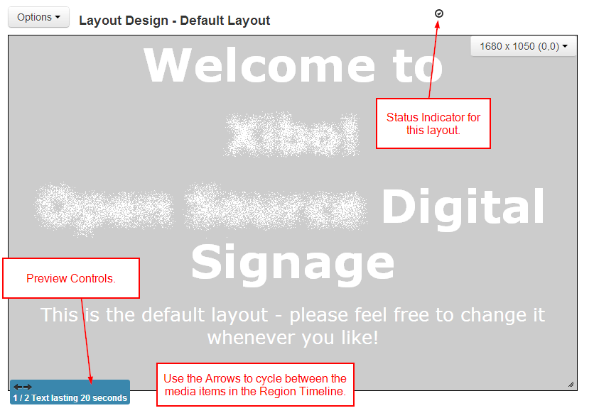

<!--toc=layouts-->
# Previewing

## Regions
The Layout Designer offers a preview of many Media Types directly in the Designer Window. This preview is accessed using the Preview Controls that appear in the bottom left of all Region windows.

## Layouts
A whole Layout can be previewed using Preview Layout in the options menu. The Layout preview opens *a new window* and runs through the entire Layout from start to finish.

Before the Layout can start all media must be downloaded to your browser and verified, so there might be a slight delay while this happens.

### Supported Media
The Layout Preview uses the capabilities of your Desktop Browser to display as much of the Layout as possible. Usage of 3rd party plugins is kept to a minimum.

 - Images are rendered in a `
` using CSS3 background-image
 - Text/Ticker and other HTML content is rendered in `<iframe>`'s
 - Videos are rendered using the `<video>` tag
 - Flash is rendered using the flash plug-in

