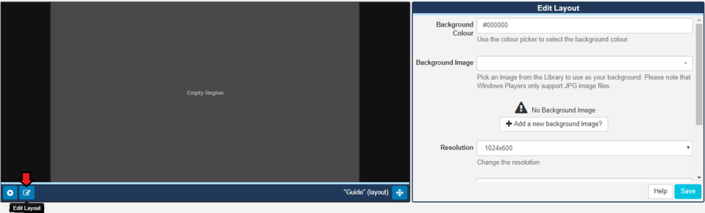
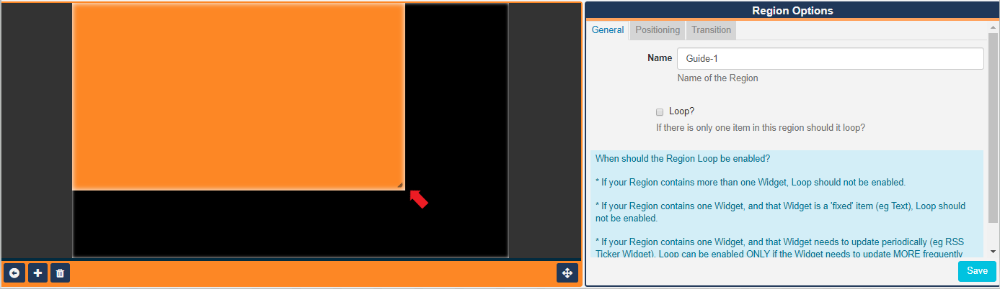
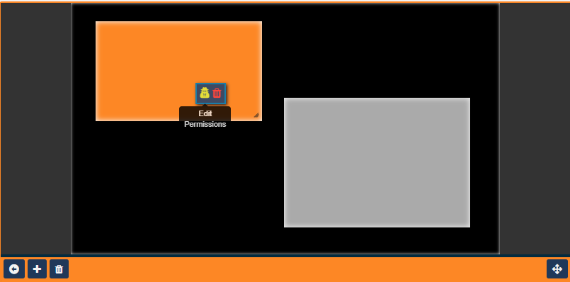

<!--toc=layouts-->

# Regions 

Regions define areas on a **Layout** which hold **Widgets** (media content) to form sets of timed content.

{tip}
If you are using a version earlier than 2.3 for the v2 CMS, please use the following link: [Regions v2](layouts_regions_2.0.html)
{/tip}

{tip}
If you are using the **1.8 series**, please use the following link: [Regions 1.8](layouts_regions_1.8.html)
{/tip}

A new Layout will contain one full size empty **Region** by default ready for resizing, positioning and adding media content to. 

Click on the 'edit' icon located in the bottom left hand corner of the Layout View window to open the **Layout Editor**. 

{tip}
You can toggle to a full sized screen using the icon located in the bottom right of the editor.
{/tip} 

**Regions** can be positioned anywhere inside the **Layout Editor** canvas using drag and drop, and resized by using the resize handle located in the lower right-hand corner of the Region. 

Click inside a Region to use the resize handle and to open the **Region Options** form for further configuration.

{tip}
When you are in **Layout Editor** mode you will notice that the window toolbar changes to orange!
{/tip}

Click on the icon to add more Regions.

Remove Regions and all associated content by clicking in the Region you wish to delete and then click on the icon. **Please note: This action cannot be undone!**

{tip}
Regions can also be deleted from here or from the Timeline by clicking on a Region and clicking the bin icon on the bottom toolbar or by right clicking on the target Region and selecting the bin icon from the pop up menu.
{/tip}

Click on to exit edit mode and return to the Layout View.

## Region Options

### General

This tab allows you to optionally create a name for a Region for easier identification, and to enable the  **Loop** option if it is required.

{tip}

#### When to enable Loop?

It may be desirable to have a Region with just 1 media item reload when that item has finished. With the **Loop** ticked the media item will reload each time it expires and show refreshed content until other Regions have fully played out. Loop is only effective for a Region with only 1 media item and should only be used for certain Media types where the content changes (Ticker RSS, Calendar etc).

#### Consider the following rules when thinking about using the Region Loop option for the best results:

- If your Region contains more than one Widget, Loop should not be enabled.
- If your Region contains one Widget, and that Widget is a 'fixed' item (eg Text), Loop should not be enabled.
- If your Region contains one Widget, and that Widget needs to update periodically (eg RSS Ticker Widget), Loop can be enabled ONLY if the Widget needs to update MORE frequently than the duration of the overall Layout.

{/tip}

### Positioning

This tab allows for precise sizing and positioning as well as the ability to set a **Layering Order** for playback.  

### Rules for Layering Regions

{tip}
**Please note:** You cannot overlay anything on a Region that has Widgets / Media that use the Edge browser. This would include HLS and Embedded Youtube.
For content other than a video you can use the CEF browser instead.
{/tip}

If required, overlapping Regions can be ordered for playback using z-index settings.

Enter a number in the **Layer** field to determine the order that Region should be shown within the overall stack.

The **Layer** order is determined by the number entered here, with 1 considered the lowest Layer. The higher the number the higher the Layer.

{tip}
On some devices, it is impossible to overlay anything on a Region showing a **Video** or **VideoIn** Widget. Whether it is possible will depend on the device and whether hardware accelerated playback is being used. In general, it is possible on Android (when **not** using the SurfaceView option in the [Display Settings Profile](displays_settings.html)), Linux, Tizen and webOS Players, but if you have a requirement for this, be sure to test your intended device carefully to ensure this works in your use case.
{/tip}

At the bottom of this tab, click on the **Make this Region full screen** text to resize as shown by the dimensions displayed here.

### Exit Transition

**Exit Transitions** happen when the last media item in a Region is shown and occurs only when all other media items have expired in the other Regions. 

{tip}
Transitions are supported in the Android, webOS, Tizen Players and Windows Players from v2 R252 and need to be pre configured. Please contact your Administrator.
Transitions are currently not supported in the Linux Player.
{/tip}

Ensure any edits made are saved using the **Save** button on the Region Options form before returning to the Layout View.

### Permissions for a Region

Control which **User** and **User Groups** can view/edit/delete the Region.  

Assign/edit Permissions by right clicking on the target Region to open the Permissions form.

{tip}
Alternatively Permissions can also be located from the [Tools](layouts_tools.html) button on the bottom toolbar. Click or drag to the target Region, and complete the Permissions form as appropriate.
{/tip}

**Please note:** The owner of the Layout has full control over sharing. 

{tip}
A globally shared Layout can have Region access rights defined for any other users of the CMS. Read more for [Permissions for User Objects](users_permissions.html#user_objects) 
{/tip}

