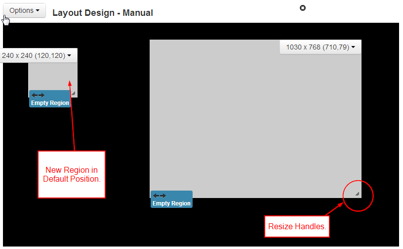

<!--toc=layouts-->
# Regions

Regions are defined areas on the Layout that can hold sets of content (called
Playlists). Regions can be moved around inside the Layout using drag and drop,
and resized using the Resize Handle in the Lower Right hand corner of the
Region.

**Regions are shown on the Layout Designer as semi-transparent white overlays.**

With each change to a Region a "Save Position" button will appear at the top of
the Layout. This must be clicked to Save the Changes that have been made.

If a Layout has been created from a Template it will most likely have a full
screen Region pre-created. Make sure you don't accidentally create regions
over the top of this one - empty regions cause the Layout to be marked as
invalid.

The Windows Player does not support overlapping Regions - if you have a mixed
player network then for the best compatibility please sure the Regions do not
overlap.

## Adding Regions

Regions are added using the toolbox "Add Region" button. Once the button is
clicked a new region appears and is ready to be moved or resized by the
designer.

## Region Menu

Each Region has its own menu of Actions which appears at the top right of
the Region appears when the mouse is hovered over the region. It also shows the
Width, Height and Coordinates.

The menu's default action is "Edit Timeline" which can also be accessed by
double clicking on the region.

- **Edit Timeline**
    Assign content to this Region or change the sequence of existing content.

- **Options**
    Assign the Region a name and manually adjust its width, height and coordinates.

- **Delete**
    Completely remove this Region and all its associated content.

- **Permissions**
    Control which users and user groups can view/edit/delete this Region.

Ideally Regions that are intended for Video content should be at the same aspect
ratio as the indented content.

## Options

The Region options form allows for naming a region, precise sizing and
positioning and exit transitions.

To get a full screen Region go into the Region options and select "Set Full
Screen".

## Permissions

The owner of the layout has full control on how the new layout is to be shared.
A globally shared layout may have one of its layout region access rights being
disabled for any other user edit. Use the Region Action Menu and select
"Permissions" to define the selected region access rights to other users of the
CMS.

### Inheritance

By default the CMS will inherit permissions from the Layout when creating new
Regions and assigning new Widgets. This allows user collaboration on a Layout.

If this option is turned off in global settings, new items created by a user
will not automatically get shared with other collaborators.
