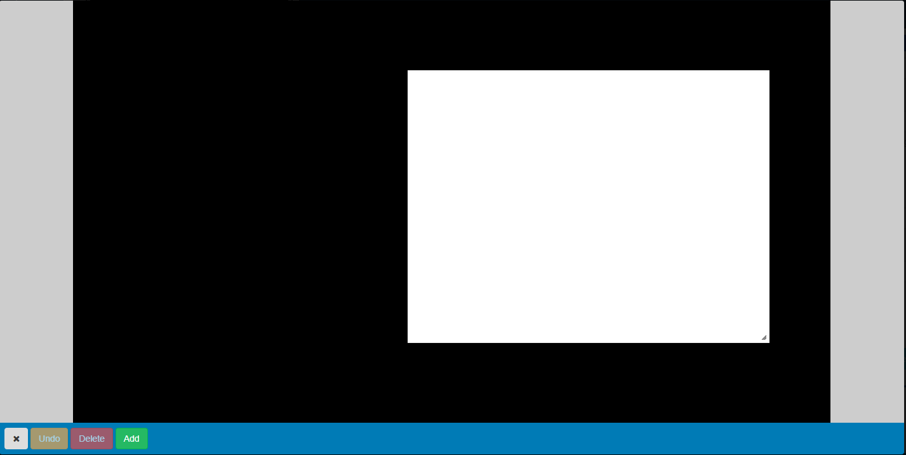
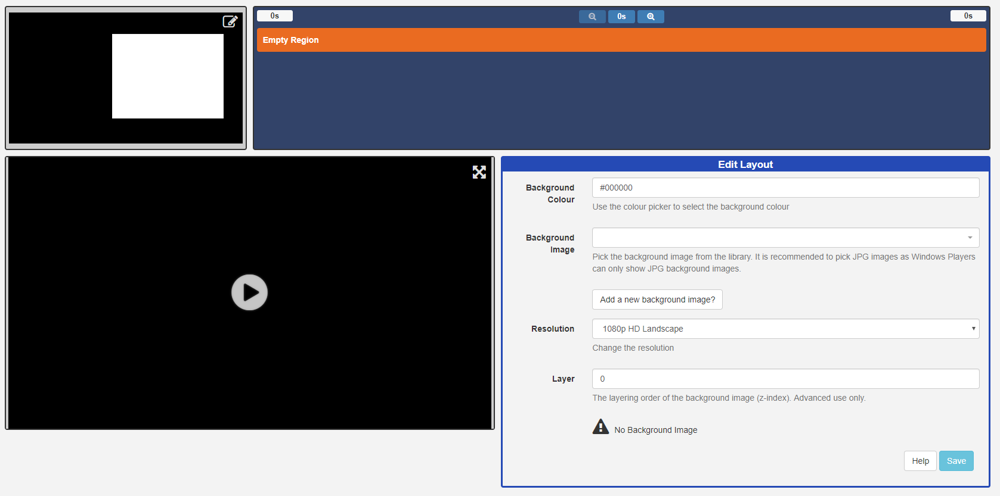
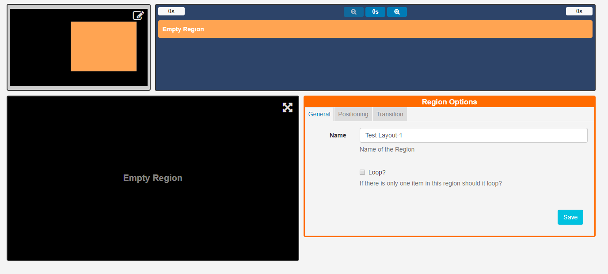
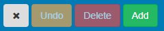
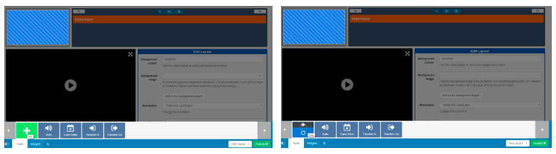

<!--toc=layouts-->

# Regions (New Features for v2)

Regions define areas on a **Layout** which hold **Widgets** (media content) to form sets of timed content.

{tip}
If you are using 1.8 please use the following link to the appropriate manual page for your version: [Regions 1.8](layouts_regions_1.8.html)
{/tip}

{tip}
A new Layout will contain one full size empty **Region** by default ready for resizing, positioning and adding media content to. 

Ensure that the Layout has been 'checked out' to enable editing.
{/tip}

Click on the 'edit' icon located in the top right hand corner of the **Layout Navigator** window to open.

**Regions** can be positioned anywhere inside the **Layout** canvas using drag and drop, and resized by using the resize handle located in the lower right-hand corner of the Region. 

Click on **X** located on the left of the toolbar to save changes and exit the window. The **Layout Navigator** will now show the **Region** resized and positioned.

{tip}
As all edits made here are autosaved click on **Undo** to revert any changes.
{/tip}

Further actions can be accessed by clicking on a Region on the Layout Navigator. Edits can be made using the **Region Options** form.

## Region Options

### General

Complete a name for the Region and use the checkbox to Loop the content if required.

### Positioning

This tab allows for precise sizing and positioning.  **Make the Region full screen** by clicking on the text which will display the dimensions the Region will be set by.

### Transition

**Exit Transitions** happen when the last media item in a Region is shown and occurs only when all other media items have expired in the other Regions. 

{tip}
Transitions are only supported in the Linux, Android and webOS Players and need to be pre configured. Please contact your Administrator.
{/tip}

## Adding Regions

Regions can be added in two ways:

- open the **Layout Navigator** window and click on the **Add** button.

  

- select **Tools** on the bottom toolbar and click on **Region** to add or drag to the Layout Navigator window.

### Deleting Regions

Remove Regions and all associated content by clicking on a **Region** to highlight then **click** on the **bin icon**, located at the bottom right of the toolbar. **This action cannot be undone**.

{tip}
Delete by right clicking on the target Region.
{/tip}

### Permissions for a Region

Control which **User** and **User Groups** can view/edit/delete the Region.  Click on the **Permissions** button, located under **Tools** on the toolbar then click or drag to the target Region. Edit the Permissions form as appropriate.

{tip}
Assign/Edit permissions by right clicking on the target Region.
{/tip}

**Please note:** The owner of the Layout has full control over sharing. 

{tip}
A globally shared Layout can have Region access rights defined for any other users of the CMS. Read more for [Permissions for User Objects](users_permissions.html#user_objects) 
{/tip}

{tip}
**Please note:** The Windows Player does not support overlapping Regions. For a mixed Player network ensure Regions do not overlap for the best results.
{/tip}