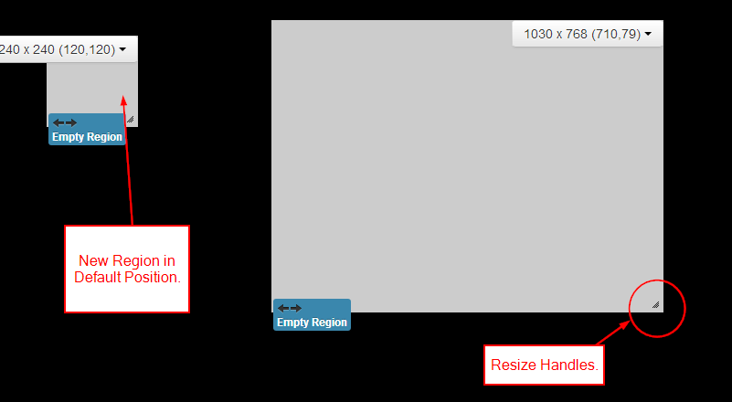

# Regions

{tip}
**Please note:** If you are using a CMS later than 1.8.x please select from the options below:

- 2.0.x CMS click [here](layouts_regions_2.0.html)

- 2.3.x CMS click [here](layouts_regions_3.html)

- 3.0.x CMS click [here](layouts_regions_3.html)
- 3.1.x CMS click [here](layouts_regions)

{/tip}

Regions define areas on a Layout which hold Media content (Widgets) to form Playlists (sets of timed content).

Regions can be positioned anywhere inside a Layout using drag and drop, and resized by using the resize handle located in the lower right-hand corner of the Region.

**Regions show on the Layout Designer as semi-transparent white overlays.**

{tip}
Each change that is made to a Region must be saved using the Save Region Positions button, or it will revert back to previous settings.
{/tip}

## Adding Regions

Add Regions by using the **+Region** button in the toolbox, a new Region will appear in the top left of the Layout, which can then be moved or resized by the designer.

{tip}
If a Layout has been created from a Template it will most likely have a full-screen Region pre-created. Make sure you don't accidentally create new Regions over the top of this one, empty Regions cause the Layout to be marked as invalid and **WILL NOT PLAY**.
{/tip}

## Region Menu

Each Region has its own drop-down menu of Actions, located at the top right corner of a Region, as well as showing the width, height and coordinates of that Region.

### Edit Timeline 

Assign content to the Region or amend the existing Playlist.

{tip}
The menu's default action is **Edit Timeline** which can also be accessed by double-clicking on the Region.
{/tip}

### Options

This form allows for naming, precise sizing and positioning as well as Exit Transitions and Layering. Use the **Set Full Screen** button at the bottom of this form to set the Region full screen.

**Exit Transitions** happen when the last Media item in a Region is shown and occurs only when all other Media items have expired in the other Regions. 

{tip}
Transitions are only supported in the Ubuntu /Android and webOS Display clients and need to be configured, please contact your Administrator.
{/tip}

### Delete

Remove the Region and all its associated content. This action cannot be undone.

### Permissions

Control which User and User Groups can view/edit/delete the Region.

The owner of the Layout has full control over sharing. 

{tip}

A globally shared Layout can have Region access rights defined for any other users of the CMS. Read more for [Permissions for User Objects](users_permissions.html#user_objects) 
{/tip}

{tip}
**NOTE:** The Windows Player does not support overlapping Regions. For a mixed Player network ensure Regions do not overlap for the best results.
{/tip}