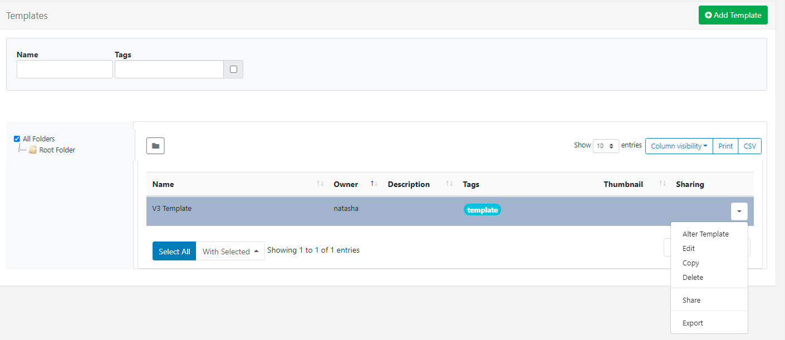

<!--toc=layouts-->

# Templates

{tip}
If  you are using a CMS earlier than v3.0.0 please use the following link: [Templates](layouts_templates_2.html)
{/tip}

Templates are saved copies of **Layouts** which can then be used to create new Layouts. Using a template can speed up the design process and are a good way to ensure that a corporate image/standard is maintained. 

## Creating a Template

Templates can be created two ways:

1 - Adding directly from the **Templates** page

2 - Saving an existing **Layout** as a Template

## 1. Add Layout from Template Page

- Click on **Templates** under the **Design** section of the main menu
- Select the **Add Template** button and complete the appropriate form fields.

### Folder

Templates can be optionally saved to **Folders**.

{tip}
Templates that are saved in Folders will inherit the View, Edit, Delete **Share** options that have been applied to the destination Folder for that User/User Group!
{/tip}

- Click on the **Select Folder** button and expand to select the Folder to save in.

![UPDATE IMAGE]

The selected folder file path will be shown next to the Folder field on the form. 

Users can also right click a folder to create a new Folder to save in and access further options:

{tip}
Available Folder options are based on enabled [Features and Share](users_features_and_sharing.html) options for a User/User Group.
{/tip}

{nonwhite}
Further information for Administrators regarding Folder access and set-up can be found [here](https://xibo.org.uk/docs/setup/folders-administration)
{/nonwhite}

{white}
For further information regarding Folder access and set-up, please speak to your Administrator.
{/white}

### Name

- Give the Template a **Name** for easy identification purposes when selecting to use by Users.

### Tags

Templates can be tagged for organisation and to make it easier to find a large number of Templates when grouped by Tag.  When entering text into the Tag field on the form, an auto complete helper will show possible matches to make it easier for Users to select from.

Predefined  Values will be shown by using the **Tag value** drop down, if the Value is already known it can be typed directly into the field using the following format: `Colour|Red`

{tip}
If a Value has been set as 'Required' by an Administrator, then the Value must be entered in order to save the form!
{/tip}

Users can add an associated Value to a Tag that does not already have a predefined value by using the **Tag value** field. If a Tag value is not needed, this field can be left blank.

{tip}
Tags can also be assigned to multiple Templates using the [With Selected](https://xibo.org.uk/manual/en/tour_grids.html#multi-select) option at the bottom of the Template grid!
{/tip}

For further information on what **Tag **and **Tag Values** to use, please speak with your Administrator.

{nonwhite}
Tag management information for Administrators can be found [here](https://xibo.org.uk/docs/setup/tags-adding-editing-assigning)
{/nonwhite}

### Resolution

Templates/Layouts are designed for an intended display resolution and will function best when shown on a **Player** with a matching resolution. If they are shown on a display that has a different resolution it will dynamically resize which may result in unused screen space.  

{tip}
Sending a Player a Layout that has been designed with a 4:3 resolution which is connected to a 16:9 TV screen would result in two empty bars either side of your content. 
{/tip}

**If you require an alternative resolution to the available options listed, contact your Administrator**

{nonwhite}
Resolution management for Administrators can be found [here](https://xibo.org.uk/docs/setup/resolutions-administration)
{/nonwhite}

{tip}
Use the **Description Tab** to complete useful information/instructions for other users of the Template!
{/tip}

### Save

On saving the form, the [Layout Designer](layouts_designer.html) will automatically open.

## 2. Saving a Layout as a Template

A **Published Layout** can be saved as a Template from the **Layout Designer** by using the menu on the toolbar and selecting **Save Template**.

{tip}
Layouts can also be saved as Templates by using the **Row Menu** for a Layout in the Layouts Grid and selecting **Save Template**!
{/tip}

- Complete the form fields, move from the Current Folder location and assign Tags if required.
- Use the tick box to include all Widgets  that have been added to the Layout to the Template.

Once saved, Templates can be managed from the Templates grid.

## Row Menu

Each Template has additional actions/shortcuts that can be accessed from the Row Menu.

### Alter Template

Use to open the Layout Designer to make design changes to the Template.

{tip}
If the Layout design has been **Published**, Checkout to make changes or view in a Read Only mode!
{/tip}

### Edit

Make changes to the Template record such as, Folder location, Name and Tags etc. 

### Copy

Create copies of Templates and choose to include all contained **Media** items, to use as a base for creating new Templates or to simply make modifications. 

### Delete

Remove a Template and all its associated media. Layout specific media such as Text/RSS will be deleted. **Please note:** This action is irreversible!

### Share

Enable [**View**, **Edit** and **Delete**](users_features_and_sharing.html) access for selected Users/User Groups.

### Export

Export the Template including all associated Widgets/Media/DataSet structures to a ZIP file, so it can be easily shared. 

{tip}
When exporting a Template, all assigned **Layout**, **Playlist** and **Media Tags** will be exported. Select the **Import Tags** option to add these Tags on Layout Import.
{/tip}

{tip}
Use the **With Selected** option at the bottom of the Templates [Grid](tour_grids.html) to Edit Tags, Delete and Share in bulk actions!
{/tip}

