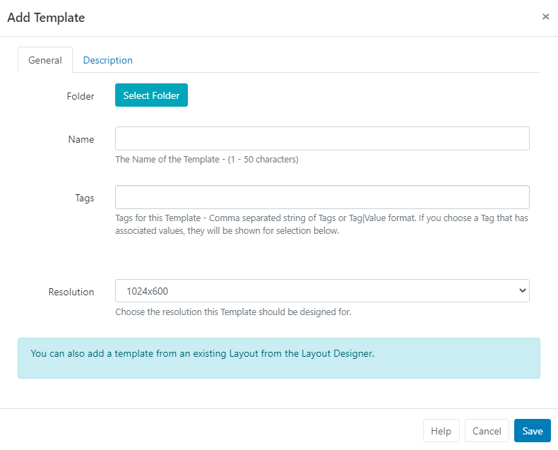
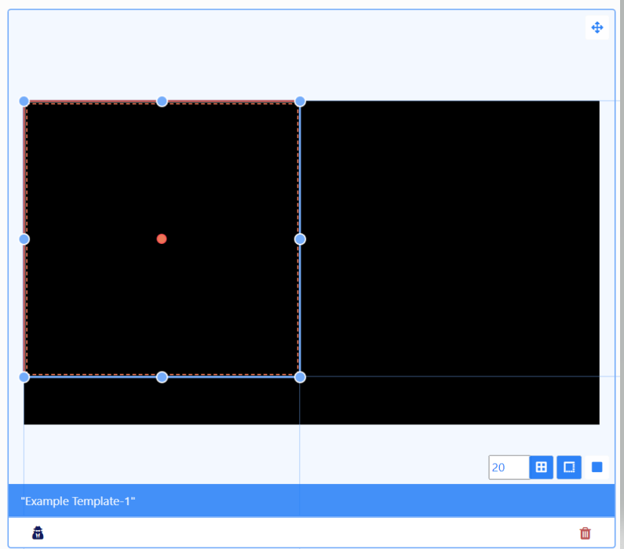
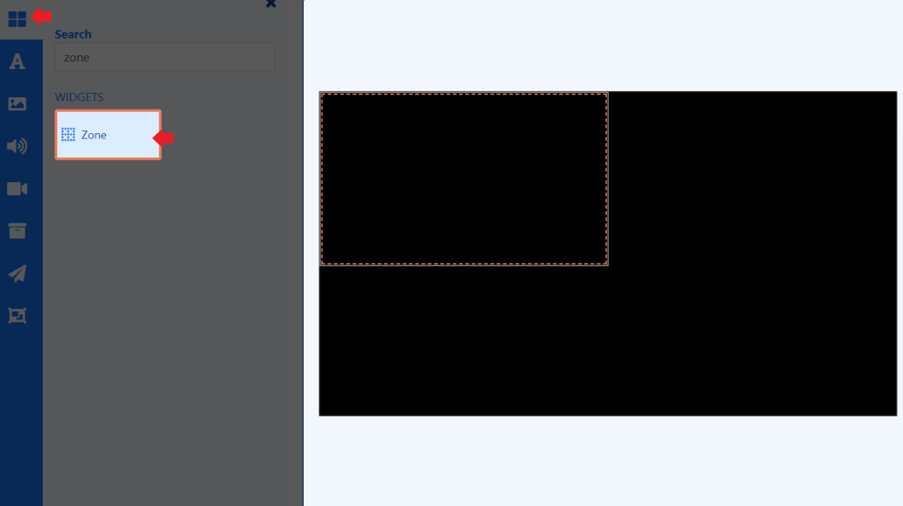
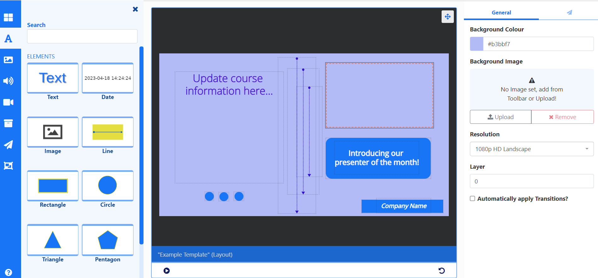
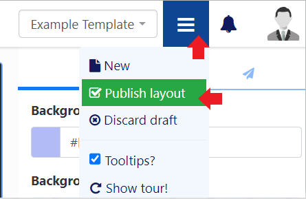
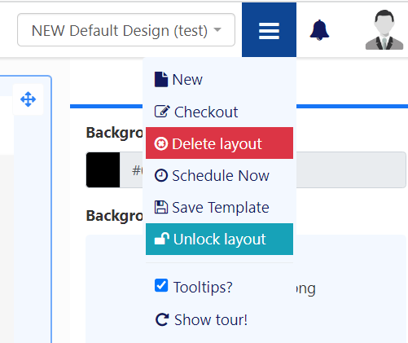

# Templates

Use Templates to speed up the design process and ensure a corporate standard is maintained.

## Feature Overview:

- Use existing Layout designs to easily save as Templates.
- Create and manage Templates from a dedicated page for easier management.
- Add Zones to Templates to act as content placeholders on a Layout.
- Set Share options to restrict User access to selected zones on a Template.
- Show Published Templates for selection in the Layout Editor.
- Speed up the entire Layout design process for all Users.
- Apply a standardised look to all Layouts.

Create new [Templates](layouts_templates.html#content-create-template) to use or save your existing [Layout](layouts_templates.html#content-save-layout-as-template) designs to use as Templates for future Layouts.

## Create Template

Templates are created by selecting **Templates** under the **Design** section of the main CMS menu.

- Select the **Add Template** button and complete the form fields.

[Folders](tour_folders.html) are used to organise, search and easily [Share](users_features_and_sharing.html#content-share) User objects with other Users/User Groups. Templates saved to a Folder will inherit the access options applied to that Folder.

{tip}
If Users should also have access to the content of the Template (image media files for example), ensure that these are also saved to the same Folder!
{/tip}

- Give your Template a **Name** for easy identification in the CMS and include optional [Tags](tour_tags.html).

- Select the [Resolution.](layouts#content-resolutions) 

On **Saving**, the [Layout Editor](layouts_editor.html) will automatically open with one full size Zone.

Zones are used to define areas on a Layout which content can be added to.

{tip}
If you don't want to include any Zones and add content directly to the Template, remove the Zone from the canvas by right clicking and selecting **Delete**. Add content in the same way as creating a [Layout](layouts.html).
{/tip}

### Adding Zones

{tip}
Zones are only available when creating a new **Template** or by selecting **Alter Template** from the row menu for an existing Template from the Templates grid!
{/tip}

- Click anywhere on the zone to select to resize and move:

{tip}
Use the buttons in the bottom right of the viewer to select to **Snap to Grid**, **Snap to Borders** or **Snap to Elements** for easier positioning when adding items.
{/tip}

**Zones** can be added from the toolbar:

- Click on the top **Widget** button.
- Use the scroll bar or enter `Zone` in the Search field.

- Select the Zone and drag and drop or click on the canvas to add.
- Resize and Position on the canvas.
- Set to **Loop** only if the Zone contains a Widget that needs to update periodically (e.g. RSS Ticker) and it needs to update more frequently than the duration of the overall Layout.

### Layering

Use the positioning tab in the properties panel to set [Layering](layouts_editor.html#content-layering) for overlapping Zones/content.

{tip}
Right click to show a [context menu](layouts_editor.html#content-context-menu) and easily move items backwards and forwards.

[Sharing]((users_features_and_sharing.html#content-share)) options are particularly useful if you want a User to only have access to a section of the Layout to manage.
{/tip}

Add both [content](layouts_editor.html#content-toolbar) and Zones to your Template to build your design. 

{tip}
Adding multiple items to one zone will create a [Playlist](media_module_playlist.html).
{/tip}

Once your Template is complete, use the menu at the top of the editor to **Publish**:

Published **Templates** will show for selection in the toolbar of the Layout Editor when creating Layouts!

## Save Layout as Template

Published Layouts can be saved as a Template from two locations:

- From the [Layout Editor](layouts_editor.html), after **Publishing** go back to the menu and select **Save Template**:

- From the [Layouts](layouts.html) grid, use the row menu for a **Published** Layout and **select Save Template**.

Complete all relevant form fields to save the selected Layout as a Template.

{tip}
Use the tick box to include all **Widgets** that have been added to the Layout to be included in the Template.
{/tip}

- **Save**

{tip}
Layouts that are saved as a Template can be viewed and edited from the **Templates** grid under the **Design** section of the main CMS menu.
{/tip}

## Row Menu

All Templates have a row menu where Users can access a list of actions/shortcuts.

- Notable settings are listed below:

#### Alter Template 

Select to make design changes to the Template in the Layout Editor.

#### Checkout

To make edits to a Published Template click to Checkout and create a draft. Once edited the Template can be published to make the changes permanent overwriting the existing Template. Discard will revert the Template back to its original published state.

{tip}
Take your time with any edits you need to make as using **Checkout** ensures that no changes are made to your published version or shown on scheduled **Displays** until you choose to do so. **Publish** confirms changes have been made and will overwrite your published version. **Discard** will delete the draft with the published version remaining untouched.
{/tip}

#### Publish

Select to Publish to add to Templates which can be selected in the Layout Editor when creating Layouts.

#### Discard 

Discard all changes made to a draft and revert back to the previous Published version.

#### Share

Set [Share](users_features_and_sharing.html#content-share) options for User/User Group access to individual Templates.

#### Export 

Export the Template including all associated Widgets/Media/DataSet structures to a ZIP file, so it can be easily shared. 

{tip}
When exporting a Template, all assigned **Layout**, **Playlist** and **Media Tags** will be exported. Select the **Import Tags** option to add these Tags on Layout Import.

Use the **With Selected** option at the bottom of the Templates grid to perform bulk actions for multiple Templates! 
{/tip}

#### Next...

[Overlay Layouts](layouts_overlay.html)

