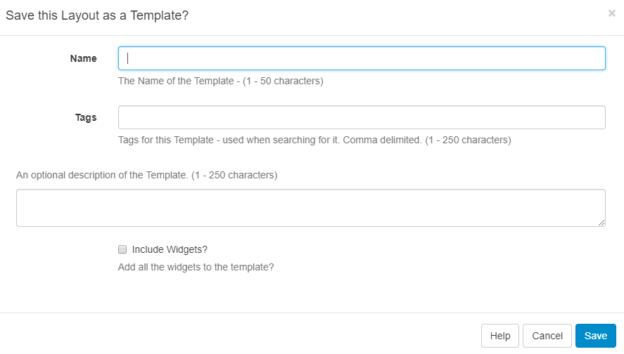

<!--toc=layouts-->
#Templates
Templates are saved copies of Layouts that can be used when creating a new Layout. Saving a using a Template can save a lot of time spent on the design process.

##Saving
Templates are saved from the Layout Designer Options menu using the "Save Template" menu item.

Saving a template will store an exact copy of the layout, including regions, playlists and media.

## Import / Exports
Templates can also be exported and imported so that they can be shared across users.