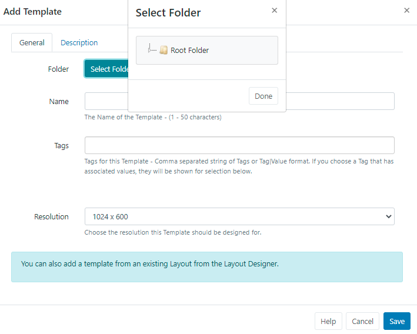
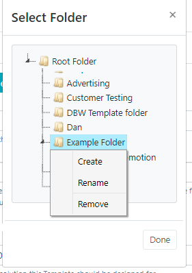
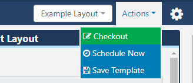
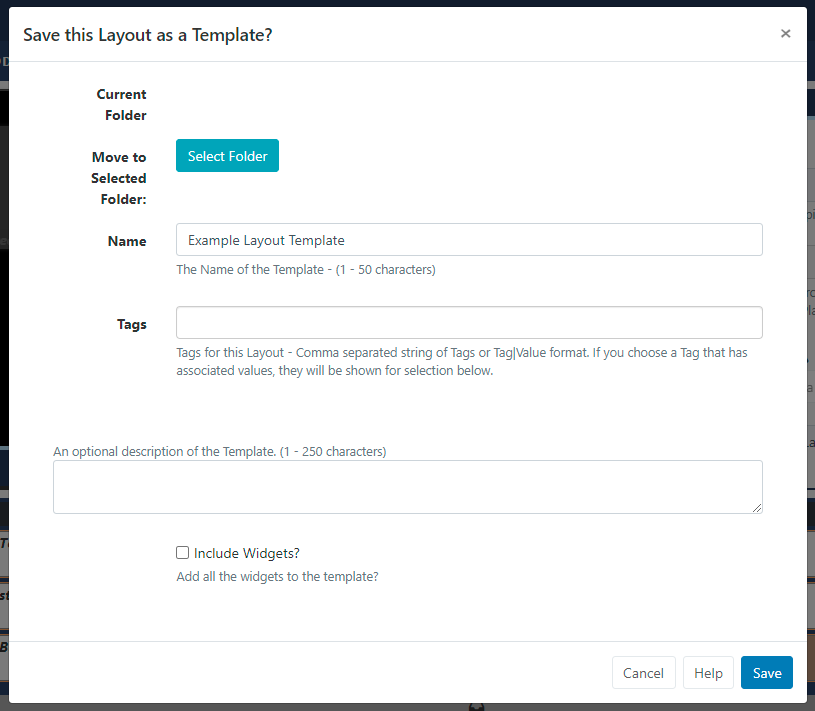

<!--toc=layouts-->

# Templates

{tip}
If you are using a CMS earlier than v3.0.0 please click [here](layouts_templates_2.html)
{/tip}

Templates are saved copies of designed **Layouts** which can then be used when creating new Layouts. Using a template can speed up the design process and is a good way to ensure that a corporate image/standard is maintained. 

## Creating a Template

Templates can be created two ways:

1 - Adding directly from the **Templates** page

2 - Saving an existing **Layout** as a Template

## 1. Add Layout from Template Page

- Click on **Templates** under the **Design** section of the main menu
- Select the **Add Template** button and complete the appropriate form fields.

- Templates can be optionally saved to **Folders**.

{tip}
Templates that are saved in Folders will inherit the View, Edit, Delete **Share** options that have been applied to the destination Folder for that User/User Group.

If users should also have access to the content of the Template, ensure that this is also saved to the same Folder!
{/tip}

- Click on the **Select Folder** button and expand to select the Folder to save in.

- Users can also right click a folder to access further Folder options:

{tip}
Options available to User/User Groups are based on enabled [Feature and Sharing](users_features_and_sharing.html) options!
{/tip}

- The selected folder file path will be shown next to the Folder field on the form.

{nonwhite}
Further information for Administrators regarding Folder access and set-up can be found [here](https://xibo.org.uk/docs/setup/folders-administration)
{/nonwhite}

{white}
For further information regarding Folder access and set-up, please speak to your Administrator.
{/white}

- Provide a **Name** for easy identification purposes within the CMS.

- Include optional [Tags](tour_tags.html) to organise and make it easier to search for.

- Select the **Resolution** to be used for this Template/Layout.

Templates/Layouts are designed for an intended display Resolution and will function best when shown on a **Player** with a matching resolution. If they are shown on a display that has a different resolution it will dynamically resize which may result in unused screen space.  

{tip}
Sending a Player a Layout that has been designed with a 4:3 resolution which is connected to a 16:9 TV screen would result in two empty bars either side of your content. 
{/tip}

- Provide a **Name** for easy identification purposes within the CMS.

- On saving the form, the [Layout Designer](layouts_designer.html) will automatically open.

## 2. Saving a Layout as a Template

A **Published Layout** can be saved as a Template from the **Layout Designer** by using the status menu and selecting **Save Template**:

{tip}
Layouts can also be saved as Templates by using the **Row Menu** for a Layout in the Layouts Grid and selecting **Save Template**!
{/tip}

Complete all relevant form fields to save the selected Layout as a Template:

- Use **Select Folder** to move from the shown Current Folder Location.
- Give the Template an identifiable **Name** so that Users can easily select from the Template drop down when adding Layouts.
- Assign [Tags](tour_tags.html) if required.
- Provide an optional description/explanation/instructions to other users of this Template.
- Use the tick box to include all **Widgets** that have been added to the Layout to be included in the Template.
- **Save**

Once saved, Templates can be managed from the Templates grid.

Each Template has additional actions/shortcuts that can be accessed from the row menu.

**Alter Template** - Use to open the Layout Designer to make design changes to the Template.

**Checkout** - If the Template has been Published, Checkout to edit.

**Publish** - Publishing a Template will add it to the list of selections when adding a new Layout from v3.1.

**Discard** - Revert back to the previous Published version and discard all changes made whilst in a draft status from v3.1

**Edit** - Make changes to the Template record such as, Folder location, Name and Tags etc. 

**Select Folder** - add or make edits to a selected folder path.

**Copy** - Create copies of Templates and choose to include all contained **Media** items, to use as a base for creating new Templates or to simply make modifications. 

**Delete** - Remove a Template and all its associated media. Layout specific media such as Text/RSS will be deleted. **Please note:** This action is irreversible!

**Share** - Enable [**View**, **Edit** and **Delete**](users_features_and_sharing.html) access for selected Users/User Groups.

**Export** - Export the Template including all associated Widgets/Media/DataSet structures to a ZIP file, so it can be easily shared. 

{tip}
When exporting a Template, all assigned **Layout**, **Playlist** and **Media Tags** will be exported. Select the **Import Tags** option to add these Tags on Layout Import.
{/tip}

{tip}
Use the **With Selected** option at the bottom of the Templates [Grid](tour_grids.html) to Edit Tags, Delete and Share in bulk actions!
{/tip}

