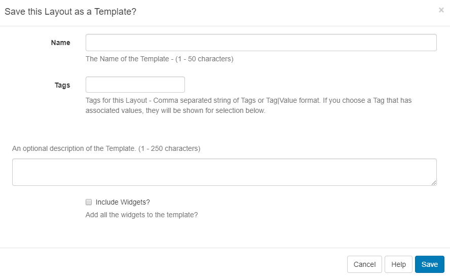
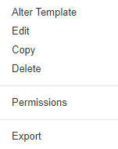

# Templates

{tip}
**Please note:** If you are using a 3.x CMS, please use the following link: [Templates](layouts_templates.html)
{/tip}

Templates are saved copies of **Layouts** which can then be used to create new Layouts. Using a template can speed up the design process as well as maintaining a corporate image/standard.

## Saving a Layout as a Template

**Published Layouts** can be saved as templates in the Layout Designer by using the **Actions** menu on the toolbar and selecting **Save Template**.

{tip}
If you are using version 1.8 use the **Actions tab** located on the Layout Designer page and click on the **Save Template button**.
{/tip}

{tip}
Layouts can also be saved as templates by using the row menu for a Layout in the Layouts grid.
{/tip}

Complete the form fields and select whether to include assigned Widgets to the template and save.

Templates can be tagged which allows for ordering and makes it easier to find and view a large number of Templates if grouped by a certain Tag.
{tip}
Administrators can set certain **Tag's** to have a **Value** associated to them.   Tags that have a Tag Value will show the selections available from an additional field -  **Tag value** drop down.
For further information on what **Tag** and **Tag Values** to use, please speak with your Administrator.
{/tip}

Once saved, templates can be selected by users (with appropriate Permissions) when creating a new Layout.

All saved **Templates** are managed from the CMS menu located under the **Design** section. Click on Templates and use the row menu for the selected template.

### Import / Exports

For ease of use across users, templates can be exported and imported so that they can be easily shared.