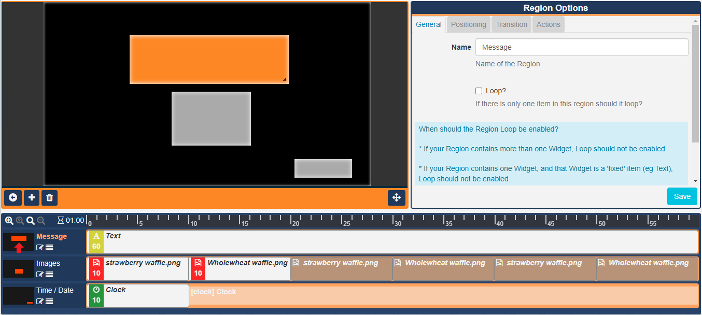
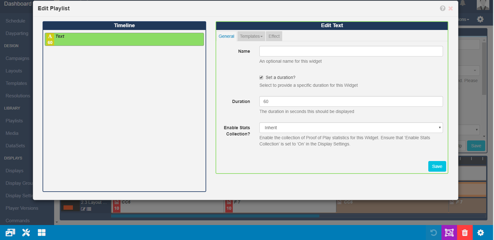

<!--toc=layouts-->

# Layout Timeline

{tip}
**Please note:**

- If you are using a v3.1.x CMS, please click [here](layouts_timeline.html)
- If you are using a v2.0.x CMS, please click [here](layouts_timeline_2.0.html)
- If you are using a v1.8.x CMS, please click [here](layouts_playlists.html)

{/tip}

Each Region on a Layout has its own **Playlist** of content, which is shown in a specified order by a Player. 

A Playlist can consist of a **single item** (such as a company logo), or **multiple items** (such as an image slideshow).

{tip}
If you are using a version 2 CMS earlier than 2.3 please use the following link: [Layout Timeline](layouts_timeline_2.0.html).

If you are using 1.8.x CMS, please use the following link: [Playlists](layouts_playlists.html).
{/tip}

A Region's Playlist is viewed/edited in the **Layout Timeline** window.  

The timeline clearly shows how each Regions assigned Widgets will play. The greyed out entries indicate what will play when that items own duration is exceeded.

{tip}
The above Timeline tells us the following:

**Text** determines the duration of the Layout, as the longest running Region with a 60 second duration.

**Image 1** will play for 10 seconds then **Image 2** will play for 10 seconds, this will repeat twice more to remain on screen for 60 seconds (until the Text Widget has fully played out)

**Clock** has a set duration of 10 seconds but will remain on screen for 60 seconds (until the Text Widget has fully played out)

{/tip}

The window to the left of the Region gives a preview of the Region positioning on the Layout. 

Clicking on a Region from the Region Preview will open the **Region Editor** and **Region Options** form to make edits.

{tip}
You can also use the edit icon next to the Region Position Preview to open the editor and the Region Options form.
{/tip}

{tip}
Ensure you click on the back arrow to **Return to Layout View** and exit edit mode.
{/tip}

## Assigning Content

Use the toolbar on the Layout Designer to add [Widgets](layouts_widgets.html) or use the [Library Search](layouts_library_search.html) to add content that has already been uploaded to the Library.

{tip}
Widgets that are available can be enabled/disabled by an Administrator in the [Modules](media_modules.html) section of the CMS.
{/tip}

Once Media has been added, the timeline will automatically scroll to the newly added content (highlighted as green) for easy configuration.

{tip}
Drag and drop Widgets in a Regions Timeline to reorder the sequence they should play.
{/tip}

Use the timeline buttons to zoom in and out to decrease/increase the visible time span and use the blue scroll bar to see all assigned content in your Timeline.

{tip}
Easily snap back to the Widget you are currently working on when scrolling through the Timeline by using the **Scroll to Selected Widget** button.
{/tip}

Add and edit media content using the **Playlist View**. Click on the menu icon located next to the Region Position Preview window.

Use the toolbar to add media as normal.

Media can be added to a specific point on the Timeline. 

Drag or click to add media to a position marker shown on the Timeline.

### Deleting from Regions

Widgets can be deleted by clicking on the Widget to be removed and clicking on the red bin icon, on the bottom right of the toolbar, or by right clicking and selecting the bin icon.

### Widget Actions

To delete, click on the Widget assigned in the Layout Timeline and click on the red **bin icon** in the bottom right hand corner of the screen. 

{tip}
Right-click on the Widget on the Layout Timeline to also delete.

**Attached Audio**, **Expiry Dates**, **Transition In**, **Transition Out** and **Sharing** options can also be edited in this way.

{tip}
In versions earlier than 3.0.0 [Sharing](users_features_and_sharing.html) is labelled [Permissions](users_permissions.html)!
{/tip}

Use the arrows to move Widgets along the Timeline to reorder the sequence.

{/tip}

For further information regarding the available Actions, please see the [Tools](layouts_tools.html) manual page.

