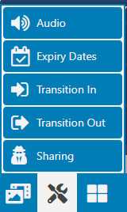
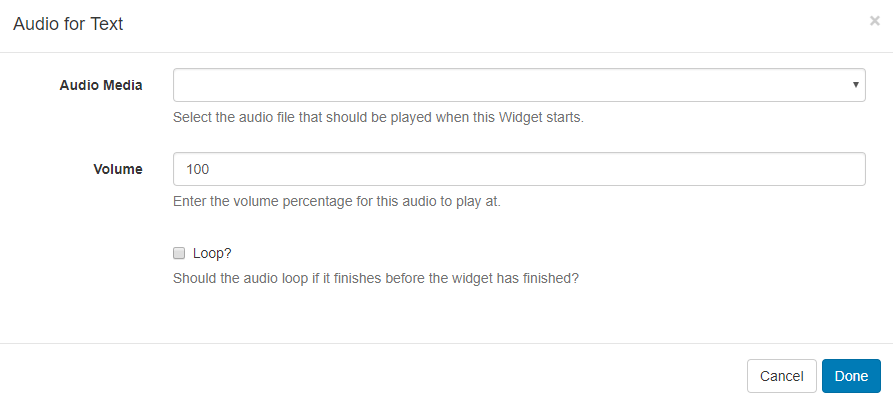
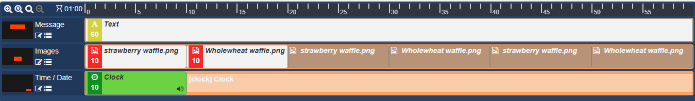
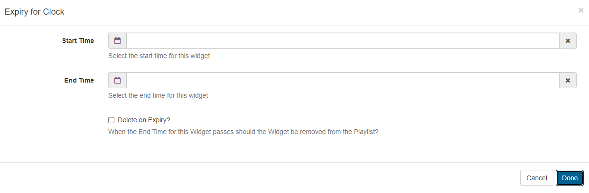
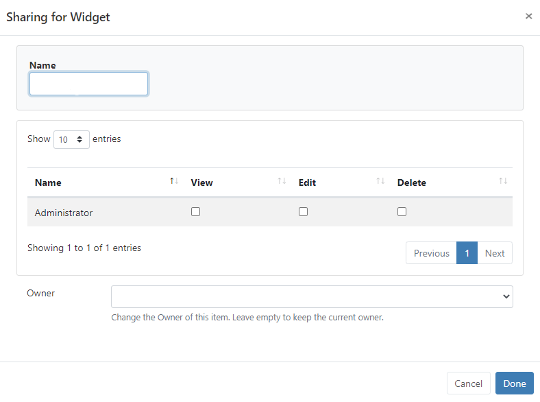

<!--toc=layouts-->

# Tools

{tip}
If you are using a version earlier than **v2.3** please use the following link: [Tools](layouts_tools_2.0.html). 
{/tip}

Located on the bottom toolbar of the [Layout Designer](layouts_designer.html), the **Tools** button contains a menu of actions that can be applied to the components of Layouts. 

{tip}
Versions earlier than 3.0.0 **Sharing** will be labelled **Permissions**!
{/tip}

### Audio

Upload Audio files to the [Library](media_library.html) so that they can be selected to attach to Widgets. 

- Click on the Audio button and click to add or drag and drop to the target Widget on the Layout Timeline.

- Use the drop-down menu to select an audio file from the Library.

When assigning audio to a Widget you can enter **Volume** as well as a **Loop** parameter to determine whether the audio will loop for the duration of the existing Widget or just play through once. The audio will be stopped when its parent Widget finishes playing.

Once audio has been assigned to a Widget, a **speaker icon** will be visible for the media item in the Region Timeline.

{tip}
Click on the speaker icon to edit the assigned audio.
{/tip}

### Expiry Dates

Click on the Expiry Dates button and click to add or drag and drop to a Widget to enter **Start** and **End** dates and times. Use the checkbox to additionally delete the Widget at the set end time.

Widgets that have Expiry Dates assigned can be identified by the a calendar icon, shown in the corner of the media item on the Layout Timeline. 

{tip}
Click on this icon to make edits to expiry dates/times as necessary.
{/tip}

#### Expiry Date Status Icons

- Start date has been set for a future date/time.

- Expiry date has been set.

- Widget has been marked to be deleted on reaching the expiry date.

-  The Widget has expired but remains on the Layout.

  {tip}
  Once the End date has passed the Widget will be removed from the Region. Expired Widgets that have **not** been set to **Delete on Expiry** will remain visible in the Layout Designer so that **Start** and **End** times can be re-adjusted if needed.
  {/tip}

It is important to note that the Layout will be marked invalid and not sent to Players if a Region is empty due to Widget expiry. It should also be noted that if at the time of download there was a valid Layout but the Player has since gone offline, the Layout will show with an empty Region.

### Transitions

Transition Type and Duration can be applied to a Widget by clicking to add or drag and drop.

{tip}
Transitions are supported for Android/webOS ,Tizen Players and Window Players from v2 R252.
Transitions are currently not supported on the Linux Player.
{/tip}

### Fade/Fly In

Select a Transition and Duration to be applied when the media item starts. 

### Fade/Fly Out

Select the finish Transition and Duration to be applied to the media item when further Widget's are set to follow in the Layout Timeline.

Default Transition Type's and Duration can be entered by an Administrator on the **Settings** page using the **Defaults** tab, which can then be applied to all Widgets. 

Applied defaults can be overridden for Layouts by unticking the box on the Edit Layout form.

- Assign and complete Transitions as before.

{tip}
When Transition Defaults are applied to a Widget the Edit form will show blank fields. Only manually entered Transitions will show on Edit Transition forms.
{/tip}

{tip}
If there are no more Widgets to follow or the Layout is in the process of being removed then the **Exit Transition** will apply as configured in [Region Options](layouts_regions.html#region_options>).
{/tip}

### Sharing  

{tip}
If you are using a version earlier than 3.0.0 Sharing will be named [Permissions](users_permissions.html)
{/tip}

Enable/Disable **View**, **Edit** and **Delete** access for Users/User Groups for Widgets and Regions by clicking to add or by drag and drop. 

{tip}
Please see the manual page for [Features and Sharing](users_features_and_sharing.html) for further information on Sharing options!
{/tip}