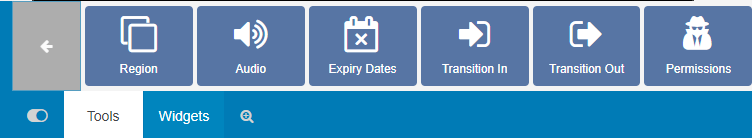
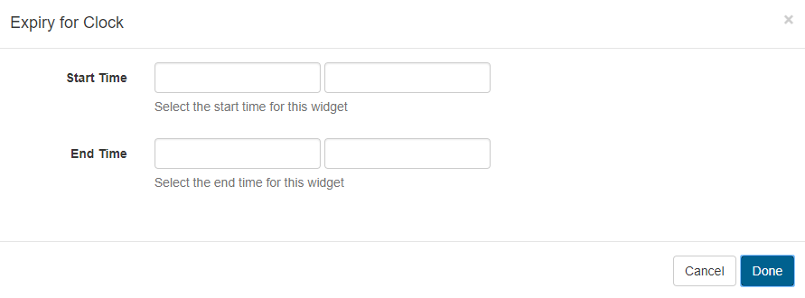
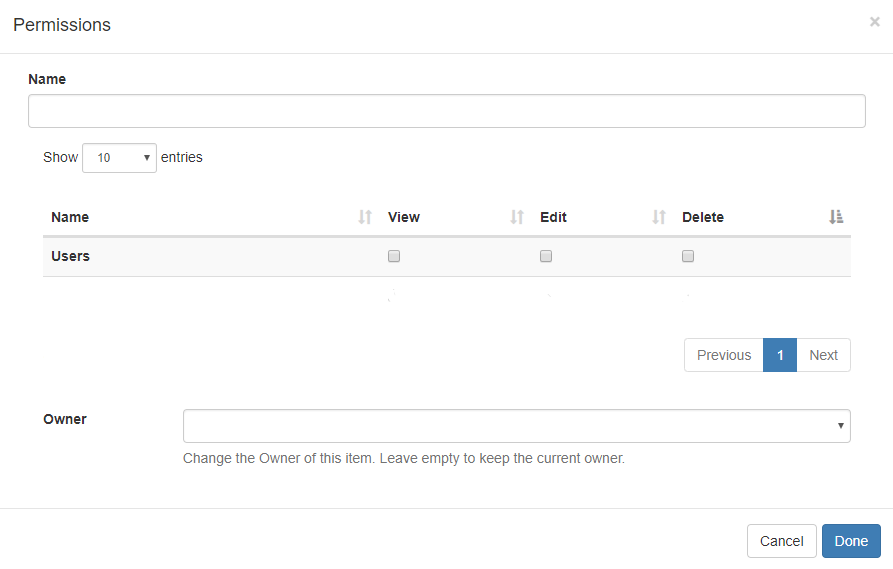

<!--toc=layouts-->

# Tools (New Features for v2)

Located on the bottom toolbar on the [Layout Designer](layouts_designer.html), the **Tools** tab contains actions that can be applied to the components of Layouts. 

### Region

Regions can be simply added to Layouts by clicking on the Region button or drag and drop to the **Layout Navigator**. 

### Audio

Upload Audio files to the **Library** which can then be selected to attach to Widgets. Click on the Audio button and click to add or drag and drop to the target Widget on the Layout Timeline.

Use the drop-down menu to select an audio file from the Library.

When assigning audio to a Widget you can enter **Volume** as well as a **Loop** parameter to determine whether the audio will loop for the duration of the existing Widget or just play through once. The audio will be stopped when its parent Widget finishes playing.

Once audio has been assigned to a Widget, a **speaker icon** will be visible for the media item in the Region Timeline.

{tip}
Click on the speaker icon to edit the assigned audio.
{/tip}

### Expiry Dates

Click on the Expiry Dates button and click to add or drag and drop to a Widget to enter **Start** and **End** dates and times. Use the checkbox to delete the Widget at the set end time.

Widgets that have Expiry Dates assigned can be identified by the **clock icon** shown in the corner of the media item on the Layout Timeline. 

{tip}
Click on this icon to make edits to expiry dates/times as necessary.
{/tip}

{tip}
Once the End date has passed the Widget will be removed from the Region. Expired Widgets that have not been set to **Delete on Expiry** will remain visible in the Layout Designer so that **Start** and **End** times can be re-adjusted if needed.
{/tip}

It is important to note that the Layout will be marked invalid and not sent to Players if a Region is empty due to Widget expiry. It should also be noted that if at the time of download there was a valid Layout but the Player has since gone offline, the Layout will show with an empty Region.

### Transitions

{tip}
Transitions are supported for Android/webOS and Tizen Players.
{/tip}

### Fade/Fly In

Select a transition and duration to be applied when the media item starts. 

### Fade/Fly Out

Select the finish transition and duration to be applied to the media item when further Widget's are set to follow in the Layout Timeline.

{tip}
If there are no more Widgets to follow or the Layout is in the process of being removed then the Exit Transition will apply as configured in Region Options.
{/tip}

### Permissions

Set view, edit and delete permissions for Widgets and Regions by clicking to add or drag and drop. 

Please see the manual page for [Permissions](users_permissions.html) for further information.