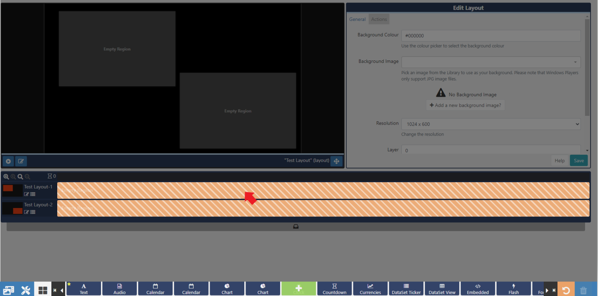
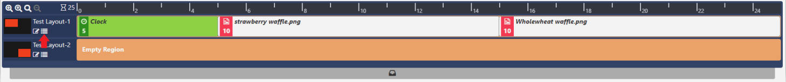
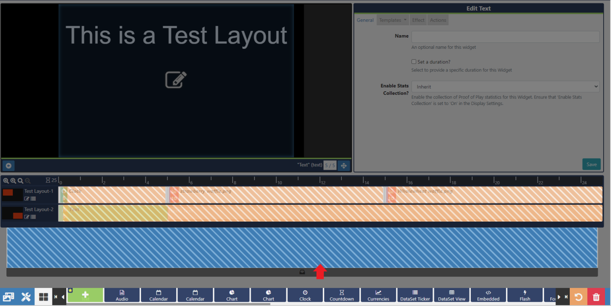
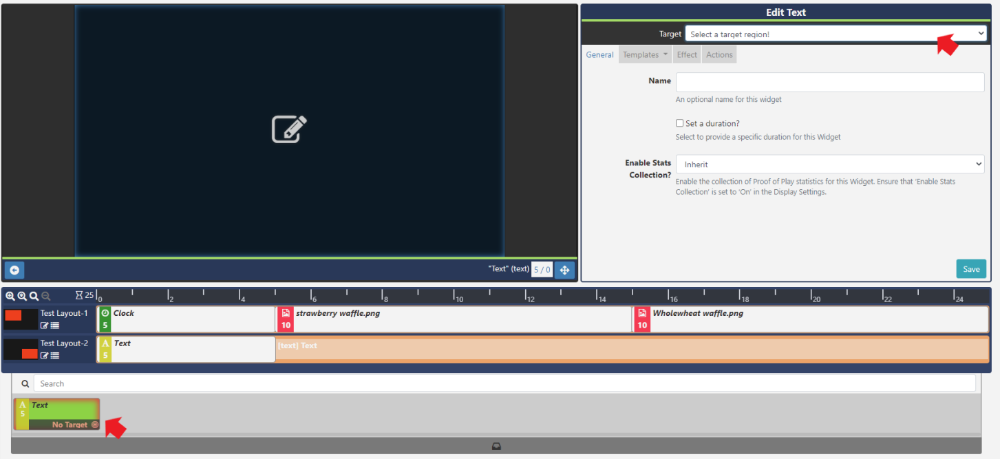
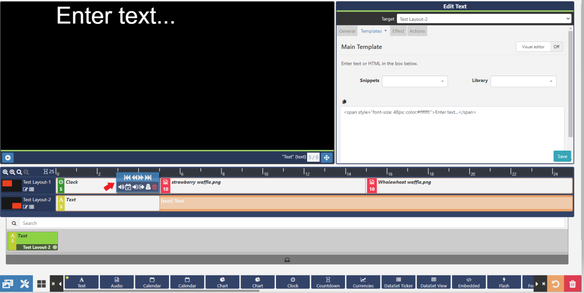

<!--toc=layouts-->

# Widgets

{tip}
If you are using a CMS earlier than v3.0.0 please use the following link: [Widgets](layouts_widgets_2.html)
{/tip}

Media is assigned to Layouts using **Widgets**, which provide the actions for a selected Module.

Widgets are available from the toolbar at the bottom of the [Layout Designer](layouts_designer.html). Use the  arrows to scroll through all the available Widgets.
{tip}
Widgets that are available can be disabled/enabled by an Administrator in the [Modules](https://xibo.org.uk/manual/en/media_modules.html) section of the CMS.
{/tip}

Widgets can be marked as **Favourites** to position them at the beginning of the Widget list for ease of access.

Click on the **Star** to select / unselect a Widget as a Favourite.

## Adding to Regions

Clicking on a Widget will give you the option to **click to Add** 

 or **Grab** to drag and drop 

Add the Widget by clicking directly on, or dragging to, a target **Region**.

Once added the Widget will be added to the **Layout Timeline** and can be configured using the available **edit** options in the **Editor**. 

Add Widgets to a specific point on the Timeline, by dragging or clicking on a position marker to add.

Widgets can also be added / edited using an alternative **Playlist view**, access by clicking on the menu icon next to a Region.

The Playlist View will open so that Widgets can be added and edited from here.

{tip}
Use the **Select Multiple Widgets** button, located next to the bin icon on the bottom toolbar, to highlight multiple items on the Playlists to delete.
{/tip}

{tip}
To make **edits** at anytime simply click on the Widget on the **Layout Timeline** or in the **Playlist view**, to open the available options form for that Widget.
{/tip}

{tip}
Click on the Widgets button, on the bottom toolbar, to disable it from view for a 'clearer' work space.
{/tip}

## Adding Widgets to the Interactive Drawer

When configuring [Interactive Actions](layouts_interactive_actions.html) that require Navigate to Widget as the specified Action Type, Widgets first need to be added to the interactive drawer.

Widgets are added to the Interactive Drawer in the same way, by clicking to add or drag and drop.

Once added, click on the Widget in the Interactive Drawer to set a Target Region:

On saving, the Widget will update and show the selected Target Region. Configure the Widget using the Edit form:

## Removing Widgets

To delete, click on the Widget assigned in the Layout Timeline or Interactive Drawer and click on the red **bin icon** in the bottom right hand corner of the screen. 

Right-click on a Widget to also delete:

{tip}

Right click on a Widget to access the [Tools](layouts_tools.html) menu as a shortcut!
{/tip}

