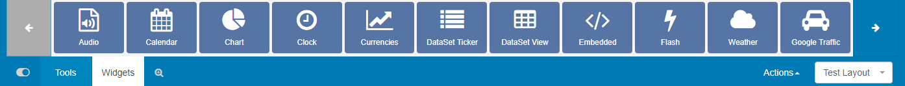
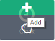
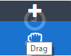
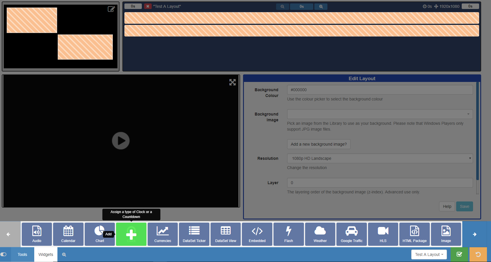
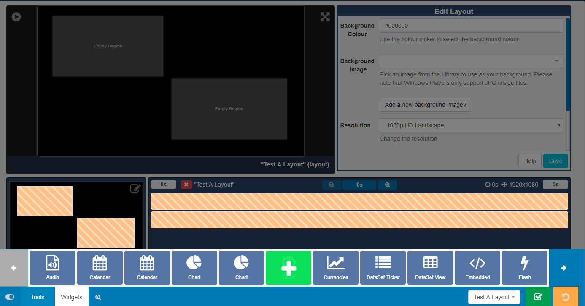

<!--toc=layouts-->

# Widgets (New Features for 2.0)

Media is assigned to Layouts using **Widgets**, which provide the actions for the selected Module.

Widgets are available from the toolbar at the bottom of the **Layout Designer** to add to Regions. Use the  arrows to scroll through all the the available Widgets.
{tip}
Widgets that are available can be disabled/enabled by an Administrator in the Modules section of the CMS.
{/tip}

## Adding to Regions

Clicking on a Widget will give you the option to **click to Add** 

 or **Drag and Drop** 

Add the Widget by clicking directly on or dragging to a target **Region**.

Once added the Widget will be added to the **Layout Timeline** and can be configured using the available **edit** options in the **Editor**. 

{tip}
To make **edits** at anytime simply click on the Widget on the **Layout Timeline** to open the available options form for that Widget.
{/tip}

{tip}
Toggle Widgets to off when you have finished adding to Regions using the slider to the left of the Tools tab for a 'clearer' work space.
{/tip}

## Deleting from Regions

To delete, click on the Widget assigned in the Layout Timeline and click on the red **bin icon** in the bottom right hand corner of the screen. 

{tip}
Right-click on the Widget on the Layout Timeline to also delete. **Attached Audio**, **Expiry Dates**, **Transition In**, **Transition Out** and **Permissions** can also be edited in this way.
{/tip}

