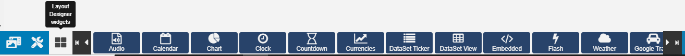
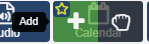
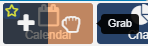
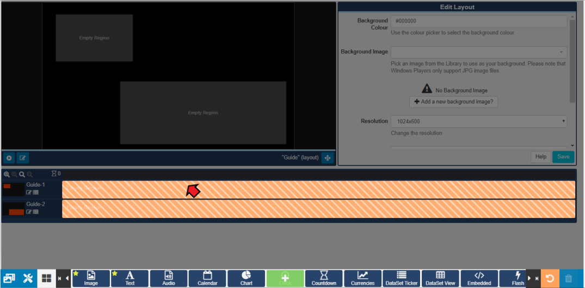

# Widgets

{tip}
**Please note:**

-  If you are using a v3.0.x CMS, please use the following link: [here](layouts_widgets_3.html)
-  If you are using a v3.1.x CMS, please click [here](layouts_widgets.html)

{/tip}

Media is assigned to Layouts using **Widgets**, which provide the actions for the selected Module.

Widgets are available from the toolbar at the bottom of the **Layout Designer** to add to Regions. Use the  arrows to scroll through all the the available Widgets.
{tip}
Widgets that are available can be disabled/enabled by an Administrator in the Modules section of the CMS.
{/tip}

From version 2.3, Widgets can be marked as **Favourites** so that these Widgets are positioned at the beginning of the Widget list for easier access. 

Click on the **Star** to select / unselect a Widget as a Favourite.

## Adding to Regions

Clicking on a Widget will give you the option to **click to Add** 

 or **Grab** to drag and drop 

Add the Widget by clicking directly on, or dragging to, a target **Region**.

Once added the Widget will be added to the **Layout Timeline** and can be configured using the available **edit** options in the **Editor**. 

From v2.3, Widgets can be added to a specific point on the Timeline. 

Drag or click to add to a position marker shown on the Timeline.

From v2.3, Widgets can also be added / edited using an alternative **Playlist view**, by clicking on the menu icon for a Region.

Add and Edit Widgets using this alternate view.

{tip}
Use the **Select Multiple Widgets** button, located next to the bin icon on the bottom toolbar, to highlight multiple items on the Playlists to delete.
{/tip}

{tip}
To make **edits** at anytime simply click on the Widget on the **Layout Timeline** or in the **Playlist view**, to open the available options form for that Widget.
{/tip}

{tip}
Click on the Widgets button, on the bottom toolbar, to disable it from view for a 'clearer' work space.
{/tip}

## Deleting from Regions

To delete, click on the Widget assigned in the Layout Timeline and click on the red **bin icon** in the bottom right hand corner of the screen. 

{tip}
Right-click on the Widget on the Layout Timeline to also delete. **Attached Audio**, **Expiry Dates**, **Transition In**, **Transition Out** and **Permissions** can also be edited in this way.
{/tip}

