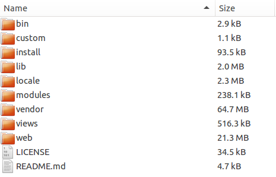

<!--toc=manual_install-->
# Manual Installation

It is possible to install [[PRODUCTNAME]] without using Docker, this is referred to as a 
manual or custom installation.

## Requirements

[[PRODUCTNAME]] requires:

 - MySQL 5.6 
 - A web server (nginx, apache, iis)
 - PHP 5.6+ (lower than PHP7)
 - PHP-CLI 5.6+ (lower than PHP7)
 - PHP PHAR support
 - ZeroMQ bindings for PHP
 - URL Rewriting
 - Virtual Hosts or dedicated web server (modify DocumentRoot)
 - CRON/Scheduled Tasks

We have explained some common environment configurations in 
[Prepare your environment](install_environment.html).

<nonwhite>

## Release Download
The latest release can be downloaded from the [release archives page on GitHub](https://github.com/xibosignage/xibo-cms/releases).

## Community Guides
Special thanks to members of our community who have written guides for installing [[PRODUCTNAME]] in 
specific environments.

These guides are community contributed and should be considered as guidance only:

 - [Docker on Ubuntu 16:04](https://community.xibo.org.uk/t/xibo-1-8-0-with-docker-on-ubuntu-16-04/9392)
 - [Docker on Synology DSM6+](https://community.xibo.org.uk/t/synology-dsm6-xibo-docker-1-8-installation/9697/8)
 - [Non-docker on IIS 8.5, Windows Server 2012](https://community.xibo.org.uk/t/xibo-step-by-step-installation-iis-8-5-on-windows-server-2012/9878/16)
 - [Non-docker on CentOS 7](https://community.xibo.org.uk/t/installation-guide-of-xibo-1-8-on-centos-7/9429/1)

</nonwhite>

## Installation

Beyond this point it is assumed that a web server running with PHP and MySQL is
available and that the compressed archive (ZIP or Tarball) of the CMS
installation package has been transferred to the server.

The installation process is:

1. Download and extract the archive
2. Starting the Installation
3. Pre-requisites
4. Creating the database
5. Database details
6. Starting the Installation
7. Final Configuration
8. Install [XMR](install_xmr.html)
9. Configure [XTR](install_xtr.html)
10. Complete

### Download and extract the archive

The CMS archive contains a sub folder called [[PRODUCTNAME]]-cms-[[PRODUCTVERSION]], the contents of 
this folder should be copied into an appropriate location on your web server. It 
is **strongly recommended** that the folder is extracted in a non-webservable location. On a 
dedicated server the `DocumentRoot` should point to `/path/to/[[PRODUCTNAME]]-folder/web`. Other 
configurations are discussed on the [environment](install_environment.html) page.

The extracted archive should look like the below screen shot:

A folder is provided for the [[PRODUCTNAME]] library which will be used to store images, videos and 
other files. This folder can be moved to another location and changed during the install process.

### Starting the Installation
Navigating to `http://localhost` will automatically start the installation.

The installation is in a _wizard_ format that contains 6 steps in total. The wizard will guide the 
installer through the process of installing [[PRODUCTNAME]].

### Step 1 - Pre-requisites
The installer contains a detailed check list of all the items required for a successful installation. 
Each item will have either:

* A tick - the item is present and correct
* An exclamation mark - the item is present but may not be configured correctly.
* A cross - the item is missing.

Any items with an exclamation mark or a cross should be addressed and the retest button used to run 
this step again.

The most common problems here are missing PHP modules, configuration of PHP settings and file 
permissions issues to the library.

Once all the items are ticked press next to advance.

###Creating the database
The CMS can install into a new database, or an existing one. We recommend a new database.

[[PRODUCTNAME]] does not prefix its table names and may conflict with content in an existing database.

The choice for a new or existing database can be made by switching between the two available tabs.

###Database Details
Whether you chose an existing database or a new one, the installer will need to collect some 
information about that database to allow the CMS to connect, read and write.

The installer will need the following information:

**Host**
The host name for your MySQL installation - in the majority of cases this will be "localhost".

**Admin Username**
The "root" user name for your MySQL installation. This is only used for the installation and is 
only required if you have asked the installer to create a new database.

**Admin Password**
The "root" password. This is only used for the installation and is only required if you have 
asked the installer to create a new database.

**Database Name**
The name for the CMS database.

**Database User name**
The user name for the CMS to use to connect to the database - usually this can be the same.

**Database Password**
The password to use to connect to the database.

###Start the Installation
The installer will now create / populate database for [[PRODUCTNAME]]. You should see a series 
of dots appear on the screen as this happens. It can take a few moments to complete. Assuming 
everything went well, click "Next".

_If there are errors at this point, please see the troubleshooting section of this manual._

###Admin Password
Each installation will require at least one "Super User" level Administrator to manage the system, 
apply upgrades and configure the advanced settings. The installer will prompt for the creation of 
this user at Step 3.

**This user name and password should be kept safe as it will be required when the installation is complete.**

###Settings
The next screen deals with configuring [[PRODUCTNAME]]. The first box asks for the location 
that [[PRODUCTNAME]] should store the media you upload. The release archive included a folder for this 
`/library` or a different folder can be used. Enter enter that folder here 
e.g `/var/www/[[PRODUCTNAME]]/library`.

The next box asks for a CMS key - this key is used to authenticate Displays with the CMS and should 
be something obscure.

The final tick box asks if it's OK to send anonymous statistics back to the [[PRODUCTNAME]] project. 
We would be very happy if you did!

###Complete
The installation is now complete and the system is ready to log in.

## XMR and XTR
XMR is the push messaging engine in [[PRODUCTNAME]] and it is recommended to
 have XMR running for all installations. Instructions for installing XMR can be 
 found [here](install_xmr.html).
  
XTR is the task runner and should be configured for all installations. Instructions for
configuring XTR can be found [here](install_xtr.html).