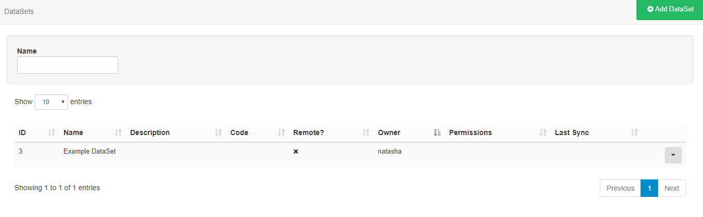
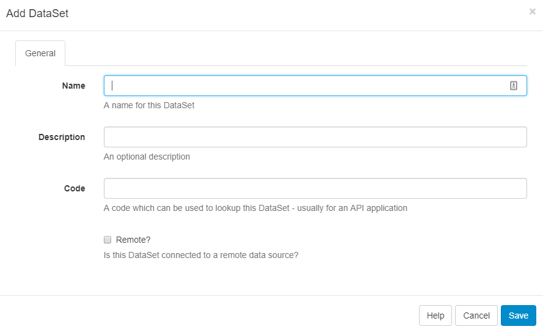
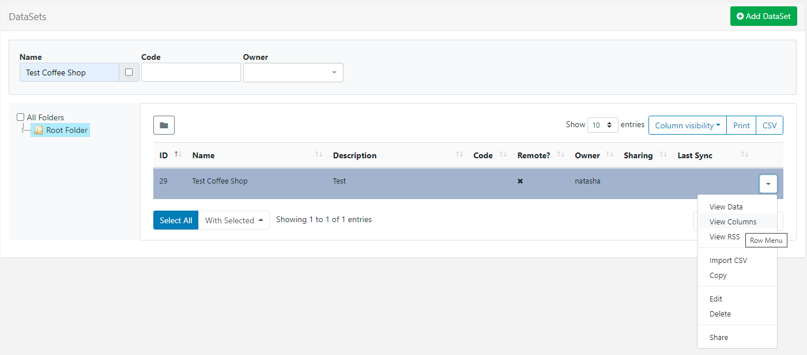

<!--toc=media-->
# DataSets

DataSets are a feature to design and store **tabular** data. Once designed the data can be imported from a CSV file, entered manually, as JSON via the API or synced remotely on a Schedule. A DataSet provides a convenient way to import and display data from other systems in [[PRODUCTNAME]].

Examples of where DataSets could be utilised:

- A drinks menu at a bar
- Tee times at a golf club
- Meeting room bookings


DataSets have been designed to be versatile and reusable and come in two parts:

1. **The DataSet** (Data Structure and data)
2. **The Display** (DataSet View / Ticker / a source of data for a custom Module)

DataSets are first defined, which can then be reused across multiple DataSet Views and Layouts. Access by navigating to DataSets under the Library section on the Menu to view the DataSet grid where you can add new and manage existing DataSets.




## Add DataSet

Click on the **Add DataSet** button and complete the form fields.



Designing a DataSet is a **2 step** process - first add the **DataSet record** and then configure **Columns**.

### DataSet Record

**Name** - Use to identify in the CMS

**Description** - optional (what is it used for?)

**Code** - Usually used for referencing via the API

**Remote?** - Should this DataSet sync itself with a remote data source?

<tip>
If you choose to make the DataSet Remote you will be presented with further tabbed headers with information that will need completing, see the [Remote DataSets](media_datasets.html#Remote_Datasets) section of this page.
</tip>

### Columns

Use the row menu and select **View Columns**, a new grid will open which will show all Columns currently created for that DataSet.



<tip>
By default, all DataSets will have **Col1** added which should be edited or deleted using the row menu.
</tip>

Columns are used to define the structure of the data, with each Column having a number of settings to achieve this. Click on the **Add Column** button and complete the fields on the form.


**Heading** -  a heading to identify the Column.

**Column Type** - Value (User entered), Formula (calculated) or Remote. 

**Data Type** - String, Number, Date, External Image, Library Image, the format to use for the data.

**Column Order** - The position this Column should appear when viewing/entering Data.

Options for Filtering and Sorting are also included on this form.


### Additional Information

Depending on the Column Type selecting additional information will be required:

**(Value) List Content** - A comma-separated list of values that can be selected for this field.

**(Formula) Formula** - A MySQL statement suitable for use in a ‘SELECT’ statement, or a string to format a date field `$dateFormat(<col>,<format>)`.

**(Remote) Remote Data Path** - A JSON syntax string showing how to access the Data in the Remote data source.

There is no theoretical limit to the number of columns [[PRODUCTNAME]] can support; although a smaller DataSet is often easier to enter and display.

<tip>
Columns can be added and removed after Data has been entered. The ordering and list content of Columns can also be changed after Data has been collected.
</tip>

## Remote DataSets

A Remote DataSet will need additional information completed; the Remote data source URL, request params, request method and authentication information.

Remote DataSets are a special type of DataSet which periodically syncs from a **3rd party data source** which you specify when adding/editing the DataSet. [[PRODUCTNAME]] will call the URL specified at the time period specified and parse the data according to the instructions set on the DataSet and any Remote Columns.

The remote data source must be JSON formatted.

Data is populated according to the Columns defined as Column type **Remote**. When specifying a Remote Column a "data path" is entered which is the JSON syntax path to the data for that column, with respect to the Data Root specified on the DataSet.

Consider an example JSON data source:

```json
{
    "base": "EUR",
    "date": "2017-12-22",
    "rates": {
        "GBP": 0.88568,
        "THB": 38.83,
        "USD": 1.1853
    }
}
```

If we wanted columns to capture the currency symbol and value, we would set our "Data Root" to `rates` and then have Columns for:

- Symbol - data path = 0
- Value - data path = 1

#### **Dependents**

A remote DataSet can depend on another DataSet to formulate its request. Each row in the dependent DataSet will be used to create a request using the parent DataSet's request parameters.

## Data Row

Once you have your DataSet defined with Columns you will need to add some data. This can be done in a number of ways:

- Manually through the CMS user interface
- Imported via a CSV file
- Through the API
- Remotely synced

### Manually

Data can be viewed/added and edited in a DataSet using **View Data** on the row menu or the button on the Columns page.

The data table returned will contain a column for each of the Columns you've defined in your configuration. 


Add a new row by clicking on the **Add Row** button to open a form with fields to be completed for all non-formula Columns. A Row can be edited by clicking anywhere on the row and deleted using the blue X.

### Importing CSV 

The CMS has a DataSet CSV importer that can be used to extract data from a **CSV file** and put it into a DataSet. The importer can be accessed through the row menu of any DataSet, with the exception of DataSets configured for Remote data sources.

When the importer opens the Columns in the DataSet will be listed with a field next to them, indicating the Column in the Remote file that should be used as a source of data for that Column. You may also choose to overwrite the existing data and ignore the first row of the CSV file.

An example of the form is shown below:


It is important to ensure that your CSV file has the correct file encoding if you are using non-ASCII characters. Non-ASCII characters are very common for languages outside of English. The file encoding most commonly used is UTF-8.

If you have edited your CSV file using Excel, you will need to make sure you select "Unicode (UTF-8)" from the Tools -> Web Options -> Encoding tab on the Save as dialogue.

### Through the API

You can write your own application which syncs data into a DataSet using the [[PRODUCTNAME]] API. Data can be added row by row or via importing whole JSON structures.

<nonwhite>
Further discussion on the API can be viewed in the [Developer documentation](/docs/developer).
</nonwhite>

### Remotely

Remote DataSets are kept in sync with a Task called **Fetch Remote DataSets**. This task is configured by default and runs once per minute.

## Row Menu

As well as the Actions that have been previously mentioned, each data set can have a number of actions performed against it, accessed using the row menu.

### Delete

Select the Delete menu item to show the DataSet Delete form which gives the option of deleting any associated data contained. 

<tip>
DataSets can only be deleted if they are not currently being used.
</tip>

### Permissions

The creator (owner) of the DataSet or a Super Administrator can assign View/Edit/Delete Permissions for User/User Groups.
<tip>
Users with Edit permissions will be able to add/edit data and reorganise the structure of the DataSet.
Only Users with View permissions will be able to use the DataSet in Layouts.
</tip>

<nonwhite>

Take a look at our  [DataSets Getting Started Guide](https://community.xibo.org.uk/t/getting-started-guide-datasets/14149) which will walk through how to create 'Meeting Room Bookings' using DataSets.

</nonwhite>