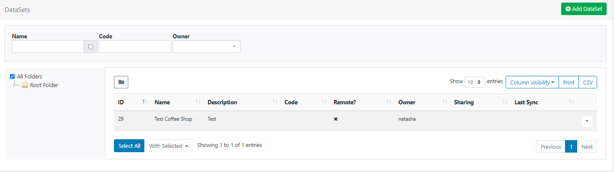
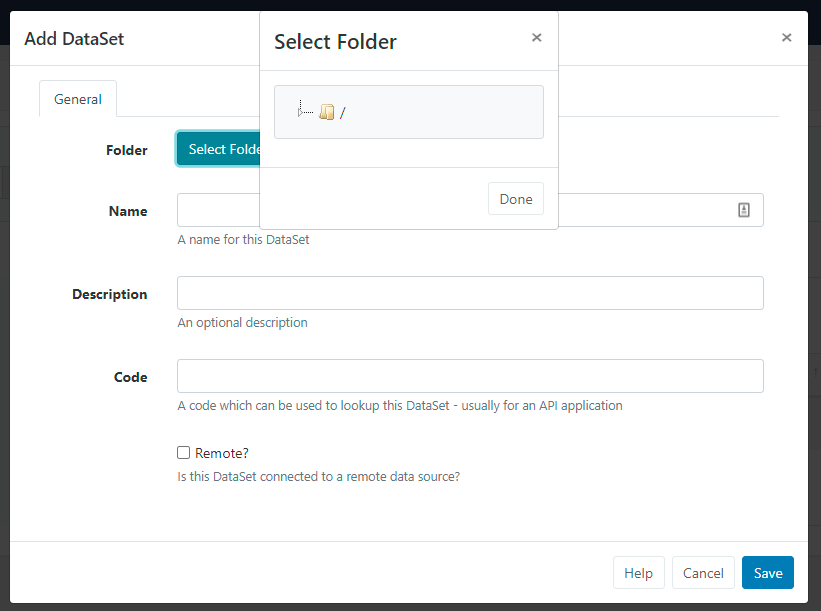
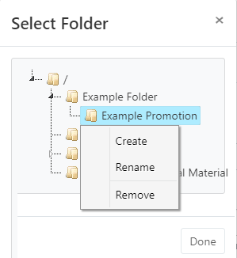

<!--toc=media-->

# DataSets

DataSets are a feature to design and store **tabular** data. Once designed data can be imported from a CSV file, entered manually, as JSON via the API or synced remotely on a Schedule. A DataSet provides a convenient way to import and display data from other systems in [[PRODUCTNAME]].

Examples of where DataSets could be utilised:

- A drinks menu at a bar
- Tee times at a golf club
- Meeting room bookings

DataSets have been designed to be versatile and reusable and come in two parts:

1. **The DataSet** (Data Structure and data)
2. **The Display** ([DataSet View](media_module_dataset_view.html)/[DataSet Ticker](media_module_dataset_ticker.html)/[Chart](media_module_chart.html) or a source of data for a custom Module)

DataSets are first defined, which can then be reused across multiple DataSet Views/Tickers/Chart Widgets added to Layouts. Access by navigating to DataSets under the Library section of the main menu:




The DataSets [Grid](tour_grid.html) allows you to edit existing and create new. 

The **Folder** tree will open by default:

{tip}
**Please note:** Folders are available from v3.0.0! (Speak to your Administrator to upgrade the CMS to benefit from this new feature!)
{/tip}

- Click on a Folder/ sub-folder to search the contents and return results based on any filters applied to the Grid.

or

- Tick **All Folders** to include searching in the Root Folder and return results based on any filters applied to the Grid.

{tip}
Click the Folders menu to toggle on/off from view.  When Folders are hidden from view, the file path for the selected folder will be shown!
{/tip}

## Create a new DataSet

Creating a DataSet is a 2 step process:

1. Add the DataSet record
2. Create and configure Columns

### Add the DataSet record

Click on the Add DataSet button and complete the appropriate form fields:


From **v3.0.0** DataSets can be optionally saved to **Folders**.

{tip}
DataSets that are saved in Folders will inherit the View, Edit, Delete **Share** options that have been applied to the destination Folder for User/User Group access!
{/tip}

- Click on the **Select Folder** button and expand to select a Folder to save in.



Users can also right click a Folder to access further options:



{tip}
Available options are based on enabled [Feature and Sharing](users_features_and_sharing.html) options for a User/User Group.
{/tip}

- The selected Folder file path will be shown next to the Folder field on the form.

{nonwhite}
Further information for Administrators regarding Folder access and set-up can be found [here](https://xibo.org.uk/docs/setup/folders-administration)
{/nonwhite}

{white}
For further information regarding Folder access and set-up, please speak to your Administrator.
{/white}

- Give the DataSet a **Name** for easy identification purposes within the CMS.
- Provide an optional **Description** to give more detail/instructions to other potential users of the DataSet.
- Enter a Code to lookup this DataSet (usually used for referencing via the API)

- If this DataSet should sync itself with a remote data source enable the **Remote** checkbox to present further options for configuration.

If your DataSet is **not Remote**, click to **Save** the DataSet record and continue from the the [Create and Configure Columns](https://xibo.org.uk/manual/en/media_datasets.html#create_and_configure_columns) section of this page.

### Remote DataSets

Remote DataSets are a special type of DataSet which will periodically sync from a 3rd party data source. [[PRODUCTNAME]] will call the URL at a chosen time period and parse the data according to instructions set on the DataSet record and any **Columns** defined as **Remote**.

On selecting Remote, additional tabbed fields are presented so that the Remote DataSet record can be completed:


Use each tab to enter the URL for the remote data source, request method, request parameters and authentication information.

**Remote** - Enter the URL for the remote data source and request method.

**Authentication** - provide authentication information and optional string of custom HTTP headers. (Custom Headers are available from v2.3.10)

**Data** - The remote data source can be JSON formatted or selected as a CSV. (The CSV option is available from v2.3.0)

- #### JSON Source

JSON data is populated according to Columns defined as Remote types. When specifying a 'Remote Column' a 'data path' needs to be entered which is the JSON syntax path to the data for that column, in respect to the **Data Root** specified.

{tip}
Consider an example JSON data source:

```json
{
    "base": "EUR",
    "date": "2017-12-22",
    "rates": {
        "GBP": 0.88568,
        "THB": 38.83,
        "USD": 1.1853
    }
}
```

If we wanted to columns to capture the currency symbol and value, we would need to set the **Data Root** to `rates` and have Columns for:

Symbol - data path = 0
Value - data path = 1

{/tip}

- #### CSV Source

If the CSV source contains headers, tick to ignore the first row.

{tip}
In both cases, use the **Test data URL** to ensure that the desired structure is returned!
{/tip}

**Advanced** - Set how often the remote data should be fetched and imported.

- Once completed, click to **Save** the DataSet record.

### 2. Create and Configure Columns

Columns are used to define the structure of the data.

- Use the row menu for the selected DataSet record and select **View Columns**.


{tip}
All created Columns for the DataSet will be shown here. By default, all new DataSets will have a **Col1** added. This should be edited or removed using the row menu!
{/tip}

- Click on the **Add Column** button to create a new column. 
- Use the form fields to define settings:


- Include a **Heading** to identify the Column.
- Use the drop down to select the type of Column required.
  {tip}
  Additional information will be required for the particular type selected, see the section below!
  {/tip}
- Select the format to use for the intended type of data.
- Set the position this Column should appear when viewing/editing Data.
- Use the additional check boxes if **Filters** or **Sort** is required for the selected Column.

#### Additional information required for Column Types

Depending on the Column Type selected, additional information will be required:

- **Value** - Provide a comma-separated list of values that can be selected for this field.

- **Formula** - Enter a MySQL statement suitable to use in a 'SELECT' statement, or a string to format a date field `$dateFormat(<col>,<format>,<language>)`

  {tip}
  Ensure that `<col>` has a date and time specified for the date format to work.
  If the Language has not been set, it will default to English.
  {/tip}

- **Remote** - Provide a JSON syntax string showing how to access the data from a 3rd party data source.

There is no theoretical limit to the number of Columns [[PRODUCTNAME]] can support, although a smaller DataSet is often easier to manage and display.

{tip}
The ordering and list content of Columns can be changed after Data has been collected!
{/tip}

Xibo should accept any date format that is in a correct PHP date format. Use the **Date Format Table** at the bottom of this page for further reference.

## Data Row

- Once you have defined the Columns needed for the DataSet, you will need to add some data. This can be achieved a number of ways:

  - Manually through the CMS User interface
  - Imported via a CSV file
  - Using the API
  - Remotely Sync

### Manually 

Data is added/edited using the **View Data** button on the Columns page or from the row menu for a DataSet.

The data table will show each of the Columns as they have been configured.


- Add a new row of data by clicking on the **Add Row** button and complete for each non-formula Column type.
- Click **Next** to continue adding data to add more rows.
- When all data has been completed, click **Save**

- **Edit** by clicking on the row to edit and make the necessary changes and click to **Save**.

- **Delete** a row by clicking on the cross at the end of the selected row, and confirm.

{tip}
From v2.3, Users can toggle to a **Multi Select Mode** using the button on the grid. In this mode, Users can select multiple rows and click on **Delete Rows** to remove in bulk.

Once complete click on the **Edit Mode** button to come out of multi-select mode.
{/tip}

### Importing CSV 

The CMS has a DataSet CSV importer that can be used to extract data from a **CSV file** and put it into a DataSet. The **Import CSV** function can be accessed through the row menu of any DataSet (with the exception of DataSets configured for Remote data sources).

When the importer opens, there are options to overwrite any existing data with the data held in the import file as well as ignoring the first row of the CSV to import if your file has headings.

The Remote Columns in the DataSet will be listed with a field next to them to indicate the column number in the CSV file that corresponds with the listed Column Header.  

An example of this form is shown below:


{tip}
It is important to ensure that your CSV file has the correct file encoding if you are using non-ASCII characters. Non-ASCII characters are very common for languages outside of English. The file encoding most commonly used is UTF-8.

If you have edited your CSV file using Excel, you will need to make sure you select "Unicode (UTF-8)" from the Tools -> Web Options -> Encoding tab on the Save as dialogue.
{/tip}

### Through the API

You can write your own application which syncs data into a DataSet using the [[PRODUCTNAME]] API. Data can be added row by row or by importing whole JSON structures.

{nonwhite}
Further discussion on the API can be viewed in the [Developer documentation](/docs/developer).
{/nonwhite}

### Remotely

Remote DataSets are kept in sync with a Task called **Fetch Remote DataSets**. This task is configured by default and runs once per minute.

#### Dependents

A remote DataSet can depend on another DataSet to formulate its request. Each row in the dependent DataSet will be used to create a request using the parent DataSet's request parameters.

## Row Menu

- Use the row menu for a DataSet to access additional actions:

- View RSS  allows for publishing content in a Layout as an RSS feed from data held in your own DataSet. Click **View RSS** to copy the URL which can then be included in the  [Ticker](media_module_ticker.html)  Widget configuration.
- From v3.1.0 export the DataSet as a CSV

On selecting Delete, users will be given the option of also deleting any data contained within the DataSet.

{tip}
DataSets can only be deleted if they are not in use.

From v2.3 multiple DataSets can be selected and deleted in bulk using the With Selected option at the bottom of the grid.
{/tip}

- Assign [View, Edit, Delete access](users_features_and_sharing.html) for other Users/User Groups.


{tip}
**Please note:** In versions earlier than 3.0.0 Share will be labelled as [Permissions](users_permissions.html)!
{/tip}

{tip}
DataSets are edited independently to Layouts, so there is no need to access or edit the Layout(s) the DataSet has been added to.
Changes will be available in the system straight away ready to be picked up by Players on their next collection, with no need to make any edits to Layouts!
{/tip}


## Date Format Table

| Format Character | Description                                                  | Example returned values                 |
| ---------------- | :----------------------------------------------------------- | --------------------------------------- |
|                  | **Day**                                                      |                                         |
| d                | Day of the month, 2 digits with leading zeros                | 01 to 31                                |
| D                | A textual representation of a day, three  letters            | Mon through Sun                         |
| j                | Day of the month without leading zeros                       | 1 to 31                                 |
| l                | (lowercase ‘L’) A full textual representation of the day of the week | Sunday through Saturday                 |
| N                | ISO-8601 numeric representation of the day of the week (added in PHP 5.1.0) | 1 (for Monday) through 7 (for Sunday)   |
| S                | English ordinal suffix for the day of the month, 2 characters | st, nd, rd or th. Works well with j     |
| w                | Numeric representation of the day of the week                | 0 (for Sunday) through 6 (for Saturday) |
| z                | The day of the year (starting from 0)                        | 0 through 365                           |
|                  | **Week**                                                     |                                         |
| W                | ISO-8601 week number of year, weeks starting on Monday (added in PHP 4.1.0) | 42 (the 42nd week in the year)          |
|                  | **Month**                                                    |                                         |
| F                | A full textual representation of a month, such as January or March | January through December                |
| m                | Numeric representation of a month, with leading zeros        | 01 through 12                           |
| M                | A short textual representation of a month, three letters     | Jan through Dec                         |
| n                | Numeric representation of a month, without leading zeros     | 1 through 12                            |
| t                | Number of days in the given month                            | 28 through 31                           |
|                  | **Year**                                                     |                                         |
| L                | Whether it’s a leap year                                     | 1 if it is a leap year, 0 otherwise.    |
| o                | ISO-8601 year number. This has the same value as Y, except that if the ISO     week number (W) belongs to the previous or next year, that year is used instead. (added in  PHP 5.1.0) | 1999 or 2003                            |
| Y                | A full numeric representation of a year, 4 digits            | 1999 or 2003                            |
| y                | A two digit representation of a year                         | 99 or 0                                 |