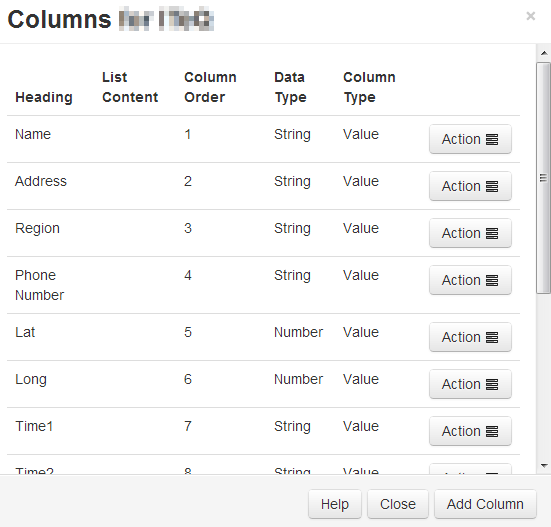
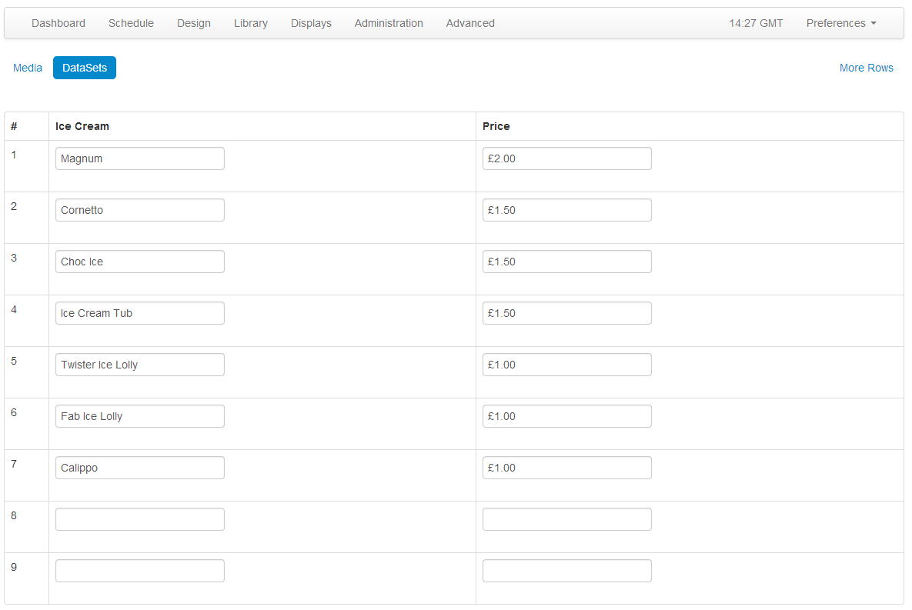

<!--toc=media-->
# DataSets

DataSets are a feature to design and store tabular data. Once designed the data can be imported from a CSV file, entered manually, as JSON via the API or synced remotely on a schedule. A DataSet provides a convenient way to import and display data from other systems in [[PRODUCTNAME]].

Examples of where this could be used are:

*   A drinks menu at a bar
*   Tee times at a golf club
*   Meeting room bookings

DataSets have been designed to be versatile and reusable and therefore come in two parts:

*   The DataSet (Data Structure and data)
*   The Display (DataSet View / Ticker / a source of data for a custom Module)

The DataSet is defined in the Library and can be reused across multiple DataSet views and Layouts. DataSets are accessed using the Library menu, DataSet sub menu. An example table showing DataSets is below.


Each data set can have a number of actions performed against it, using the row menu.


## Designing your DataSet

DataSets can be added using the top right "Add DataSet" button and Edited using the row menu. Designing a DataSet is a 2 step process - first you add the DataSet record and then you configure the columns.

- **Name**: A name for the DataSet - used to identify it later in the CMS.
- **Description**: A description of this DataSet - what is it and what is it for.
- **Code**: A code for this DataSet, usually used for referencing this DataSet via the API
- **Is Remote?**: Should this DataSet sync itself with a remote data source?


If you choose to make the DataSet a remote DataSet then you will also need to fill in details for the remote data source URL, request params, request method and authentication information. You will also need to determine how the resulting remote DataSet should be used. Further explaination on what these fields mean can be found below.


#### Permissions

The creator of a dataset (or an admin) is able to set the permissions for the DataSet on a user group, or on a user by user basis. Only users with Edit permissions will be able to add/edit data and reorganise the data structure, only users with a view permission will be able to use the DataSet in their Layouts.


### Columns

Columns are added/edited by selecting "View Columns" from the row menu of any DataSet. A new window will open showing all columns currently created on that DataSet.



Columns are used to define the structure of the data, each column has a number of settings to achieve this, these are:

- **Heading**: The Heading for this Column
- **Column Type**: Value, Formula or Remote. Is this column a user entered value (Value) or a calculated column (Formula).
- **Data Type**: What is the format for this data? String, Number, Date, Library Image, External Image.
- **Column Order**: The position this column should appear when viewing / entering data.

Depending on the Column Type a column will also require:

- **List Content**: A comma separated list of values that can be selected for this field.
- **Remote Data Path**: A JSON syntax string showing how to access the data in the remote data source


There is no theoretical limit to the number of columns [[PRODUCTNAME]] can support; although a smaller DataSet is often easier to enter and display.

Columns can be added and removed after data has been entered. The ordering and list content of columns can also be changed after data has been collected.


### Remote DataSets

Remote DataSets are a special type of DataSet which periodically syncs from a 3rd party data source which you specify when adding/editing the DataSet. [[PRODUCTNAME]] will call the URL specified at the time period specified and parse the data according to the instructions set on the DataSet and any Remote Columns.

The remote data source must be JSON formatted.

Data is populated according to the Columns defined that are of column type "Remote". When specifying a remote column a "data path" is entered which is the JSON syntax path to the data for that column, with respect to the Data Root specified on the DataSet.

Consider an example JSON data source:

```json
{
    "base": "EUR",
    "date": "2017-12-22",
    "rates": {
        "GBP": 0.88568,
        "THB": 38.83,
        "USD": 1.1853
    }
}
```

If we wanted columns to capture the currency symbol and value, we would set our "Data Root" to `rates` and then have a columns for:

- Symbol - data path = 0
- Value - data path = 1


#### Dependents

A remote DataSet can depend on another DataSet to formulate its request. Each row in the dependent DataSet will be used to create a request using the parent DataSet's request parameters.


## Deleting

DataSets can be deleted using the action menu. Select the Delete menu item to show the DataSet Delete form. DataSets can only be deleted if they are not currently being used.


# Data

Once you have your DataSet configured you will want to add some data to it. This can be done in a number of ways:

- Manually through the CMS user interface
- Imported via a CSV file
- Through the API
- Remotely synced


## Manually

Data can always be viewed/added and edited in a DataSet using the View Data row menu, or the "View Data" action menu on the Columns page. The data table returned will contain a column for each of the Columns you've defined in your configuration. There will also be a filter option for each - see below for an example:




A new row can be added using the "Add Row" button, which opens a form with fields for all non-forumla columns. A row can be eidted by clicking anywhere on the row, and deleted using the `x` in the right most column.


## Importing from CSV file

The CMS has a DataSet CSV importer that can be used to extract data from a CSV file and put it into a DataSet. The importer can be accessed through the row menu of any DataSet, except DataSets configured for remote data sources.

When the importer opens the columns in the DataSet will be listed out with a field next to them indicating the column in the remote file that should be used as a source of data for that column. You may also choose to overwrite the existing data and ignore the first row of the CSV file.

An example of the form is shown below:


It is important to ensure that your CSV file has the correct file encoding if you are using non-ASCII characters. Non-ASCII characters are very common for languages outside of English. The file encoding most commonly used is UTF-8.

If you have edited your CSV file using Excel, you will need to make sure you select "Unicode (UTF-8)" from the Tools -> Web Options -> Encoding tab on the Save as dialog.


## Through the API

You can write your own application which syncs data into a DataSet using the [[PRODUCTNAME]] API. Data can be added row by row or via importing whole JSON structures.

<nonwhite>

Further discussion on the API can be viewed in the [CMS API documentation](cms_api.html).

</nonwhite>


## Remotely


Remote DataSets are kept in sync with a Task called "Fetch Remote DataSets". This task is configured by default and runs once per minute.