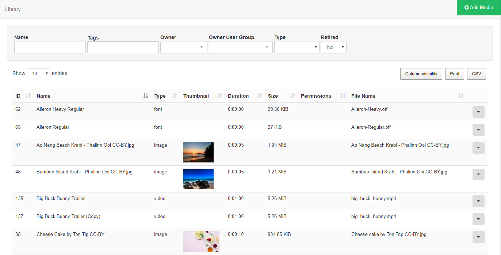
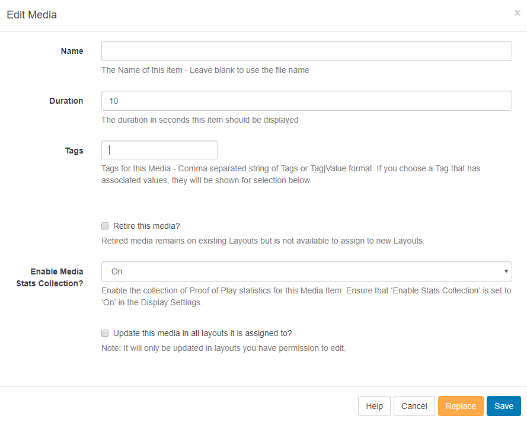
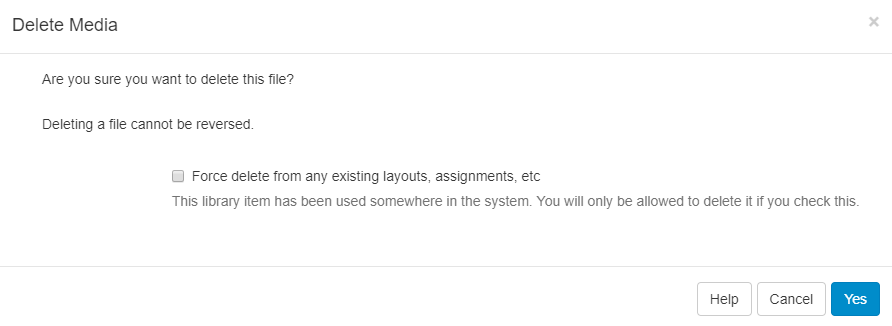
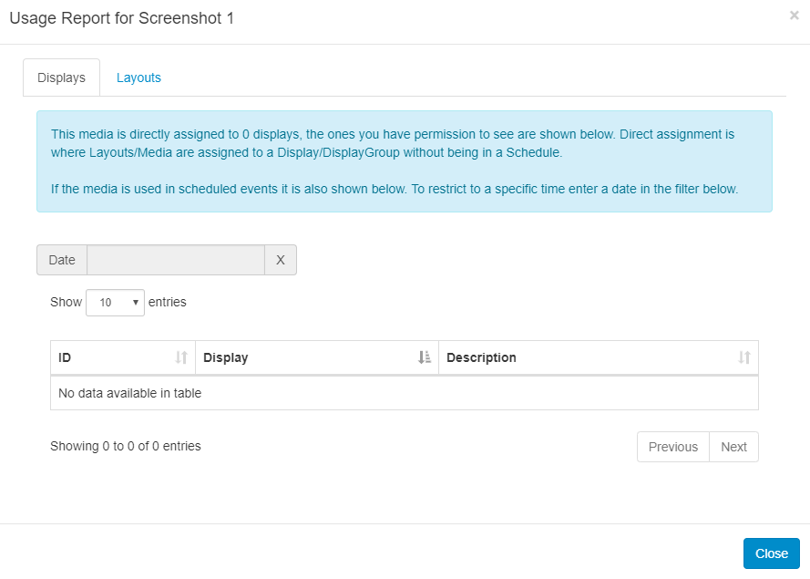

<!--toc=media-->

# Library 

The CMS Library stores all file-based media that is uploaded for use onto Layouts.

## Uploading Media

Library media can be either uploaded directly to the Library using our easy to use file upload tool or by URL.

{tip}
**Please note:** Adding Media via URL is available from v2.2.0
{/tip}

Navigate to Media under the Library section of the menu to open the Library grid:

### Add Media

Uploading is achieved in two steps.

1. Click **Add files** and select the file(s) you wish to upload.
2. Click **Start upload** to begin the transfer of all files, alternatively click on the blue upload button next to individual files to upload individually. Once successfully uploaded, click Done.

{tip}
Files can also be added via drag and drop.
{/tip}

{tip}
Media can also be uploaded directly to a **Widget** assigned in a **Layout**, which will also save to the Library by default.
{/tip}

### Add Media (URL)

Use the Add Media (URL) button to provide a remote URL to the file.

{tip}
All media items that have been uploaded to the Library are available to include in Layouts by simply using the [Library Search](layouts_library_search.html) tab on the **Layout Designer** tool bar.
{/tip}

## Adding New Fonts

[[PRODUCTNAME]] comes with a set of standard fonts provided by our text editor tool - CKEditor. New fonts can also be added and uploaded to the **Library** using the easy file upload tool. Once added the font will be available to use in the text editor.

{tip}
If the new font does not show in the text editor after upload, try clearing the browser cache. 
{/tip}

{tip}
**Please note:** Fonts have preferences built into them known as OS/2 tags. [[PRODUCTNAME]] checks for OS/2 preferences and can use fonts with OS/2 tags 0 or 8. Fonts with other OS/2 tags may produce an error on uploading and may not display correctly.
{/tip}

## Row Menu 

Each **Media** file has a row menu with a list of actions and shortcuts that can be performed against it:

### Edit

The Edit Media form allows you to make edits to the name and duration of the selected file amongst other actions.

**Tags**:

Media can be tagged to allow for ordering and make files easier to find.

{tip}
Administrators can set certain **Tag's** to have a **Value** associated to them. Tags that have a Tag Value will show the selections available from an additional field - **Tag value** drop down.

From v2.3.6, you can add an associated value for Tags without an existing predefined value. Enter the Value you wish to associate with the Tag in the **Tag value** field and click enter. If you do not wish to enter a Tag value, then this field can be left blank.

For further information on what Tag and Tag Values to use, please speak with your Administrator.
{/tip}

**Expiry date:** (available from v2.2.0)

Select a date and time to completely remove the selected Media file from the CMS
**Please note:** This will remove the Media from any Layouts that contain this file.

**Retire this media:**

If you do not want to completely remove the Media file and keep it assigned to existing Layout's then tick the **Retire this media** option. The Media file will not show for selection for new Layouts.

**Enable Media Stats Collection:**

Use the drop-down to set the collection of [Proof of Play](displays_metrics.html#proof_of_play) statistics to On / Off / Inherit for the selected Media file.

{tip}
To collect Proof of Play records ensure that the Enable Stats Reporting has been ticked in [Display Settings](displays_settings.html)

**Update this Media in all Layouts it is assigned to:**

Ticking this box will update any edits made to be reflected in the Layouts that the selected Media file is currently assigned to.

{tip}
Edits will only be updated in Layouts which you have permission to edit.
{/tip}

**Replace**

It may be necessary to upload a new revision of an existing file. This can be done by using the **Replace** button at the bottom of the form.

Upload a replacement file using the same steps as before and select whether the replacement file should be updated to all Layouts it is currently assigned to and the old version removed.

### Copy

Make copies of the selected media file, give the copied file a new name and Tag.

### Delete

Media files can only be deleted from the CMS if they are not being used on any existing **Layouts**. The option to force a delete from any existing Layouts must be used with caution, deleting a file cannot be reversed.

{tip}
Retiring content means that it will no longer be available to assign to new Layouts but will remain in existing Layouts it is assigned to, meaning scheduled content can remain unaffected.
{/tip}

### Permissions

Assign **view/edit/delete** permissions for User/User Groups.

### Download

Download a copy of the **media file** for ease of sharing.

### Enable Stats collection?

Click to select **Off** / **On** / **Inherit** settings for collection of **Proof of Play** statistics for the selected media file.

### Usage Report

This will show if the selected **media file** is scheduled to **Displays**. Use the Layout tab to see what Layouts the media file is currently included in.

{tip}
The Usage Report is great to make checks prior to deleting files.
{/tip}