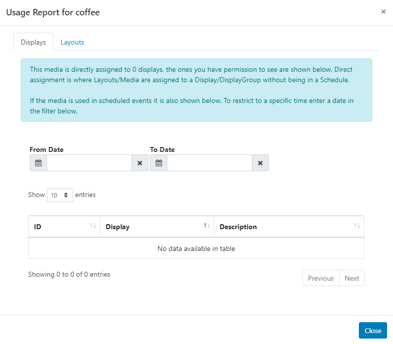
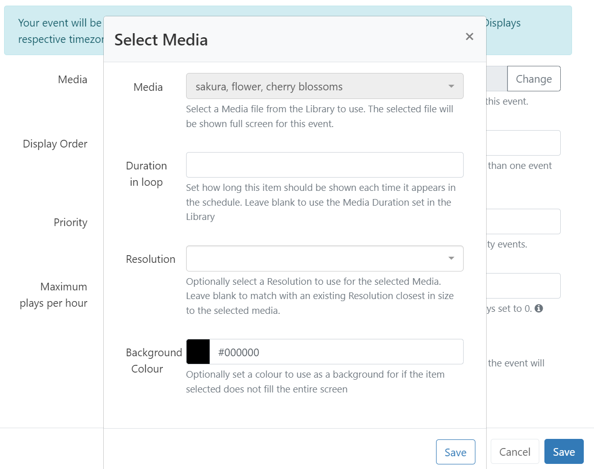

# Media Library 

[[PRODUCTNAME]] supports a wide variety of media types, from Widgets which are created and stored directly on Layouts and Playlists to file-based media that is uploaded and stored in the CMS Library which can then be reused across multiple Layouts and Playlists.

{version}
**NOTE:** [[PRODUCTNAME]] takes no measures to control what content is put on your Displays. It is your responsibility to ensure that your content is appropriate material for your desired audience. Content must be appropriately attributed if you do not own the rights to it.
{/version}

Manage all file based media by selecting **Media** under the **Library** section of the main CMS menu:

Use the multiple filter fields across the top of the [grid](tour_cms_navigation.html#content-grids) to restrict criteria for returned results.

{tip}
Use the **OR/AND** option for **Names** and to filter items that have been assigned multiple **Tags**.

Images and Videos that have a set thumbnail can also be filtered by **Orientation** once set:

- Use the row menu for the item and select **Edit** for an Image/Video file.  

- Scroll down to the bottom of the form and set the intended **Orientation**.

{/tip}

 [Folders](tour_folders.html) are used to organise, search and easily [Share](users_features_and_sharing.html) User objects with other Users/User Groups.

- Click on a Folder/sub-folder to search the contents of only the selected Folder and return results based on any filters applied.

or

- Tick **All Folders** to include searching in the Root Folder and return results based on any filters applied.

{tip}
Click the Folders menu to toggle on/off from view.  When the Folder tree is hidden from view, the file path for the selected folder will be shown!
{/tip}

## Adding Library Media

Library media can be either uploaded directly using the **Add Media** button or by providing a URL using the **Add Media (URL)** button.

{tip}
Add Media to the CMS Library and save to [Folders](tour_folders.html) to have media ready for use for the appropriate [Users](users_administration.html)/[User Groups](users_groups.html)! 

Files added to the CMS Library can be easily added to Layouts and Playlists using a [Library Search](layouts_editor.html#content-library-search)
{/tip}

### Add Media (Upload)

- Select the **Add Media** button

  

- Click **Add files** and select the file(s) you wish to upload. 

{tip}
Default thresholds and limits can be specified which are then considered in the event an [Image](media_module_image.html) should be resized when uploading an image for example. Further information can be found in [CMS Settings](tour_cms_settings.html#content-resizing-images).
{/tip}

- Give your file a **Name** for easier identification in the CMS and optional [Tags](tour_tags.html). 

{tip}
If the Name field is left blank, the file will be named as per the original file name on upload!
{/tip}

Upload files to a specified Folder location to inherit the View, Edit, Delete Share options that have been applied to the destination Folder for easy User/User Group access:

- Click on the **Select Folder** button and expand to select the Folder to save in.

{tip}
Users can also right click a Folder to access further options as enabled in the [Feature and Sharing](users_features_and_sharing.html) options for a User/User Group.
{/tip}

- Click in the Folder you wish to upload the file to and click **Done**. 
- The **Current Folder** will now show the selected file path.

- Click the **Start upload** button to begin the upload of all files. If a Folder has been selected and you have added multiple files, all files will be uploaded to that location.

Files can also be uploaded individually and have different Folder locations specified:

- Instead of clicking on the Start upload button, click on the **blue upload** button shown at the end of the row for an added file. 

- Change the Folder location using the **Select Folder** button as before and then click the blue button at the end of the row to upload just that singular file.

- Once all files have been successfully uploaded, click **Done**.

{tip}
Media files can also be uploaded directly to Layouts/Playlists using the upload tool from a [Library Search.](layouts_editor.html#content-library-search) Media uploaded to a Playlist have an additional option to set [Widget Expiry Dates](media_playlists.html#content-widget-expiry-dates).

Media files that are uploaded and added directly to Layouts/Playlists are also saved by default to the CMS Media Library.
{/tip}

### Add Media via URL

- Select the **Add Media (URL)** button:

- Save to a [Folder](tour_folders.html) to inherit the View, Edit, Delete Share options that have been applied to the destination Folder for easy User/User Group access.
- Provide the remote URL for the file.
- Give your file a **Name** for easier identification in the CMS.

{tip}
If the Name field is left blank, the file will be named as per the original file name!
{/tip}

- Click to **Save**.

## Row Menu

Each item in the **Library** has a row menu where Users can access a list of actions/shortcuts

## Edit

Select **Edit** to make changes to **Folder** locations, **Durations** and **Tags** and other settings.

- Notable settings are listed below:

### Expiry Dates

Set an Expiry Date for Library Media to remove the file from any Layouts/Playlists it has been used on. 

### Retire Media

Ticking **Retire this Media** will keep the media file assigned to any existing Layouts/Playlists but will not be made available for further selection to add to Layouts/Playlists.

### Enable Media Stats Collection

- Set the collection of [Proof of Play](displays_metrics.html#proof_of_play) statistics to On / Off / Inherit for the selected media file.

{tip}
Ensure that **Enable Stats Reporting** has been ticked in [Display Settings](displays_settings.html) in order to collect Proof of Play stats!
{/tip}

### Update Media

Use the check box **Update this Media in all Layouts it is assigned to** so that any edits are reflected in Layouts/Playlists that this media file is currently assigned to. 

{tip}
Edits will only be updated in Layouts/Playlists which you have [access](users_features_and_sharing.html#content-share) to edit!
{/tip}

### Replace Media

It may be necessary to upload a new revision of an existing file by using the **Replace** button at the bottom of the form.

- Upload a replacement file using the same steps as before to [Add Media (Upload).](media_library.html#content-add-media-upload)
- Tick to **Update** the replacement file to all Layouts/Playlists it is currently assigned to.
- Tick to **Delete** the old file version completely from the CMS.

## Delete

Media files can only be deleted from the CMS if they are **not** being used on any existing **Layouts/Playlists**.

{version}
The option to force a delete must be used with caution as deleting a file cannot be reversed.
{/version}

{tip}
[Retiring Content](media_library.html#content-retire-media) rather than deleting it will keep the media file in any existing Layouts/Playlists it has been assigned to, with any scheduled content unaffected. Media will not be available to add to any new Layouts/Playlists.
{/tip}

{feat}Purge List|v4{/feat}

- Tick in the box to enable a hard push using XMDS to completely remove the file from a Players local storage.

### Usage Report

{tip}
This report is great to use to make final checks prior to tidying media files!
{/tip}

This will show if the selected **media file** is directly assigned/scheduled to **Displays**. 

- Use the Layout tab to see what **Layouts** the media file is currently included in. 

{tip}
Use the [With Selected](tour_cms_navigation.html#content-multi-select---with-selected) option at the bottom of the Library grid to muti-select rows to easily perform bulk actions!
{/tip}

### Schedule

Image and Video Library media files can be directly Scheduled to a Display as full screen content from the row menu.

- Click **Schedule**

- Set the **Duration** of the item to determine how long this media file should be shown each time it appears in the schedule. Use the duration,as set in the Media Library by leaving this field blank.
- Optionally select a **Resolution** to use. If left blank a resolution that matches closest in size to the selected media file will be used.
- An optional **Background Colour** can be set to fill any gaps if the media does not fill the entire screen.
- **Save**
- Complete the rest of the form fields to complete the new [Schedule](scheduling_events.html).

## Tidy Library

As the CMS is used and Layouts/Playlists and Media are added, over time the Library can become cluttered with old content that is no longer in use.

The Library can be *tidied* by a User or Super Administrator so that it is kept clean and small. 
**Actions cannot be reversed so this must be used with caution.**

{tip}
This might be particularly useful if the CMS is installed on a web server that has quotas or if Users have been assigned their own quotas!
{/tip}

There are two places where the Library can be tidied:

1. From [CMS Settings](tour_cms_settings.html#content-tidy-library-(global)) - available to all Super Administrators only.
2. From the **Library**  - for all Users when [Enable Library Tidy](tour_cms_settings.html#content-tidy-from-user-library) is ticked.

{nonwhite}
{cloud}
The Tidy Library function is turned off by default for **Xibo Cloud Hosting** customers as it can be potentially destructive if the options are not fully understood. Use the checkbox to [Enable Library Tidy](tour_cms_settings.html#content-tidy-from-user-library) if required.
{/cloud}
{/nonwhite}

Once enabled Users can click on a **Tidy Library** button located at the top of the Library page:

 The form will show the number of files that will be deleted and how much space those files take up.

{tip}
This will only delete files that are owned by the logged in User which are no longer in use on a Layout or Assigned to a Display Group/Display.
{/tip}

#### Next...

[Modules and Connectors](media_modules.html)