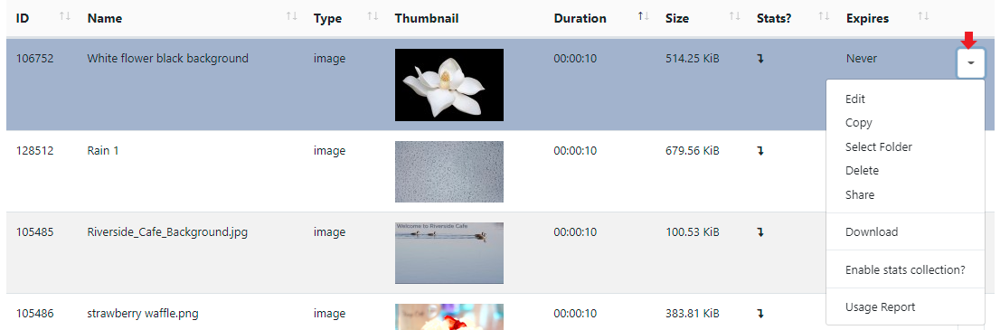
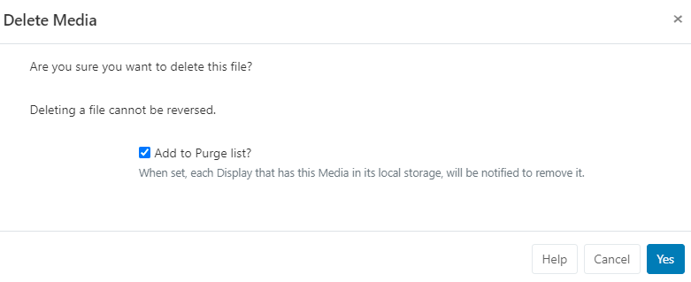

<!--toc=media-->

# Library 

{tip}

**Please note:**

- If you are using a v3.0.x CMS, please click [here](media_library_3.html)

- If you are using a CMS version earlier than v3.0.0 please click [here](media_library_2.html)
  {/tip}

The CMS Library stores all file-based media that is uploaded for use on Layouts. 

{tip}
Pixabay images and videos that are selected to be used on Layouts/Playlists are also added to the Library!
{/tip}

Library media is managed from **Media** under the **Library section** of the main menu:

Use the availalble filters to easily narrow down searches.

{tip}
Use the **AND** option to filter items that have been assigned multiple **Tags**!
{/tip}

{tip}
Images and Videos that have a set thumbnail can also be filtered by Orentation. Set by using the row menu and select **Edit** for an Image/Video file.  Scroll down to the bottom of the form and set the intended **Orientation**.
{/tip}

Use the **Folder Search** option to view media saved to folders:

- {tip}
  When Folders are hidden from view, the file path for the selected folder will be shown!
  {/tip}

  - Click on a Folder/sub-folder to search the contents and return results based on any filters applied to the grid.

  or

  - Tick **All Folders** to include searching in the Root Folder and return results based on any filters applied to the grid.

## Adding Media

Library media can be either uploaded directly using the **Add Media** button and uploading or by providing a URL using the **Add Media (URL)** button.

{tip}
Upload to the library to have media ready for use to be selected using [Library Search](layouts_library_search.html) options!
{/tip}

### Upload

- Select the **Add Media** button at the top of the grid:

  

- Click **Add files** and select the file(s) you wish to upload. 

{tip}
Files can also be added via drag and drop!
{/tip}

- Give your file a **Name** for easier identification in the CMS and an optional **Tag**. 

{tip}
If the Name field is left blank, the file will be named as per the original file name on upload!
{/tip}

Media can also be directly uploaded to a specified [Folder](tour_folders.html) location.

{tip}
Media files that are saved in Folders will inherit the View, Edit, Delete Share option that have been applied to the destination Folder for User/User Group access!
{/tip}

- Click on the **Select Folder** button and expand to select a Folder to save in.

- Users can also right click a Folder to access further options.

{tip}
Available Folder options are based on enabled [Feature and Sharing](users_features_and_sharing.html) options for a User/User Group.
{/tip}

- Click in the Folder you wish to upload the file to and click **Done**. 
- The **Current Folder** will now show the selected file path.

- Click the **Start upload** button to begin the upload of all files. If a Folder has been selected and you have added multiple files, all files will be uploaded to that location.

Files can also be uploaded individually and have different Folder locations specified.
Instead of clicking on the Start upload button, click on the **blue upload** button shown at the end of the row for an added file. 

- Change the Folder location using the **Select Folder** button as before and then click the blue button at the end of the row to upload just that singular file.

- Once all files have been successfully uploaded, click **Done**.

{tip}
Media files can also be uploaded directly to Layouts using the upload tool from the [Library Search](layouts_library_search.html) function for Images, Audio and Video files. Other file types (such as PDF) can be uploaded by adding the associated **Widget** to a  **Layout**. Files that are added directly to Layouts are saved by default to the Library.
{/tip}

### Add Media via URL

- Select the **Add Media (URL)** button at the top of the grid.

- Use the Select Folder button if you need to select /create a specific Folder to add this media file to.
- Provide the remote URL for the file.
- Include a Name to be used instead of the file name if required for easier identification in the system.
- Click to **Save**.

## Upload Fonts

[[PRODUCTNAME]] comes with a set of standard fonts provided by our text editor tool - CKEditor, which are currently:

- Aileron Heavy Regular (Aileron-Heavy.otf)
- Aileron Regular (Aileron-Regular.otf)
- Dancing Script Regular (DancingScript-Regular.ttf)
- Railway Regular (Railway.ttf)
- Linear Regular (linear-by-braydon-fuller.otf)

Additional fonts can be added to the **Library** using the uploader tool. Once added, the font will be available to use in the text editor.

{tip}
If the new font does not show in the text editor after upload, try clearing the browser cache!
{/tip}

{tip}
**Please note:** Fonts have preferences built into then known as **OS/2 tags**. [[PRODUCTNAME]] checks for OS/2 preferences and can use **fonts with OS/2 tags 0 or 8**. Fonts with other OS/2 tags may produce an error on uploading and may not display correctly.
{/tip}

Each item in the **Library** has a row menu where users can access a list of actions/shortcuts

### Edit

Make changes to Folder location, Naming, Duration etc:

- **Current Folder** will show the current file path.  Click **Select Folder** to move to a different location.
- [Tags](tour_tags.html) - allow for ordering and make files easier to find.

- **Expiry date** - set a date and time to remove the selected media file completely from the CMS.

{tip}
**Please note**: Expiry dates are currently not supported for the Linux Player.
{/tip}

{tip}
**Please note:** This will remove media from any Layouts that contain the selected file.
{/tip}

{tip}
If you do not want to completely remove the media file and keep it assigned to existing Layout's then tick the **Retire this media** option. The Media file will not show for selection for new Layouts.
{/tip}

- **Enable Media Stats Collection** - set the collection of [Proof of Play](displays_metrics.html#proof_of_play) statistics to On / Off / Inherit for the selected Media file.

{tip}
To collect Proof of Play records ensure that the Enable Stats Reporting has been ticked in [Display Settings](displays_settings.html)
{/tip}

- **Orientation** - applicable for Images and Videos, set as Landscape or Portrait to set for filtering.

{tip}
Use the check box **Update this Media in all Layouts it is assigned to** so that edits made are reflected in Layouts that this Media file is currently assigned to. Edits will only be updated in Layouts which you have permission to edit.
{/tip}

It may be necessary to upload a new revision of an existing file. This can be done by using the **Replace** button at the bottom of the form.

Upload a replacement file using the same steps as before and select whether the replacement file should be updated to all Layouts it is currently assigned to and if the old version should be removed.

### Copy

Make copies of the selected media file, give the copied file a new **Name** and **Tag**.

### Select Folder

Select a [Folder](tour_folders.html) to save the media file to.

### Delete

Media files can only be deleted from the CMS if they are **not** being used on any existing **Layouts** .The option to force a delete from any existing Layouts must be used with caution as deleting a file cannot be reversed.

{tip}
**Retiring Content** means that it will no longer be available to assign to new Layouts but will **remain** in existing Layouts it is assigned to, meaning scheduled content can remain unaffected. Click on **Edit** and tick the box to retire on the Edit Media form!
{/tip}

Tick in the box to enable a hard push using XMDS to completely remove the file from a Players local storage:

**Please note:** The Purge list functionality is  supported from Android R301 and Windows R302. We are currently working to bring this to all Players.

### Share

Enable [Share](users_features_and_sharing.html) options for selected Users/User Groups.

### Download

Download a copy of the **media file** for ease of sharing.

### Enable Stats collection

Enable the collection of Proof of Play statistics.

### Usage Report

This will show if the selected **media file** is directly assigned/scheduled to **Displays**. 

- Use the Layout tab to see what **Layouts** the media file is currently included in. 

{tip}
The **Usage Report** is great to make final checks prior to tidying media files.
{/tip}

{tip}
Use the **With Selected** option at the bottom of the Library [Grid](tour_grids.html) to Edit Tags, Move to Folder, Delete and Share in bulk!
{/tip}