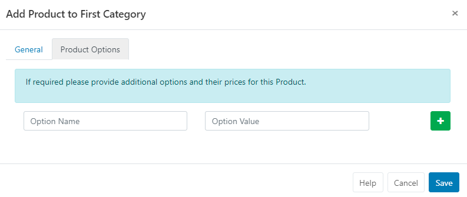
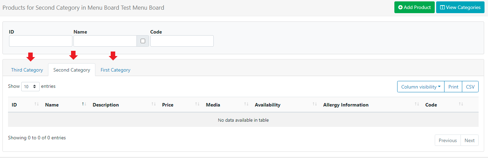

<!--toc=media-->

# Menu Boards

The Menu Boards interface provides a simple way for users to create and configure information to be used with the [Menu Board Widget](media_module_menuboards.html) to display Menu  items and information using customisable templates.

{tip}
Menu Boards is available from v3.1.0 upgrade from earlier versions to take advantage of this feature!
{/tip}

Menu Boards allow for the creation of 'reusable Menus' which are created and managed independantly to Layouts. Once created, Menus can easily be reused across multiple Layouts.

Using Menu Boards is a two part process:

- The Menu Board - contains the content of the Menu
- The Menu Board Widget - allows for configuration of the Menu

Menu Boards are administered by clicking on **Menu Boards** under the **Library** section of the main menu:

The **Folder** tree will open by default:

- Click on a Folder/ sub-folder to search the contents and return results based on any filters applied to the Grid.

or

- Tick **All Folders** to include searching in the Root Folder and return results based on any filters applied to the Grid.

{tip}
Click the Folders menu to toggle on/off from view. When Folders are hidden from view, the file path for the selected folder will be shown!
{/tip}

The Menu Boards [Grid](tour_grids.html) allows users to create new and edit existing.

## Creating Menu Board data

Creating information for Menu Boards requires 3 stages:

1. Adding a Menu Board record
2. Creating Categories
3. Adding Products

### 1. Add new Menu Board

Click on the Add Menu Board button and complete the form fields:

- Provide a **Name** for easy identification purposes within the CMS.
- Menu Boards can be optionally saved to **Folders**

{tip}
Menu Boards that are saved to Folders will inherit the View,Edit and Delete **Share** options that have been applied to the destination Folder for User/User Group access!
{/tip}

- Click on the **Select Folder** button and expand to select the folder to save in.
- Users can also right click a Folder to access further options.
- The selected folder file path will be shown next to the Folder field on the form.

{tip}
Options available to User/User Groups are based on enabled [Feature and Sharing](users_features_and_sharing.html) options!
{/tip}

{nonwhite}
{tip}
Further information for Administrators regarding Folder access and set-up can be found [here](https://xibo.org.uk/docs/setup/folders-administration).
{/tip}
{/nonwhite}

- Enter a **Code** to be used to identify this Menu Board (advanced use used for referencing the API).
- Include an optional **Description** to give more detail/instructions to other potential users of the Menu Board.
- Click to **Save**.

### 2. Create Categories

Categories are used to define and structure the menu.

- Use the row menu for a Menu Board and select **View Categories**:

  

Click on the **Add Category** button and complete the required form fields:

- Provide a **Name** which can be selected to be shown on displays as a header.
- Enter a **Code** to be used to identify this Category (advanced use used for referencing the API).
- Optionally include a **Media** file to be used for this category. 
- Click to **Save**.

Repeat this process to add the required **Categories** for the Menu Board.

### 3. Add Products

Add Products to Categories to provide pricing and other key information, to be shown on displays.

- Use the row menu for a Category and select **View Products**:

 

- Click on the **Add Product** button and complete the product information to display on screen:

- Provide the **Name** of your product.
- Give your product a **Description** to provide further information to the intended audience.

- Enter a **Price** (this can also be text such as TBC / Free etc)

{tip}
The **Price** field must not be left blank in order to save the form!
{/tip}

- 
  Toggle **On Availability** to show the product information in the menu board. Products that are toggled to **Off** will not automatically show. 

{tip}
The Menu Boards Widget has a setting to allow for **Unavailable Products** to show greyed out!
{/tip}

- Enter a **Code** to be used to identify this Product (advanced use used for referencing the API).

- Optionally include a **Media** file to be used for this Product.

{tip}
Images can be toggled on/off to be shown using the Menu Board Widget.
{/tip}

The **Product Options** tab allows for additional options to be added if required:

Repeat the process to add further **Products** to the selected Category.

Use the tabs to navigate to the other categories to add Product information.

Once all information has been completed, add the [Menu Board Widget](media_module_menuboards.html) to a Layout using the [Layout Designer](layouts_designer.html) and complete configuration options to best present the information.

{tip}
Menu Boards are edited independently to Layouts, so there is no need to access or edit the Layout(s) the Menu Board has been added to. Changes will be available in the system straight away ready to be picked up by Players on their next collection, with no need to make any edits to Layouts!
{/tip}