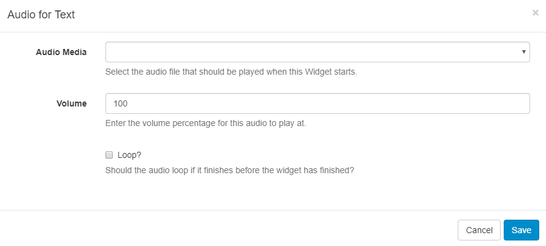
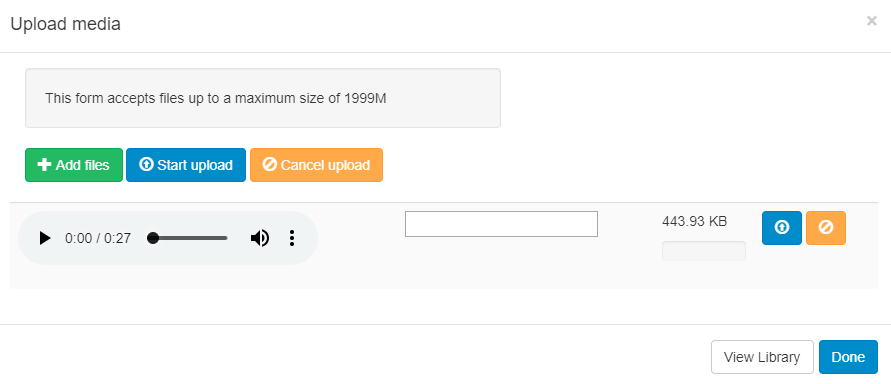

<!--toc=widgets-->

# Audio

Audio files are uploaded to the Library and served to the player for offline playback. Audio files can be **assigned** to a Widget or **added** as an Audio Widget to a Region Playlist.

## Assigned Audio Files

Each Media item on a Playlist has a speaker icon to indicate whether an Audio Widget has been assigned to it or not.

To assign an Audio file to a Widget click on the **+ speaker icon** and complete the form fields.

When assigning Audio to a Widget you can enter a volume as well as a loop parameter to determine whether the Audio will loop for the duration of the existing Widget or just play through once. The audio will be stopped when its parent Widget finishes playing.

## Adding Audio Widget

Select Audio from the Widget Toolbox and select the uploaded audio file from the Library, if it has already been added, or **Add files** to upload. Once completed the Audio Widget will be added to the Region Timeline.

<tip>
If Audio is assigned to a Widget which is the **only** Widget in its Region the Audio will stop once the Widget duration has expired, but the Widget may be left on screen until the rest of the Layout has expired.

</tip>

<tip>

The Audio Module is fully compatible with [Overlay Layouts](layouts_overlay.html) and can therefore be used effectively to draw attention.
</tip>