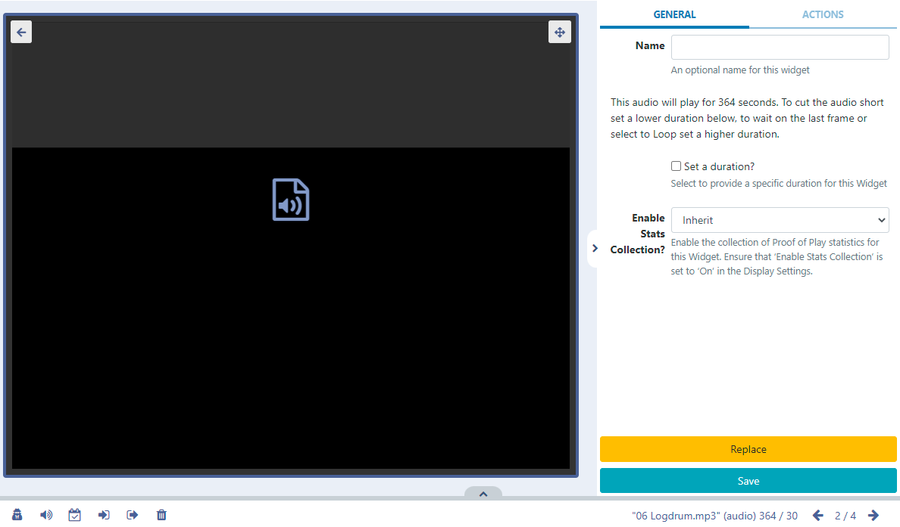

<!--toc=widgets-->

# Audio 

Add audio to Layouts.

{version}
NOTE: If you are using a CMS version earlier than 3.1, please use the links below:

- v3.0.x CMS, please click [here](media_module_audio_3.html)
- CMS earlier than v3.0.0 please click [here](media_module_audio_2.html)

{/version}

{feat}Audio Widget|v3{/feat}

Uploaded audio files are cached for off-line playback which can then be added to Layouts.

Audio files can be uploaded to the [Library](media_library.html) or uploaded directly to Layouts using the Audio [Library Search](layouts_library_search.html) function from the Toolbar in the Layout Designer.

## Configuration Options

Once added to a Layout, click on the **Audio** file icon in the **Timeline** or **Viewer** to open configuration options in the right hand properties panel:

- Provide an optional **Name** if required.
- Here you can see how long the audio will play for. 
- Tick the **Set a duration** to provide a specific duration for the audio file.

{tip}
With **Set a duration** ticked you can set a lower duration to cut the file short or select a higher duration and use the Loop function!
{/tip}

Use the **Context Menu** at the bottom of the viewer to apply further options to the Audio Widget.  

{tip}
This menu can also be easily accessed by highlighting the Audio Widget in the Layout and using a right click! See the [Layout Designer](layouts_designer.html) page for further information!

The Audio Widget is fully compatible with [Overlay Layouts](layouts_overlay.html) and can therefore be used effectively to draw attention and compliment content.
{/tip}

## Actions

Interactive Actions can be attached to this Audio Widget from the **Actions** tab in the properties panel. Please see the [Interactive Actions](layouts_interactive_actions.html) page for more information.

