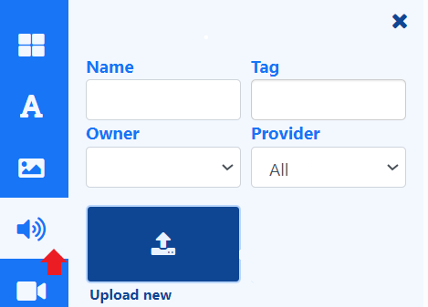

# Audio

Add Audio files to play on your Layouts and Playlists.

{feat}Audio|v3{/feat}

## Overview

- View existing and upload new audio files directly to Playlists/Layouts using the [Library Audio Search](layouts_library_search.html) from the toolbar.

- Set [start and end times](layouts_library_search#content-expiry-dates) for audio files uploaded directly to a Playlist/Layout.

- Save  audio files to [Folders](tour_folders.html#content-saving-to-folders) on upload, to easily control access to Users.

- Uploaded audio files are cached for off-line playback.

- Fully compatible with [Overlay Layouts.](layouts_overlay.html)

- Control the duration of the audio file.
  - Set a lower duration to cut the original file short.

  - Set a higher duration and use the Loop function to "loop" back to the beginning to satisfy a longer duration.

- Audio files can also be uploaded in advance to the [Library](media_library.html)

