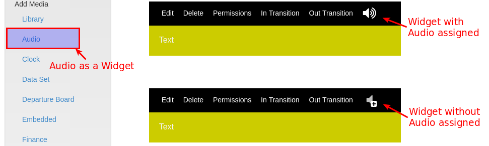

<!--toc=widgets-->

# Audio

Audio files are uploaded to the library and served to the player for
off line playback.

They can be used on a region time line as a normal widget - i.e. assigned to
the region play list - or they can be assigned to play at the start of another
media item.

Each media item in a play list has a speaker icon to indicate whether an audio
widget has been assigned to it. The icon is gray with a + sign if the widget
doesn't have any assignments, as shown below:

When assigning audio to a Widget the user can enter a volume and loop parameter.
The loop parameter determines whether the audio will loop for the duration of
the Widget it belongs to, or just play the once.

The audio will be stopped when its parent Widget finishes playing.

## Single item Region

If audio is assigned to a Widget which is the **only** Widget in its Region
the audio will stop after the Widget has expired, but the Widget may be left
on screen until the rest of the Layout has expired.

If Region loop is supported it is possible for the Widget to reload and the
audio to start again without the Layout needed to reload.

## Overlay Layouts

The audio module is fully compatible with Overlay Layouts and can therefore be
used effectively to draw attention to Overlay Layouts.
