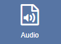
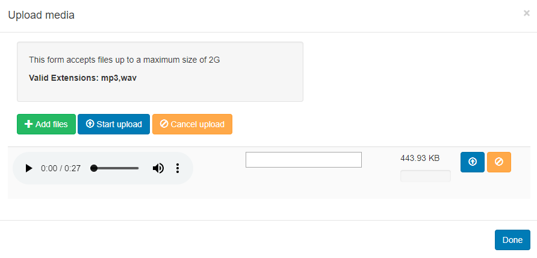

<!--toc=widgets-->

## Audio 

Audio files are uploaded to the **Library** and served to the Player for offline playback. The Audio Module allows for audio to be assigned to Layouts.

{tip}
This module is currently not supported for the Linux Player.
{/tip}

{tip}
If the audio file has already been uploaded to the Library use the [Library Search](layouts_library_search.html) tab to quickly and simply add to a Region.
{/tip}

Click on the **Audio Widget** on the toolbar,  add / drag to the target **Region.** 

{tip}
If you are using 1.8, select **Audio** from the Widget Toolbox to add to your Region Timeline.
{/tip}

Click on **Add files** to upload to the Library or click on View Library to select an uploaded file.

Once assigned to a Region, **Edit** options are available.

{tip}
If Audio is assigned to a Widget, which is the **only** Widget in its Region, the audio will stop once the Widget duration has expired, but the Widget may be left on screen until the rest of the Layout has expired.
{/tip}

{tip}
The Audio Widget is fully compatible with [Overlay Layouts](layouts_overlay.html) and can therefore be used effectively to draw attention and compliment content.
{/tip}