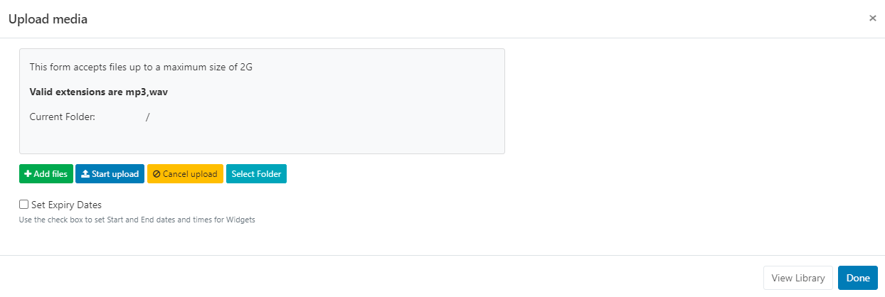
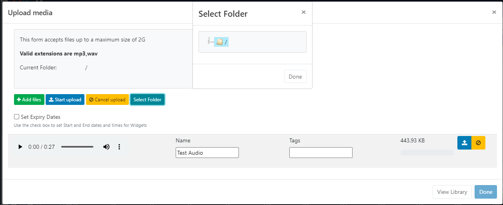
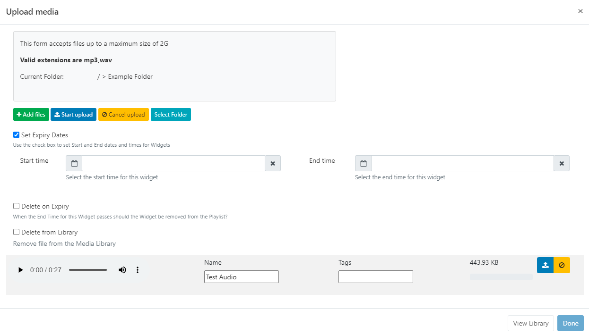
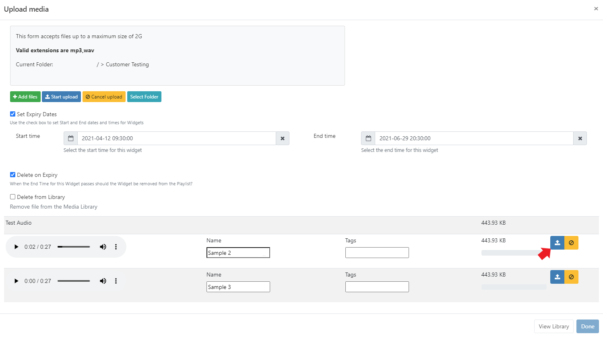
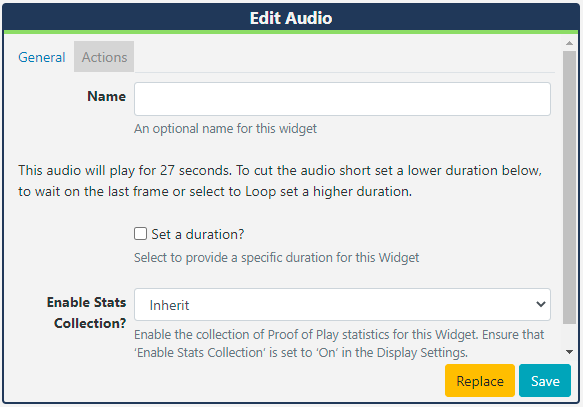

# Audio 

Add audio to Layouts.

{version}

NOTE:

- If you are using a v3.1 or later CMS, please click [here](media_module_audio.html)
- If you are using a CMS earlier than v3.0.0 please click [here](media_module_audio_2.html)

{/version}

{feat}Audio|v3{/feat}

Audio files are uploaded to the [Library](https://xibo.org.uk/manual/en/media_library.html) which are then cached for off-line playback.

## Add Widget

Click on **Audio** from the [Widget](layouts_widgets.html) toolbar and click to add or drag and drop.

{tip}
If the audio file has already been uploaded to the Library use the [Library Search](layouts_library_search.html) tab to quickly and simply add!
{/tip}

### Upload Audio file

The file uploader will open on adding the Audio Widget:

- Click on **Add files** and select the file(s) to upload.

{tip}
Files can also be added via drag and drop!
{/tip}

- Give your file a **Name** for easier identification in the CMS and an optional **Tag**.

{tip}
If the Name field is left blank, the file will be named as per the original file name on upload!
{/tip}

Audio files can also be directly uploaded to a specified **Folder** location.

{tip}
Audio files that are saved in Folders will inherit the View, Edit, Delete [Share](users_features_and_sharing.html) option that have been applied to the destination Folder for User/User Group access!
{/tip}

- Click on the **Select Folder** button and expand to select a Folder to save in.

Users can also right click a Folder to access further options.

{tip}
Available Folder options are based on enabled [Feature and Sharing](users_features_and_sharing.html) options for a User/User Group.
{/tip}

- Click in the Folder you wish to upload the file to and click **Done**. 
- The **Current Folder** will now show the selected file path.

Further information regarding Folder access and set-up can be found [here](https://xibosignage.com/manual/en/tour_folders)

There is an option to set expiry dates and times for files uploaded to this particular Widget.

{tip}
This is particularly useful should you need to preload audio for a later date/time!
{/tip}

- Tick the **Set Expiry Dates** box.

- Use the date picker to select **Start** and **End** dates and times.

- Further options are available to remove the Widget from the Playlist on expiry and to delete the media file from the Library.

- Click the **Start upload** button to begin the upload of all files added. If a Folder/Expiry Dates have been selected and there are multiple files to be added, all files will be uploaded to the specified location and have the same Expiry Dates set.
- Once successfully uploaded, click **Done**.

Files can also be uploaded individually and have different Folder locations/Expiry dates and times specified.
Instead of clicking on the Start upload button, click on the **blue upload** button shown at the end of the row for an added file. 

Change the Folder location using the **Select Folder** button as before and then click the blue button at the end of the row to upload just that singular file.

- Once all files have been individually uploaded, click **Done**.

{tip}
View or make changes to Expiry Dates by clicking on the icon on the Widget from the Timeline!
{/tip}

## Configuration Options

Click on the added **Audio Widget** from the **Timeline** to open configuration options in the **Edit Audio** form:

- Make edits to naming of the Widget if required
- Here you can see how long the audio will play for. Tick the **Set a duration** to provide a specific duration.

{tip}
Set a lower duration than shown to cut the audio short or select a higher duration and use the Loop function!

The Audio Widget is fully compatible with [Overlay Layouts](layouts_overlay.html) and can therefore be used effectively to draw attention and compliment content.
{/tip}

## Actions

Actions can be attached to this Widget, please see the [Interactive Actions](layouts_interactive_actions.html) page for more information.

