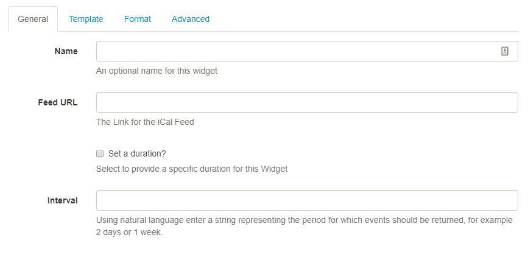
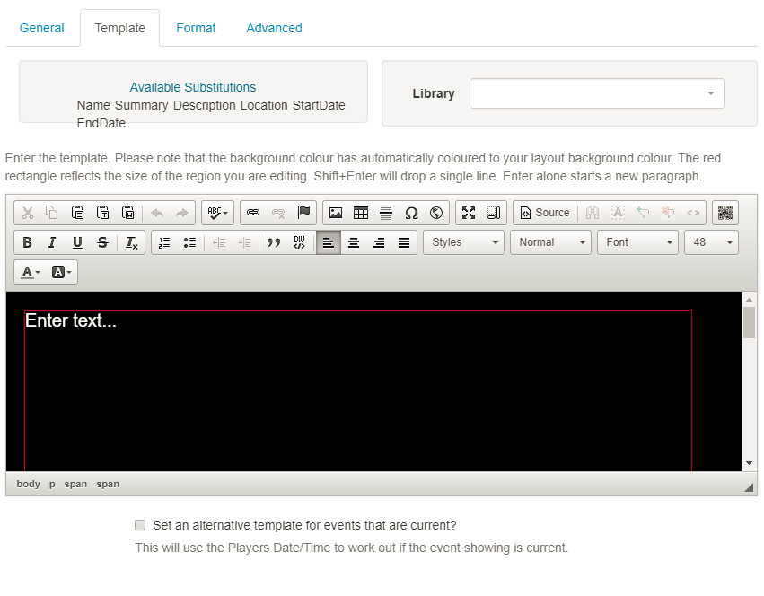
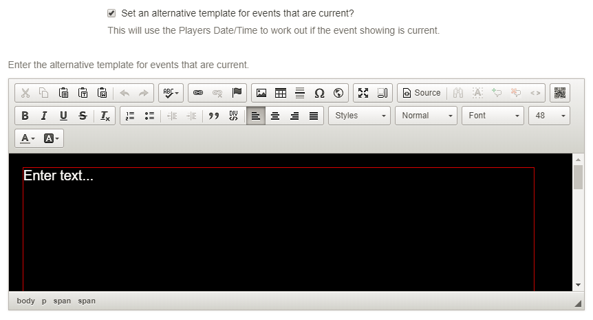
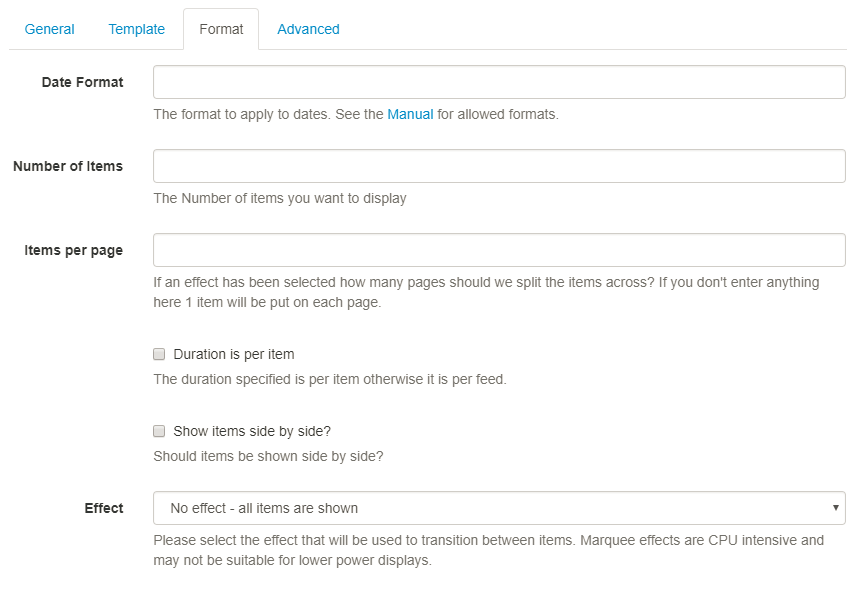
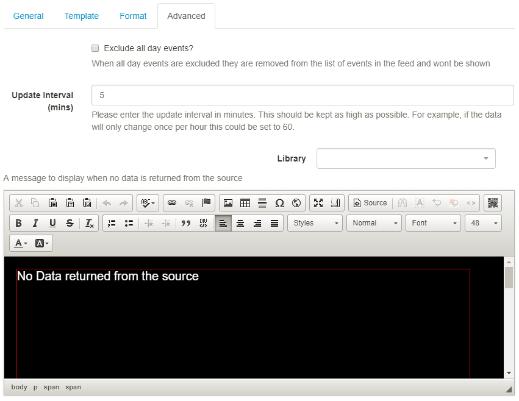

<!--toc=widgets-->

# Calendar

The Calendar Module is used to display events from an **iCAL feed**. Calendar events can be filtered using **Interval options** and formatted using text templates. 

## Edit Calendar

### General

Optionally give your Widget a name which can then be pulled into your text template.

Use the Interval option as a filter to show events for a certain period. Use natural language such as 1 day or 2 weeks to return the events within your chosen time frame.

### Template

Use the text editor to format the template. Use the tags under **Available Substitutions** to pull in the required event information from your Calendar. You can double click on the tag name, or type in the tag as its shown.

Using the **Set an alternative template for events that are current** feature will tell [[PRODUCTNAME]] to use the Players Date/Time to work out if the Event showing is current. 

An additional text editor will open so that you can include alternative text and formatting to be used just for your **current events**. 

Available substitutions should be typed into this editor to pull the required information from your Calendar.

### Format

Use **Date Format** to ensure that you show the appropriate date/time formats for your calendar events.  Click on the "Manual" link under this form field to view allowed formats.

Specify the Number of items, **Events** you wish to display from the iCAL feed.

**Items per page** - With an **Effect** selected specify the number of **Events** you wish to show per page.
{tip}
We would encourage Users to opt for an Effect when you have many Events you wish to display, otherwise, they will be shown as a static list.
{/tip}

### Advanced

Select the **Exclude all day events** tick box if you would like all day events excluded from the feed and therefore not shown on your displays.

Include a suitable time for the Update Interval in minutes, keeping it as high as possible. This determines how often the Module will request data from your feed. If your Calendar only ever modified with events Scheduled days in advance, you can set this for a long period.

{tip}
It is best practice to contact a remote feed as little as possible.
{/tip}

Include a message using the text editor to ensure that your audience is not left with blank displays when no information is returned from the iCAL feed.

{nonwhite}
Take a look at the [Calendar Module Guide](https://community.xibo.org.uk/t/calendar-module-guide-xibo-cms-1-8-10/14749) which gives a walkthrough of how to display calendar events using this Widget.
{/nonwhite}

