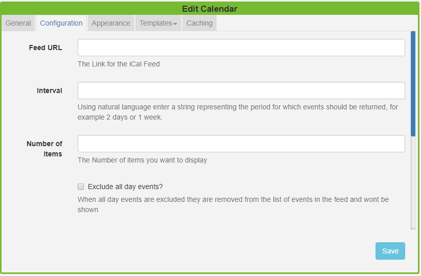
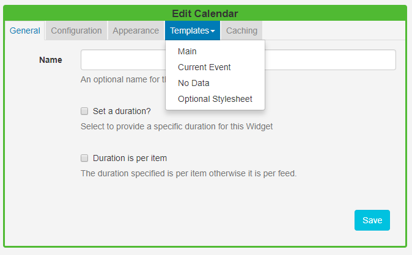
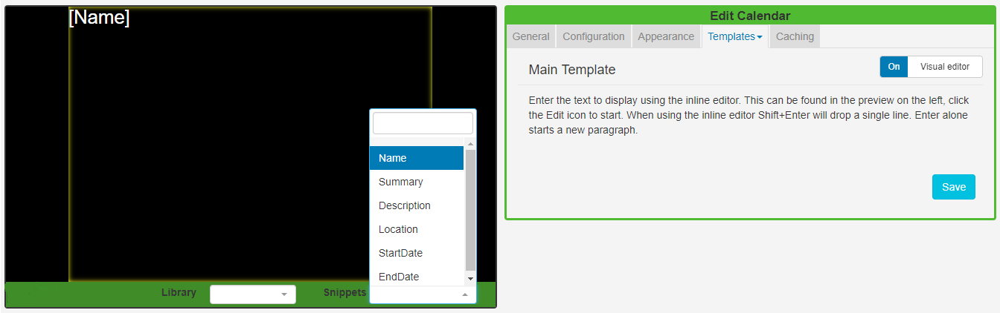
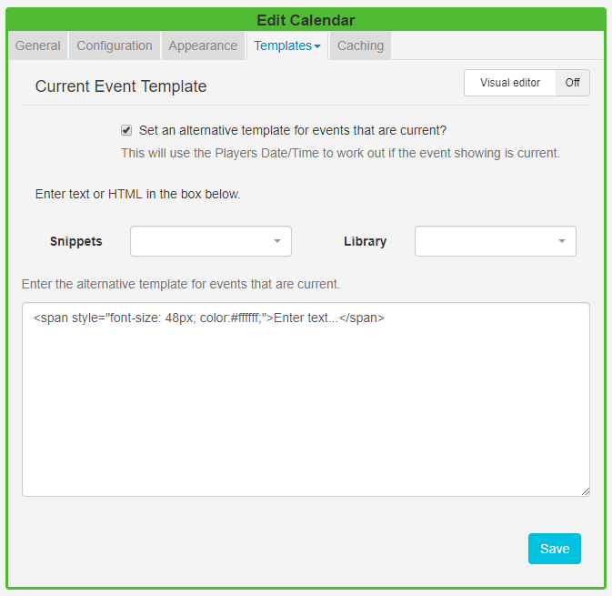

<!--toc=widgets-->

# Calendar

The Calendar Module is used to display events from an **iCAL feed**. Calendar events can be filtered using **Interval options** and formatted using text templates. 

Click on the **Calendar Widget** on the toolbar,  add / drag to the target **Region**.  

{tip}
If you are using 1.8, select **Calendar** from the Widget Toolbox to add to your Region Timeline and complete the form fields as explained below. 
{/tip}

### General

- Provide an optional name.
- Choose to override the default duration.
- Select whether the duration is per item. Left unticked the duration will be per feed.

### Configuration

- Provide the iCAL URL.
- Use the Interval option as a filter to show events for a certain period. Use natural language such as '1 day' or '2 weeks' to return the events within your chosen time frame.
- Specify the Number of items / events you wish to display from the iCAL feed.
- Select the **Exclude all day events** tick box if you would like all day events excluded from the feed and therefore not displayed.
- Choose to **Exclude current events** so that they are removed from the feed and therefore will not be displayed.
- Opt to use the **event timezone** and **calendar timezone**. Left unticked, the timezone set in the CMS will be used.
- If your feed is from **Windows** use the check box.

### Appearance

- Use **Date Format** to ensure that you show the appropriate date/time formats for your calendar events.  

- Use the checkbox to show calendar items side by side.

- Select an effect using the drop-down menu to be used to transition between items.

- With an **Effect** selected specify the number of **events** you wish to show per page.

  {tip}
  We would encourage users to opt for an effect when you have several events you wish to display, otherwise they will be shown as static lists.
  {/tip}

### Template

Click on the Template header to format the Calendar Template.

#### Main Template

Toggle **On** the Visual editor to format the main template using the inline editor. Click in the preview window to open.

Include text merge fields from the **Snippets** menu to pull in the required event information from the Calendar. Click on the **Save** button.

{tip}
If you are using 1.8 text merge fields are located under the **Available Substitutions**.
{/tip}

#### Current Event

Using the **Set an alternative template for events that are current** feature will tell [[PRODUCTNAME]] to use the Players date/time to work out if the event showing is current. 

Include alternative text and formatting to be used just for your **Current Events**. 

Include **Snippets** to pull the required information from your calendar.

#### No Data

Include a message to ensure that your audience is not left with blank displays when no information is returned from the iCAL feed.

### Optional Style Sheet

Include CSS to apply to the template structure.

### Caching

Include a suitable time for the Update Interval in minutes, keeping it as high as possible. This determines how often the Module will request data from your feed. If your calendar only ever modified with events scheduled days in advance, you can set this for a long period.

{tip}
It is best practice to contact a remote feed as little as possible.
{/tip}

{nonwhite}
Take a look at the [Calendar Module Guide](https://community.xibo.org.uk/t/calendar-module-guide/17797) which gives a walkthrough of how to display calendar events using this Widget.
{/nonwhite}

## Date Format - PHP

[[PRODUCTNAME]] should accept any date format that is in a correct PHP date format, the following characters are recognised and can be used:

| Format Character | Description                                                  | Example returned values                 |
| ---------------- | :----------------------------------------------------------- | --------------------------------------- |
|                  | **Day**                                                      |                                         |
| d                | Day of the month, 2 digits with leading zeros                | 01 to 31                                |
| D                | A textual representation of a day, three  letters            | Mon through Sun                         |
| j                | Day of the month without leading zeros                       | 1 to 31                                 |
| l                | (lowercase ‘L’) A full textual representation of the day of the week | Sunday through Saturday                 |
| N                | ISO-8601 numeric representation of the day of the week (added in PHP 5.1.0) | 1 (for Monday) through 7 (for Sunday)   |
| S                | English ordinal suffix for the day of the month, 2 characters | st, nd, rd or th. Works well with j     |
| w                | Numeric representation of the day of the week                | 0 (for Sunday) through 6 (for Saturday) |
| z                | The day of the year (starting from 0)                        | 0 through 365                           |
|                  | **Week**                                                     |                                         |
| W                | ISO-8601 week number of year, weeks starting on Monday (added in PHP 4.1.0) | 42 (the 42nd week in the year)          |
|                  | **Month**                                                    |                                         |
| F                | A full textual representation of a month, such as January or March | January through December                |
| m                | Numeric representation of a month, with leading zeros        | 01 through 12                           |
| M                | A short textual representation of a month, three letters     | Jan through Dec                         |
| n                | Numeric representation of a month, without leading zeros     | 1 through 12                            |
| t                | Number of days in the given month                            | 28 through 31                           |
|                  | **Year**                                                     |                                         |
| L                | Whether it’s a leap year                                     | 1 if it is a leap year, 0 otherwise.    |
| o                | ISO-8601 year number. This has the same value as Y, except that if the ISO     week number (W) belongs to the previous or next year, that year is used instead. (added in  PHP 5.1.0) | 1999 or 2003                            |
| Y                | A full numeric representation of a year, 4 digits            | 1999 or 2003                            |
| y                | A two digit representation of a year                         | 99 or 0                                 |