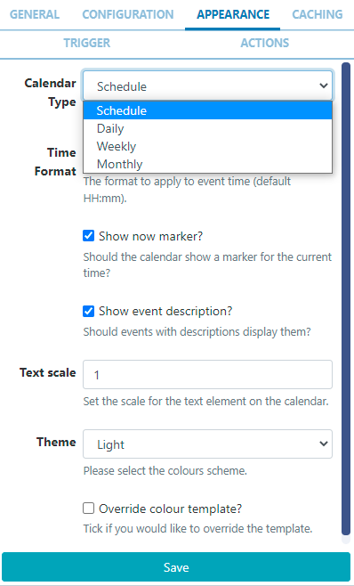
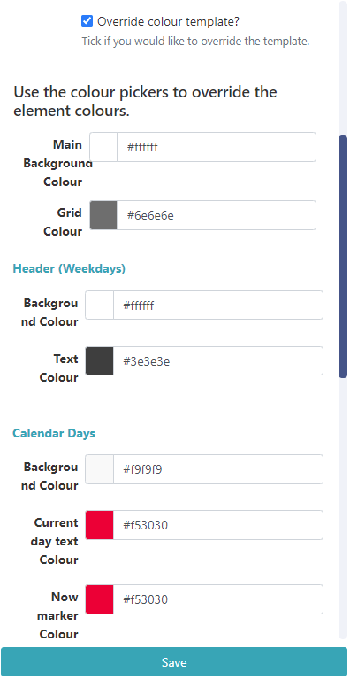

<!--toc=widgets-->

# Calendar

{tip}
**Please note:** If you are using a CMS earlier than v3.1.0, please click [here](media_module_calendar_3.html)
{/tip}

The Calendar Widget provides an easy way to display events from an **iCal feed**, in a **Schedule, Daily, Weekly** or **Monthly** Calendar view.

{tip}
Calendar is available from v3.1.0 upgrade from earlier versions to take advantage of this Widget!
{/tip}

## Add Widget

Click on **Calendar** from the [Widget](layouts_widgets.html)  toolbar and click to add or drag and drop 

On adding, configuration options are shown in the properties panel:

- Provide a **Name** for ease of identification.
- Choose to override the default **duration** if required.

### Configuration

- Provide the iCal **URL** to link.
- Include a **Message** to be shown when no events are returned.
- Use the **Interval** field to filter events for a certain period. Use natural language such as '1 day' or '2 weeks' to return the events within your chosen time frame.
- Tick the checkbox to enter a **Date range** instead with defined start and end dates.
- Select to **Exclude all day events** which will be removed from the feed and not shown.
- Select to **Exclude current events** to remove from the feed and not be shown
- Choose to **Use event timezone** or deselect to use the CMS timezone instead.
- Choose to **Use calendar timezone** if the feed specifies that it's own timezone should be used. Deselect to use the CMS timezone.
- If your feed comes from **Windows** use this check box.

### Appearance

- Use the drop down to select the **type of calendar** to use to display events:

  

#### Schedule

- Choose to provide a **Time Format** to replace the default HH:mm.
- Use the checkbox to show a **now marker** on the calendar for the current time.
- Use the checkbox to **show event descriptions** for events that have them in the iCal feed.
- Set a **Text Scale**, 1 being the lowest.
- Select from a **Light** or **Dark** colour scheme to apply to the template.

#### Daily

- Choose to provide a **Time Format** to replace the default HH:mm.
- Set **Start and End times** to show events.
- Use the checkbox to show a **now marker** on the calendar for the current time.
- Set a **Text Scale**, 1 being the lowest.
- Enter a **Grid step** duration in minutes to apply to rows of events.
- Select from a **Light** or **Dark** colour scheme to apply to the template.

#### Weekly

- Choose to provide a **Time Format** to replace the default HH:mm.
- Set **Start and End times** to show events.
- Use the checkbox to show a **now marker** on the calendar for the current time.
- Set a **Text Scale**, 1 being the lowest.
- Select from a Long, Medium, Short **Week name length** to apply.
- Enter a **Grid step** duration in minutes to apply to rows of events.
- Select from a **Light** or **Dark** colour scheme to apply to the template.

#### Monthly

- Choose to provide a **Time Format** to replace the default HH:mm.
- Use the checkbox to show a **now marker** on the calendar for the current time.
- Tick to enable **showing a header**.
- Set a **Text Scale**, 1 being the lowest.
- Select from a Long, Medium, Short **Week name length** to apply.
- Select from a **Light** or **Dark** colour scheme to apply to the template.

All calendar types have the option to provide alternative colours by using the checkbox to **Override the colour template** to change all elements of the selected calendar:

### Caching

Include a suitable time for the **Update Interval** in minutes, keeping it as high as possible. This determines how often data will be requested from the iCal feed. If the calendar is only ever modified with events scheduled days in advance, you can set this for a long period.

{tip}
It is best practice to contact a remote feed as little as possible.
{/tip}

## Trigger 

Use this tab to trigger a Web Hook **Action** when there is a **Current Event** or **No Event**!

{tip}

**Example Scenario**:

A user has a meeting room calendar configured using the Calendar Widget on a Layout which shows the current occupancy for a room and would like to change LED lights to show when vacant or in use.

- The user would first need to create **Shell Commands** which issued commands to an LED IoT device or the inbuilt LEDS's on some of the Philips Commercial Displays.
- Next an [Interactive Action](layouts_interactive_actions.html) would need to be defined on the **Layout**, which would **Navigate to Widget** and **Target the Screen**, with the **Shell Command Widgets** configured in the **Interactive Drawer**.
- Using the **Trigger** tab on the Calendar Widget, assign the code's to trigger the **Web Hooks** for **Current Event** and **No Event**.

{nonwhite}
Further information on Commands for Administrators can be found here: [Shell Commands](https://xibo.org.uk/docs/setup/command-functionality#shell_commands)
{/nonwhite}

{white}
For information on what Commands to use, please speak with your Administrator.
{/white}

{/tip}

## Actions 

Actions can be attached to this Widget, please see the [Interactive Actions](layouts_interactive_actions.html)  page for more information.

## Time Format - PHP

[[PRODUCTNAME]] should accept any time format that is in a correct PHP time format, the following characters are recognised and can be used:

| Format Character | Description                                                  | Example returned values                 |
| ---------------- | :----------------------------------------------------------- | --------------------------------------- |
|                  | **Time**                                                     |                                         |
| a                | Lowercase Ante meridiem and Post meridiem                    | am or pm                                |
| A                | Uppercase Ante meridiem and Post meridiem                    | AM or PM                                |
| B                | Swatch Internet time                                         | 000 through 999                         |
| g                | 12-hour format of an hour without leading zeros              | 1 through 12                            |
| G                | 24-hour format of an hour without leading zeros              | 0 through 23                            |
| h                | 12-hour format of an hour with leading zeros                 | 01 through 12                           |
| H                | 24-hour format of an hour with leading zeros                 | 00 through 23                           |
| i                | Minutes with leading zeros                                   | 00 to 59                                |
| s                | Seconds, with leading zeros                                  | 00 through 59                           |
| u                | Microseconds (added in PHP 5.2.2). Note that date() will always generate 000000 since it takes an integer parameter, whereas DateTime::format() does support microseconds if DateTime was created with microseconds. | 654321                                  |
|                  | **Timezone**                                                 |                                         |
| e                | Timezone identifier (added in PHP 5.1.0)                     | UTC, GMT, Atlantic/Azoresr              |
| I                | (capital i) Whether or not the date is in daylight saving time | 1 if Daylight Saving Time, 0 otherwise. |
| O                | Difference to Greenwich time (GMT) in hours                  | +0200                                   |
| P                | Difference to Greenwich time (GMT) with colon between hours and minutes (added in PHP 5.1.3) | +02:00                                  |
| T                | Timezone abbreviation                                        | EST, MDT …                              |
| Z                | Timezone offset in seconds. The offset for timezones west of UTC is always negative, and for those east of UTC is always positive. | -43200 through 50400                    |

