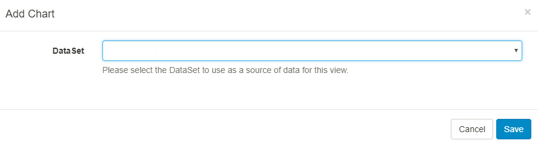
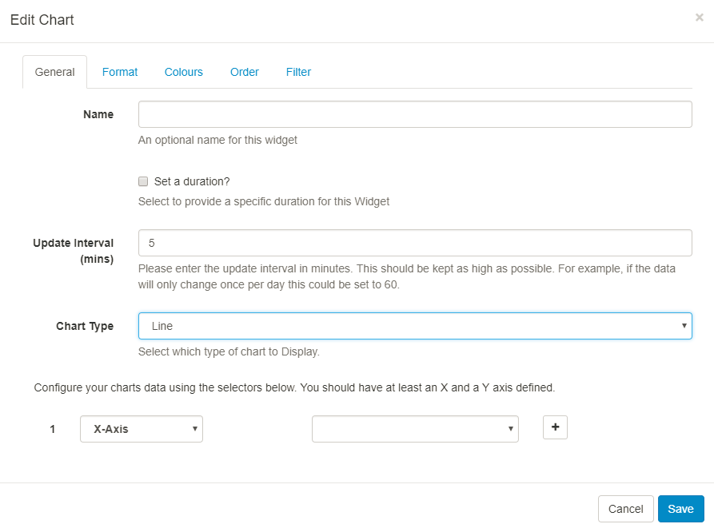
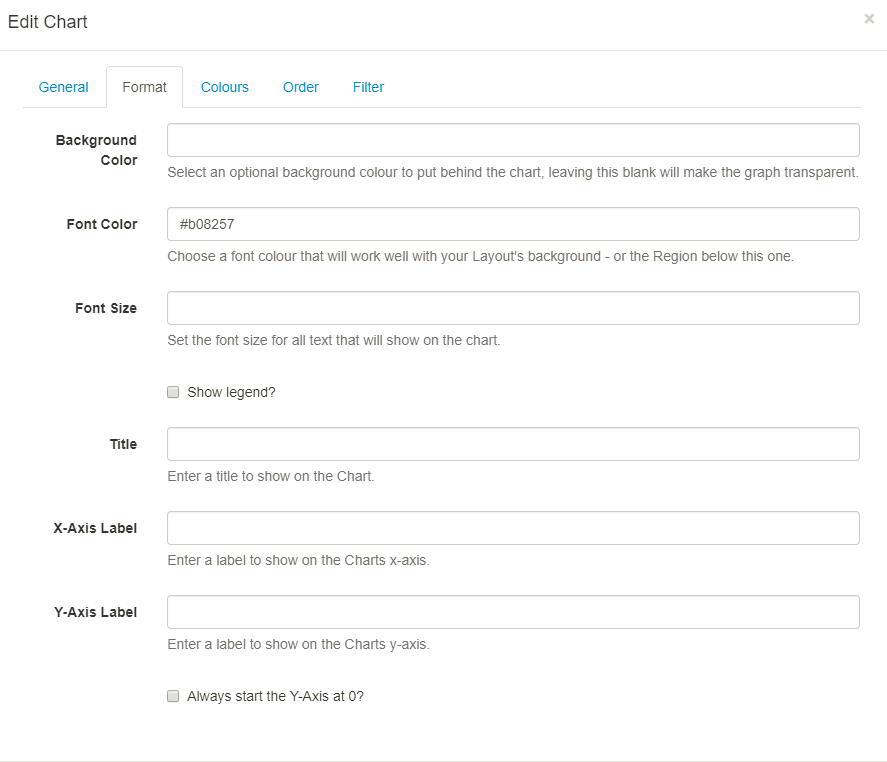
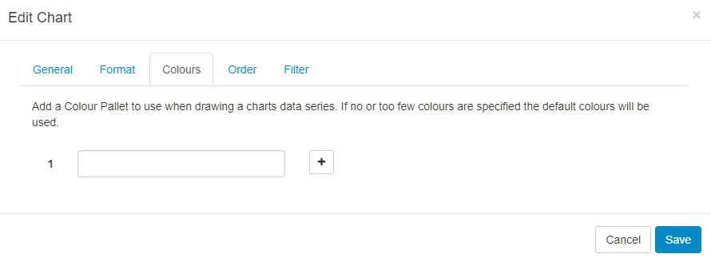
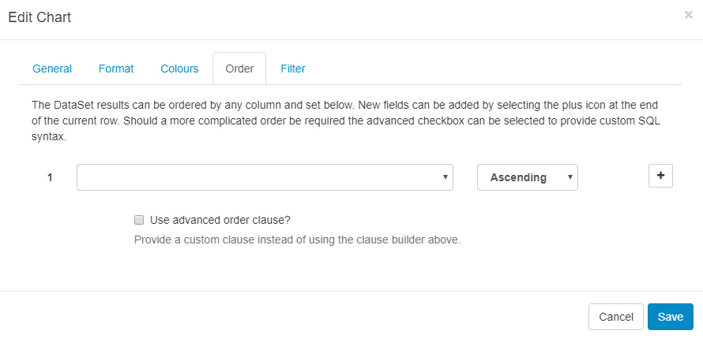
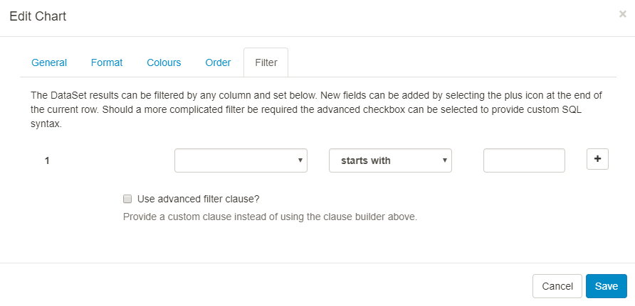

<!--toc=widgets-->

# Chart

The Chart module is used in conjunction with **DataSets** to display information as one of the following Chart Types:

* Line
* Bar
* Pie
* Donut
* Horizontal Bar
* Radar

DataSets are created and defined in the Library and can be represented in **Layouts** using the Chart module. For more information on DataSets and how they are configured, please see the [DataSet manual page](media_datasets.html).

## Add Chart

Select the Chart module from the Widget Toolbox and use the drop down to select the DataSet you wish to use.

## Edit Chart

### General

Use the drop down to select the **Chart type** which would best present information held in the selected DataSet.

All types of Chart need an X and Y axis configured from the available columns in the associated DataSet. Configure by using the selectors on this tab. Press + to get a new selector once you’ve configured the first one.

{tip}

Include a Series Identifier if you want to show a breakdown of values rather than the sum of all values. A series identifier is not suitable for Pie/Donut charts.

{/tip}

### Format

Include text, choose colours and font size to display on your chart. Optionally include and position a **Legend** to further explain your data.

### Colours

Use the **colour picker** to select colouring for your Charts data series, if you do not select any colours, the default colouring for the Module will be used (these can be configured in Module Settings by your administrator)

### Order

DataSet results can be ordered by any column. Use the clause builder or for more complex ordering, provide a SQL command.

### Filter

DataSet results can be filtered by any column. Include or omit DataSet results using the clause builder.

{nonwhite}

Take a look at the [Chart Module Guide](https://community.xibo.org.uk/t/chart-module-guide-xibo-cms-1-8-10/14794) to walk you through how you can produce a Layout to include a Chart.

{/nonwhite}